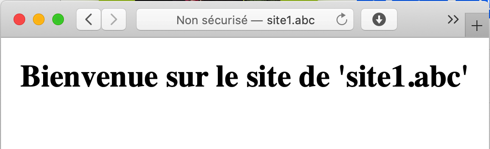

# Apache2 – hôtes virtuels et .htaccess

*Document converti depuis [ve2cuy.com/420-3c3](https://ve2cuy.com/420-3c3/?page_id=1663) — dernière modification : 2024-10-03*

---


---

## Mise en contexte

Imaginez un seul serveur Web (apache2) qui loge (host) une multitude de sites web avec des noms de domaine différents.

Par exemple, le même serveur publiant les sites **abc.def**, **def.org**, **420-3c3.info** et **tropcool.infini**.

Ces sites répondants à la même adresse IP.

Nous parlons ici d’hôtes Web virtuels.

***Apache2*** propose des fichiers de configuration pour implémenter ce type de scénario.

Ces fichiers sont situés dans le dossier ‘*/etc/apache2/sites-available/*‘.

---

## Voici la marche à suivre

**Action 1.0** – Créer un répertoire pour les documents du nouveau site Web virtuel:

```
sudo mkdir -p /var/www/site1.abc/public_html
```

**Action 1.1** – Créer une page d’accueil pour le nouveau site:   
  
***sudo nano /var/www/site1.abc/public_html/index.html***

```
<!DOCTYPE html>
<html>
  <head>
    <meta charset="utf-8">
    <title>Bienvenue à site1.abc</title>
  </head>
  
    <h1><center>Bienvenue sur le site 'site1.abc'</center></h1>
  
</html>
```

**Action 1.2** – Changer le propriétaire du dossier et de son contenu pour l’utilisateur d’apache2:

```
sudo chown -R www-data: /var/www/site1.abc
```

**NOTE**: L’utilisateur et le groupe associés à l’application ***apache2*** est défini dans le fichier /etc/apache2/envvars

```
export APACHE_RUN_USER=www-data
export APACHE_RUN_GROUP=www-data
```

**Action 1.3** – Créer le fichier suivant:

***sudo nano /etc/apache2/sites-available/site1.abc.conf***

```
<VirtualHost *:80>

    ServerName site1.abc

    # Directive optionnelle
    # ServerAlias www.site1.abc autre.org ...

    # À utiliser ensemble.  Utile lors d'un 404
    # ServerAdmin webmaster@site1.abc
    # ServerSignature EMail

    DocumentRoot /var/www/site1.abc/public_html

    # Section optionnelle, sinon les directives de apache2.conf s'appliquent.
    <Directory /var/www/site1.abc/public_html>
        Options -Indexes +FollowSymLinks
        AllowOverride All
    </Directory>

    # Section optionnelle, sinon ${APACHE_LOG_DIR}/other_vhosts_access.log sera utilisé.
    ErrorLog ${APACHE_LOG_DIR}/site1.abc-error.log
    CustomLog ${APACHE_LOG_DIR}/site1.abc-access.log combined

</VirtualHost>
```

**NOTE**: Les fichiers du dossier ***/etc/apache2/sites-available/*** renseignent sur les sites disponibles sur le serveur apache local. **Par contre**, il faudra les activer grâce à des liens dans le dossier ***/etc/apache2/sites-enabled/***.

Explication des directives du fichier précédent:

|  |  |
| --- | --- |
| VirtualHost *:80 | Le serveur Web accepte toutes les requêtes de toutes adresses IP via le port 80 |
| ServerName | Le nom de domaine (DNS) à utiliser pour afficher le site web Note: Pour un test local, renseigner le fichier ‘hosts’ |
| ServerAlias | Les sous domaines de ServerName. Par exemple, www.mondomaine.com |
| DocumentRoot | Le dossier racine du site Web |
| <Directory> | Permet de renseigner des règles locales d’accès aux ressources du site web |
| `Options` -Indexes +FollowsSymLinks  AllowOverride | Prévient l’affichage des fichiers du dossier web Permet de suivre les liens symboliques Permet la modification de la configuration globale d’Apache2 via le fichier .htaccess |
| ErrorLog CustomLog | Chemin d’accès des fichiers ‘log’  Note: La variable d’environnement APACHE_LOG_DIR  est définie dans le fichier */etc/apache2/envvars* |

**Action 1.4** – Créer un lien symbolique pour activer le site:

```
sudo a2ensite site1.abc

# Ou bien, manuellement avec:

sudo ln -s /etc/apache2/sites-available/site1.abc.conf /etc/apache2/sites-enabled/
```

**NOTE**: La commande ***a2ensite*** permet de créer le lien symbolique dans le répertoire /***etc/apache2/sites-enabled/*** directement à partir du nom de domaine du site.

**Action 1.5** – Vérifier la syntaxe des fichiers de configuration d’apache2

```
sudo apachectl configtest
```

**Action 1.6** – Redémarrer le service pour activer les modifications:

```
sudo systemctl restart apache2
```

**Action 1.7** – Il ne reste plus qu’à tester le nouveau site virtuel:



**NOTE IMPORTANTE** : Vous devez avoir renseigner un nom de domaine dans votre fichier ‘hosts’ local pour pouvoir utiliser ‘site1.abc’ dans l’adresse du fureteur. Pour Windows, ce fichier est localisé dans C:\windows\system32\drivers\etc.

---

**Action 1.8** – Visualiser le journal d’accès du site

Les journaux d’apache2 sont, habituellement, localisés dans le dossier /var/log/apache2.

Pour visualiser, en temps réel, le contenu du journal d’accès général, il suffit d’utiliser la commande suivante:

```
tail -f /var/log/apache2/access.log
```

Il sera possible de visualiser le journal du site ‘site1.abc‘ en modifiant la commande ainsi:

```
tail -f /var/log/apache2/site1.abc-access.log
```

RAPPEL – La localisation du journal d’accès est renseignée par la directive suivante:

```
CustomLog ${APACHE_LOG_DIR}/site1.abc-access.log combined
```

**NOTE**: ‘combined’ est un des formats de ‘log’ défini dans le fichier apache2.conf:

Voir le document suivant pour la directive [LogFormat](https://httpd.apache.org/docs/2.4/mod/mod_log_config.html)

```
LogFormat "%v:%p %h %l %u %t \"%r\" %>s %O \"%{Referer}i\" \"%{User-Agent}i\"" vho>
LogFormat "%h %l %u %t \"%r\" %>s %O \"%{Referer}i\" \"%{User-Agent}i\"" combined
LogFormat "%h %l %u %t \"%r\" %>s %O" common
LogFormat "%{Referer}i -> %U" referer
LogFormat "%{User-agent}i" agent
```

**1.8.1** – Voici un exemple d’un format de journal personnalisé:

```
LogFormat "Une requete de : %a pour -> %f" perso

# NOTE:  %a représente l'adresse IP, %f le nom du fichier demandé.
```

**1.8.2** – Va produire ceci dans le journal:

```
Une requete de : 192.168.2.10 pour -> /var/www/site1.abc/public_html/index.html
```

---

## Laboratoire 1.9

- Modifier le fichier de configuration du site1.abc pour que les fichiers des journaux soient enregistrés dans le dossier /var/www/site1.abc/journaux sous:
  - journal.log
  - erreurs.log
- Tester le fonctionnement des journaux.

**Astuce** – Assurez-vous de bien indiquer le nom du dossier pour la localisation des journaux sinon l’erreur suivante va se produire lors du rechargement du fichier de configuration:

```
$ sudo systemctl reload apache2.service 

Job for apache2.service failed.
See "systemctl status apache2.service" and "journalctl -xeu apache2.service" for details.

$ sudo systemctl status apache2.service 
147653]: (2)No such file or directory: AH02297: Cannot access directory 
'/var/www/site1.abc/jounaux for log file ... 
```

---

## 2 – Laboratoire

Il faut proposer le site web de la ***cie-abc.tropcool*** sous wordpress version latest via l’URL:

**http://cie-abc.tropcool**

- Créer un compte mysql ‘**tropcool**‘ avec une BD ‘**tropcool**‘. Mot de passe: **password**.
- Télécharger et déplacer l’application wordpress dans **/var/www/cie-abc.tropcool**/.
- Changer le propriétaire de **/var/www/cie-abc.tropcool** pour le compte du processus apache2.
- Créer et renseigner le fichier apache2 ‘**/etc/apache2/sites-available/cie-abc.tropcool.conf**‘ pour le site virtuel.
- Créer le lien symbolique avec la commande **a2ensite**.
- Compléter l’installation de WordPress.
- Renseigner le nom de domaine dans le fichier hosts local.
- Tester avec l’URL ***http://cie-abc.tropcool***.


---

## 3 – Le fichier .htaccess – (configuration locale)

Les fichiers `.htaccess` sont utilisés sur les serveurs web Apache pour configurer divers aspects de la gestion des sites web. Ils sont utilisés – si la directive ‘AllowOverride All’ est renseignée – pour définir, au niveau d’un dossier de contenu web, des directives tel que:

1. **Redirections** : Ils permettent de rediriger les utilisateurs d’une URL à une autre (par exemple, rediriger une page supprimée vers une nouvelle page).
2. **Contrôle d’accès** : Vous pouvez restreindre l’accès à certaines parties de votre site, par exemple en protégeant par mot de passe des répertoires.
3. **Réécriture d’URL** : Ils permettent de créer des URL plus lisibles et conviviales, en transformant des URLs longues ou complexes en des formats plus simples.
4. **Personnalisation des erreurs** : Vous pouvez définir des pages d’erreur personnalisées, comme une page 404 pour les pages non trouvées.
5. **Configuration de la mise en cache** : Vous pouvez gérer le cache du navigateur pour améliorer les performances de votre site.
6. **Compression et optimisation** : Il est possible d’activer la compression gzip pour réduire la taille des fichiers envoyés aux utilisateurs.
7. **Sécurité** : Vous pouvez ajouter des directives pour améliorer la sécurité de votre site, comme la prévention d’attaques courantes.

Les fichiers `.htaccess` (ou « fichiers de configuration distribués ») fournissent une méthode pour modifier la configuration du serveur au niveau d’un répertoire. Un fichier, contenant une ou plusieurs directives de configuration, est placé dans un répertoire de documents particulier, et ses directives s’appliquent à ce répertoire et à tous ses sous-répertoires.

---

### 3.1 – Exemple d’un fichier .htaccess pour WordPress

Dans le contexte de WordPress, le fichier `.htaccess` est souvent utilisé pour gérer des redirections, des permaliens et des règles de sécurité. Voici un exemple classique de contenu de fichier `.htaccess` pour un site WordPress :

```
# BEGIN WordPress
<IfModule mod_rewrite.c>
RewriteEngine On
RewriteBase /
RewriteRule ^index\.php$ - [L]
RewriteCond %{REQUEST_FILENAME} !-f
RewriteCond %{REQUEST_FILENAME} !-d
RewriteRule . /index.php [L]
</IfModule>
# END WordPress
```

### 3.1.2 – Explication des lignes :

- **RewriteEngine On** : Active le module de réécriture d’URL.
- **RewriteBase /** : Définit la base pour les règles de réécriture.
- **RewriteRule ^index.php$ – [L]** : Si l’URL demandée est `index.php`, ne rien changer et passer à la fin.
- **RewriteCond %{REQUEST_FILENAME} !-f** : Vérifie si le fichier demandé n’existe pas.
- **RewriteCond %{REQUEST_FILENAME} !-d** : Vérifie si le répertoire demandé n’existe pas.
- **RewriteRule . /index.php [L]** : Redirige toutes les autres demandes vers `index.php`, permettant à WordPress de gérer la requête.

---

### 3.2 – Autres exemples d’utilisation :

### 3.2.1 – **Redirection d’HTTP vers HTTPS** :

```
   RewriteEngine On
   RewriteCond %{HTTPS} off
   RewriteRule ^ https://%{HTTP_HOST}%{REQUEST_URI} [L,R=301]
```

Détaillons cette règle de redirection qui force l’utilisation de HTTPS :

### 3.2.1.2 – Explication des lignes

Ligne 1 – **`RewriteEngine On`**

- Cette directive active le moteur de réécriture d’URL. Sans cette ligne, les règles suivantes ne seront pas prises en compte.

Ligne 2 – **`RewriteCond %{HTTPS} off`**

- **Condition de réécriture** : Cette ligne vérifie si la connexion n’est pas sécurisée, c’est-à-dire si l’utilisateur accède au site via HTTP plutôt que HTTPS.
- **`%{HTTPS}`** est une variable qui indique si la connexion est sécurisée (`on` pour HTTPS, `off` pour HTTP). Ici, la condition s’applique uniquement lorsque cette variable est `off`.

Ligne 3 – **`RewriteRule ^ https://%{HTTP_HOST}%{REQUEST_URI} [L,R=301]`**

- **`RewriteRule ^`** : Cette règle s’applique à toutes les requêtes (`^` signifie « début de la chaîne », donc tout correspond ici).
- **`https://%{HTTP_HOST}%{REQUEST_URI}`** : Si la condition est remplie (c’est-à-dire que la connexion est en HTTP), cette règle redirige la requête vers la version HTTPS de l’URL.
  - **`%{HTTP_HOST}`** : représente le nom de domaine du site (par exemple, `www.votresite.com`).
  - **`%{REQUEST_URI}`** : représente la partie de l’URL après le nom de domaine (par exemple, `/chemin/vers/page`).
- **`[L,R=301]`** :
  - **`L`** : indique que c’est la dernière règle à appliquer si cette règle est exécutée. Aucune autre règle ne sera considérée après celle-ci.
  - **`R=301`** : indique qu’il s’agit d’une redirection permanente (301). Cela signifie que les moteurs de recherche et les navigateurs mettront à jour l’URL et considéreront la version HTTPS comme la version canonique.

### En résumé

Cette règle force toute connexion non sécurisée (HTTP) à être redirigée vers sa version sécurisée (HTTPS). Cela améliore la sécurité de votre site en s’assurant que toutes les communications entre le serveur et le navigateur sont chiffrées.

C’est une bonne pratique pour tout site web aujourd’hui, surtout si vous traitez des informations sensibles ou personnelles. Si vous avez d’autres questions ou besoin d’autres exemples, n’hésitez pas !

---

### 3.2.2 – **Personnalisation de la page d’erreur 404** :

```
   ErrorDocument 404 /404.php
```

### Précautions :

- **Sauvegarde** : Avant de modifier le fichier `.htaccess`, sauvegardez l’original.
- **Test** : Après les modifications, testez le site pour vous assurer que tout fonctionne correctement.
- **Syntaxe** : Une erreur de syntaxe dans ce fichier peut rendre le site inaccessible.

---

## 3.3 – Laboratoire

Il faut renseigner un fichier .htaccess pour le site site1.abc avec les directives suivantes:

- La requête d’une page inexistante retourne ceci:


- Une requête à partir d’une adresse IP autre que celle de votre poste de travail ou celle de votre voisin, retourne ceci:


- Écrire une règle .htaccess qui renvoi toute requête débutant par ind vers index.html


**NOTE**: Vous pouvez utiliser chatgpt pour cette règle.

---

## 3.3.1 – Astuces pour le labo

1 – Les directives d’accès par une adresse IP doivent-être placées dans une directive ‘<RequireAny>’

```
<RequireAny>
  ...    
</RequireAny>
```

2 – Accès à un dossier Web avec un fichier .htaccess qui contient des erreurs de configuration:

```
Internal Server Error
The server encountered an internal error or misconfiguration and was unable to complete your request.

Please contact the server administrator at webmaster@site1.abc to inform them of the time this error occurred, and the actions you performed just before this error.

More information about this error may be available in the server error log.
```

Fichier erreur.log

```
[Wed Oct 02 16:09:58.098665 2024] [core:alert] [pid 147786] [client 192.168.2.10:49780] /var/www/site1.abc/public_html/.htaccess: Unknown Authz provider: IP
```

3 – Il sera peut-être nécessaire d’activer le module ‘rewrite’ pour la redirection de page web.

```
sudo a2enmod rewrite
sudo systemctl restart apache2
```

---

##### Document rédigé par Alain Boudreault – aka ve2cuy – version 2024.10.02.01

---

[⬅️ Retour à la liste des documents](../README.md)
