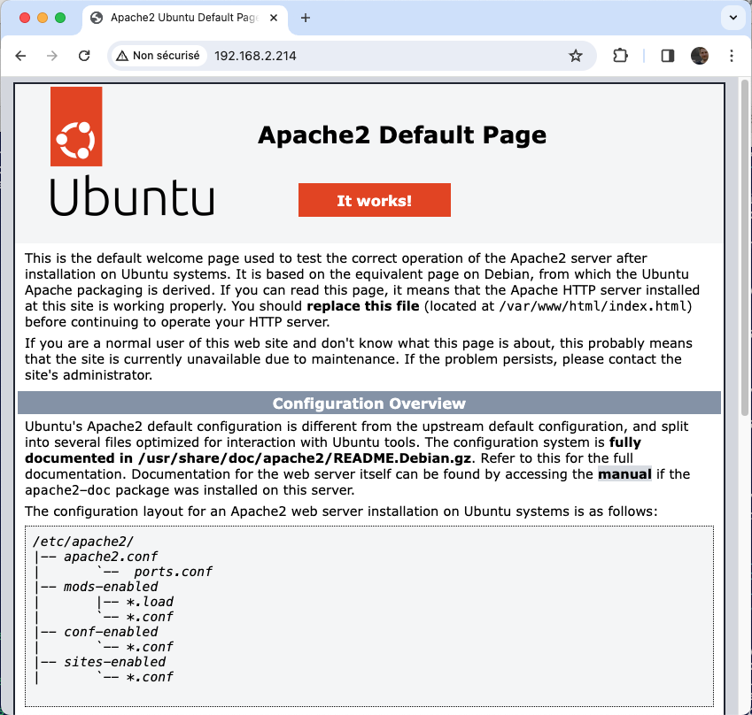

# Apache2 – Mise en route

*Document converti depuis [ve2cuy.com/420-3c3](https://ve2cuy.com/420-3c3/?page_id=2214) — dernière modification : 2024-09-12*

---

## 1. Contenu


- **Installation**
- **Dossiers** : /var/www, /etc/apache2
- **Configuration** : **Globale** – apache2.conf, **Locale** – sites-available, .htaccess
- **Droits d’accès** : Require, not, ip, All, …
- **Directives** : RequireAll, RequireAny, Files, …
- **Hôtes virtuels**

---

**NOTE**: Les exemples de ce document utilisent la syntaxe de la **version 2.4** d’Apache2

---

## 2. Apache2

[Apache2](https://httpd.apache.org/docs/current/) est un serveur web open-source largement reconnu, développé par la [Fondation Apache](https://www.apache.org). Il constitue un pilier essentiel de l’infrastructure Internet, permettant l’hébergement et la diffusion de contenus via les protocoles [HTTP](https://fr.wikipedia.org/wiki/Hypertext_Transfer_Protocol) et [HTTPS](https://fr.wikipedia.org/wiki/Hypertext_Transfer_Protocol_Secure).

Sa popularité réside dans sa flexibilité et son extensibilité, grâce à une architecture modulaire qui permet l’intégration de diverses fonctionnalités supplémentaires, telles que la gestion des scripts PHP, le chiffrement via SSL/TLS, et bien d’autres.

En outre, Apache2 est compatible avec une large gamme de systèmes d’exploitation, y compris Linux, Windows, et macOS, ce qui en fait une solution versatile et robuste pour un large éventail de déploiements web.

---

## 3. Alternative

Il existe plusieurs alternatives à Apache2 pour servir des sites web, chacune ayant ses propres caractéristiques et avantages selon les besoins spécifiques. Parmi les plus courantes, on peut citer :

1. **[Nginx](https://nginx.org)** : Connu pour sa performance et son efficacité, Nginx est souvent préféré pour les sites à fort trafic. Il est particulièrement efficace pour gérer les connexions concurrentes grâce à son architecture événementielle, ce qui en fait un excellent choix pour les applications nécessitant une grande échelle.
2. **[Lighttpd](https://www.lighttpd.net)** : Un serveur web léger conçu pour être rapide tout en consommant peu de ressources. Il est souvent utilisé dans des environnements à ressources limitées ou pour des projets où la simplicité et l’efficacité sont prioritaires.
3. **[Microsoft IIS](https://www.iis.net) (Internet Information Services)** : Un serveur web développé par Microsoft, principalement utilisé sur les serveurs Windows. Il offre une intégration poussée avec l’écosystème Microsoft, ce qui le rend idéal pour les entreprises utilisant des technologies Microsoft.
4. **[Caddy](https://caddyserver.com)** : Un serveur web moderne et facile à configurer, particulièrement apprécié pour sa gestion automatique des certificats SSL/TLS et son approche orientée vers la sécurité.
5. **[Litespeed](https://www.litespeedtech.com)** : Un serveur web commercial compatible avec Apache2, connu pour sa performance élevée, notamment dans l’hébergement partagé. Il offre des fonctionnalités avancées comme l’optimisation de la mise en cache et la compatibilité avec les directives Apache.

---

## 4. Pré-requis


Avoir accès à un serveur Ubuntu à jour.

```
sudo apt update && sudo apt upgrade -y
```

---

## 5. Installation d’apache2

À partir d’un serveur Ubuntu;

```
sudo apt installer apache2 -y

# NOTE:  Voici comment vérifier les versions disponibles sur les dépôts:

$ apt-cache policy apache2

apache2:
  Installed: 2.4.58-1ubuntu8.4
  Candidate: 2.4.58-1ubuntu8.4
  Version table:
 *** 2.4.58-1ubuntu8.4 500
        500 http://ca.archive.ubuntu.com/ubuntu noble-updates/main amd64 Packages
        500 http://security.ubuntu.com/ubuntu noble-security/main amd64 Packages
        100 /var/lib/dpkg/status
     2.4.58-1ubuntu8 500
        500 http://ca.archive.ubuntu.com/ubuntu noble/main amd64 Packages

# Et installer une version spécifique:

$ sudo apt install apache2=2.4.58-1ubuntu8.4
```

---

## 6. Vérifier le fonctionnement d’apache2

Dans un fureteur, inscrire l’adresse IP du serveur Ubuntu.

Par exemple,



---

## 7. Le dossier /var/www

**Emplacement des Fichiers Web** :

Le répertoire `/var/www` est généralement utilisé comme l’emplacement par défaut pour stocker les fichiers web d’un serveur Apache2. C’est là que sont placés les fichiers HTML, CSS, JavaScript, les images, et autres ressources nécessaires pour servir les pages web aux clients.

**Structure Typique** :

- **`/var/www/html`** : C’est le répertoire du premier site Web d’Apache2. Ce dossier est le répertoire racine du site web par défaut.
- **Autres Sous-Répertoires** : Sous **/var/www**, il est également possible d’avoir des sous-répertoires pour différents sites web. Par exemple, `/var/www/site1` et `/var/www/site2` pour différents sites. Voir le document sur les [hôte virtuels](Apache2-Hotes-virtuels-et-htaccess.md) (vhosts).

---

### 7.1 – Expérimentation avec le contenu du dossier /var/www/html

```
┌──[19:47:02]─[0]─[serveur01:/home/etudiant]
└──| ls /var/www/html/ -l
-rw-r--r-- 1 root root 10671 Aug 30 22:51 index.html
```

- Remplacer le contenu du fichier index.html par un contenu personnalisé
- Ré afficher la page du fureteur

---

## 8. Configuration d’Apache, le dossier */etc/apache2*

```
┌──[13:23:28]─[0]─[serveur01:/etc/apache2]                 
└──| ls -Al                                                
total 84                                                   
-rw-r--r-- 1 root root  7494 Sep  3 19:46 apache2.conf         # Configuration globale d'Apache2
drwxr-xr-x 2 root root  4096 Aug 30 22:51 conf-available       # Configuration supplémentaire
drwxr-xr-x 2 root root  4096 Aug 30 22:51 conf-enabled         # a2enconf, a2disconf
-rw-r--r-- 1 root root  1782 Mar 18 11:41 envvars              # Variables d'environnement, APACHE_RUN_USER=www-data, ...
-rw-r--r-- 1 root root 31063 Mar 18 11:41 magic                # Définition des MIME
drwxr-xr-x 2 root root 12288 Aug 30 22:51 mods-available       # Modules disponible
drwxr-xr-x 2 root root  4096 Sep  3 19:44 mods-enabled         # a2enmod, a2dismod
-rw-r--r-- 1 root root   287 Aug 30 23:42 ports.conf           # Ports IP écoutés par apache2, 80, 443, ...
drwxr-xr-x 2 root root  4096 Sep  3 19:19 sites-available      # Sites disponibles - Hôtes virtuels
drwxr-xr-x 2 root root  4096 Aug 30 22:51 sites-enabled        # a2ensite, a2dissite
```

---

## 9. Configuration globale, le fichier *apache2.conf*

```
# This is the main Apache server configuration file.  It contains the
# configuration directives that give the server its instructions.
# Do NOT add a slash at the end of the directory path.
#
#ServerRoot "/etc/apache2"

#
# Timeout: The number of seconds before receives and sends time out.
#
Timeout 300

# KeepAlive: Whether or not to allow persistent connections
#
KeepAlive On

# These need to be set in /etc/apache2/envvars
User ${APACHE_RUN_USER}
Group ${APACHE_RUN_GROUP}

ErrorLog ${APACHE_LOG_DIR}/error.log

# LogLevel: Control the severity of messages logged to the error_log.
# Available values: trace8, ..., trace1, debug, info, notice, warn,
# error, crit, alert, emerg.
LogLevel warn

# Include module configuration:
IncludeOptional mods-enabled/*.load
IncludeOptional mods-enabled/*.conf

# Include list of ports to listen on
Include ports.conf

# Sets the default security model of the Apache2 HTTPD server. 
# NOTE: Il ne sera pas possible pour le serveur Apache2 d'avoir accès aux dossiers
#       à l'extérieure de ceux définis ici:

<Directory />
	Options FollowSymLinks
	AllowOverride None
	Require all denied
</Directory>

<Directory /usr/share>
	AllowOverride None
	Require all granted
</Directory>

<Directory /var/www/>
	Options -Indexes +FollowSymLinks
	AllowOverride All
	Require all granted
</Directory>

# AccessFileName: The name of the file to look for in each directory
# for additional configuration directives.  See also the AllowOverride
# directive.
AccessFileName .htaccess

# The following lines prevent .htaccess and .htpasswd files from being
# viewed by Web clients.
<FilesMatch "^\.ht">
	Require all denied
</FilesMatch>

# Include generic snippets of statements
IncludeOptional conf-enabled/*.conf

# Include the virtual host configurations:
IncludeOptional sites-enabled/*.conf
```

---

## 9.2 – Les ports IP d’écoute, le fichier *ports.conf*

```
# If you just change the port or add more ports here, you will likely also
# have to change the VirtualHost statement in
# /etc/apache2/sites-enabled/000-default.conf

Listen 80
# Listen autre_port

<IfModule ssl_module>
        Listen 443
</IfModule>

<IfModule mod_gnutls.c>
        Listen 443
</IfModule>
```

---

## 9.3 – Consultation des variables d’environnement d’apache

```
# NOTE: Les variables d'environnement d'Apache ne sont disponibles que durant une session apache2. 
# Pour les consulter, il faut explicitement les charger:

$ source /etc/apache2/envvars

$ env | grep APACHE

APACHE_LOG_DIR=/var/log/apache2
APACHE_PID_FILE=/var/run/apache2/apache2.pid
APACHE_RUN_GROUP=www-data
APACHE_LOCK_DIR=/var/lock/apache2
APACHE_RUN_DIR=/var/run/apache2
APACHE_RUN_USER=www-data
```

---

## 10. **Directives et droits d’accès**

Le module `mod_authz_core` met à disposition des fournisseurs d’autorisation génériques utilisables avec la directive `Require`.

---

### Les directives Require

### 10.1 – Require all

Le fournisseur `all` accepte un argument dont les deux valeurs possibles sont : ‘**granted**‘ ou ‘**denied**‘. Les exemples suivants autorisent ou interdisent l’accès à toutes les requêtes.

Exemples d’utilisation:

```
 // Accès à toutes le ressources du dossier suivant:
 <Directory /var/www/html>
         Require all granted
 </Directory>

 // Aucun accès aux ressources du dossier suivant:
 <Directory />
         Require all denied
 </Directory>
```

### 10.2 – Require ipplages d’adresses

Les clients dont les adresses IP font partie des tranches spécifiées auront accès à la ressource.

Exemples d’utilisation:

```
 <Directory /var/www/html/dossiers_internes>
         Require ip 10.10 172.20 192.168
 </Directory>

 <Directory /var/www/html/externe_seulement>
         Require not ip 192.168
 </Directory>
```

---

## 11. Le site Web par défaut – Hôtes virtuels

### 11.1 – Le fichier /etc/apache2/sites-available/000-default.conf

Le fichier 000-default.conf contient les paramètres de configuration du site web par défaut. Les fichiers de contenu de ce site web sont situés à /var/www/html. Ces paramètres ont préséances sur ceux du fichier /etc/apache2/apache2.conf.

Voici son contenu de départ:

```
# Configuration de départ du site web par défaut
<VirtualHost *:80>
        #ServerName www.example.com
        ServerAdmin webmaster@localhost
        DocumentRoot /var/www/html
        ErrorLog ${APACHE_LOG_DIR}/error.log
        CustomLog ${APACHE_LOG_DIR}/access.log combined
</VirtualHost>
```

### 11.2 – Consultation du journal d’Apache2

```
# Consultation du journal d'apache2
sudo tail -f /var/log/apache2/access.log
# -f =  output appended data as the file grows
```

---

### 11.3 – Expérimentation avec la configuration du site par défaut

```
<VirtualHost *:80>
        #ServerName www.example.com

        ServerAdmin webmaster@localhost
        DocumentRoot /var/www/html

        <Directory /var/www/html>
                Options -Indexes
                AllowOverride None
                Require all granted
        </Directory>

        <Directory /var/www/html/documents>
                Options +Indexes
                AllowOverride None
                Require all granted
        </Directory>

        ErrorLog ${APACHE_LOG_DIR}/error.log
        CustomLog ${APACHE_LOG_DIR}/access.log combined

</VirtualHost>
```

---

## 12.3 – Laboratoire


Il faut modifier la configuration du site web par défaut, pour que le contenu Web soit publié à partir du dossier **/la_cie_abc/public_html** – (**ATTENTION**, Il faut créer cette structure à la racine du système de fichiers)

1 – Créer deux fichiers dans ce dossier:

- ***motdepasse.txt*** (À vous d’y placer un peu de texte)
- ***page.html*** (À vous d’y placer quelques balises HTML)

2 – Il ne faut pas permettre l’affichage du contenu du dossier dans le fureteur.

3 – Créer le dossier **/la_cie_abc/public_html/documents**

4 – Créer les trois fichiers suivants dans le dossier ***documents***:

- procedures.pdf
- exemple.cpp
- liste.html

5 – Il faut permettre l’affichage du contenu du dossier ***documents*** dans le fureteur.

6 – Permettre l’accès au site web par le port IP 8080. Par exemple, **http://192.168.c.d:8080/page.html**

**INDICE**: Par défaut, Apache2 ne permet pas la publication de documents Web à l’extérieur du dossier **/var/www** ou l’écoute sur des ports IP autres que **80** et **443**. Il faut permettre ces accès via les fichiers **apache2.conf** et **ports.conf** . Après modification, il faudra relancer apache2 : ***sudo systemctl restart apache2***.

---

## 14 – Site de l’utilisateur


---

Apache2 permet aux utilisateurs du système de publier un site web personnel.

Le site sera accessible via une URL de se format:

```
http://192.168.2.214/~etudiant/
```

---

### 14.1 – Voici la procédure:

**Étape 1** – Activer le module ‘**userdir**‘

```
sudo a2enmod userdir
```

**Voir le fichier**: **/etc/apache2/mods-available/userdir.conf**

```
UserDir public_html
UserDir disabled root

<Directory /home/*/public_html>
        AllowOverride FileInfo AuthConfig Limit Indexes
        Options MultiViews Indexes SymLinksIfOwnerMatch IncludesNoExec
        Require method GET POST OPTIONS
</Directory>
```

**Étape 2** – L’utilisateur doit placer son contenu web dans le dossier ‘**~/public_html**‘

Référence: [AllowOverride: FileInfo](https://httpd.apache.org/docs/2.4/mod/overrides.html#override-fileinfo), [AuthConfig](https://httpd.apache.org/docs/2.4/mod/overrides.html#override-authconfig), [Limit](https://httpd.apache.org/docs/2.4/mod/core.html#limit), [Indexes](https://httpd.apache.org/docs/2.4/mod/overrides.html#override-indexes)

**Étape 3** – L’utilisateur ‘**www-data**‘ dit être membre du groupe de l’utilisateur qui désire publier sur le Web.

```
usermod -a -G etudiant www-data
```

---

## 14.2 – Laboratoire


- Il faut créer l’utilisateur **administrateur**
- L’URL: **http://adresse_ip_du_serveur/~administrateur**,
  - Doit afficher le message suivant: **Ceci est le site de l’Administrateur du serveur**.
- Le site de l’administrateur ne doit être accessible qu’à partir de l’adresse IP de votre poste de travail et de celui de votre voisin.

---

## 15 – La directive ErrorDocument

Apache2 propose une méthode pour personnaliser les messages d’erreur Web. Par exemple, lors d’une requête sur une adresse invalide, au lieu du message:

```
404 - Not Found
```

Il est possible d’afficher un page personnalisée comme,


Ceci sera obtenu grace à la directrice ‘ErrorDocument’. Voici des exemples:

```
ErrorDocument 500 http://example.com/cgi-bin/server-error.cgi
ErrorDocument 404 /errors/bad_urls.php
ErrorDocument 401 /subscription_info.html
ErrorDocument 403 "Sorry can't allow you access today"
ErrorDocument 403 Forbidden!
ErrorDocument 403 /errors/forbidden.py?referrer=%{escape:%{HTTP_REFERER}}

# Retour au message d'origine:
<Directory "/web/docs">
  ErrorDocument 404 default
</Directory>
```

---

## 15.1 – Personnalisation d’un 404


---

### Apportons les modifications suivantes au site web par défaut.

**Étape 1** – Ajouter le code suivant au fichier 000-default.conf

```
# Sous DocumentRoot
ErrorDocument 404 https://ve2cuy.com/420-3c3/?page_id=2210

# Enregistrer, recharger (systemctl reload) et tester!
```

**Étape 2** – Ajouter le code suivant à la section ***documents***

```
<Directory /var/www/html/documents>
 ...
   ErrorDocument 404 default
</Directory>

# Enregistrer, recharger (systemctl) et tester!
```

---

## 16 – RequireAny, RequireAll, RequireNone

Les balises [RequireAny](https://httpd.apache.org/docs/2.4/mod/mod_authz_core.html#requireany), [RequireAll](https://httpd.apache.org/docs/2.4/mod/mod_authz_core.html#requireall) er [RequireNone](https://httpd.apache.org/docs/2.4/mod/mod_authz_core.html#requirenone) permettent de regrouper plusieurs directives.

### 16.1 – Voici des exemples d’utilisation:

```
<RequireAny>
    Require ip 192.168
    Require ip 10.10
    Require ip 2a02:4126:2aa4::/48
</RequireAny>

<Files adminer.php>
    <RequireAny>
        Require local
        Require ip 192.168
        Require ip 10
    </RequireAny>
</Files>

# NOTE: Dans le cas d'une négation, il faut utilise la formule 'Tout sauf'
<RequireAll>
    Require all granted
    Require not ip 111.111.111.111
    Require not ip 222.222.222.222
    Require not ip 123.123.123.123
</RequireAll>

<RequireNone>
  # Si une ou plusieurs directives contenues dans cette directive retournent un résultat positif alors la directive RequireNone échouera.
</RequireNone>
```

---

## 17 – Les hôtes virtuelles (virtual hosts)


[Le document est disponible ici](Apache2-Hotes-virtuels-et-htaccess.md).

---

FIN DU DOCUMENT

---

[⬅️ Retour à la liste des documents](../README.md)
