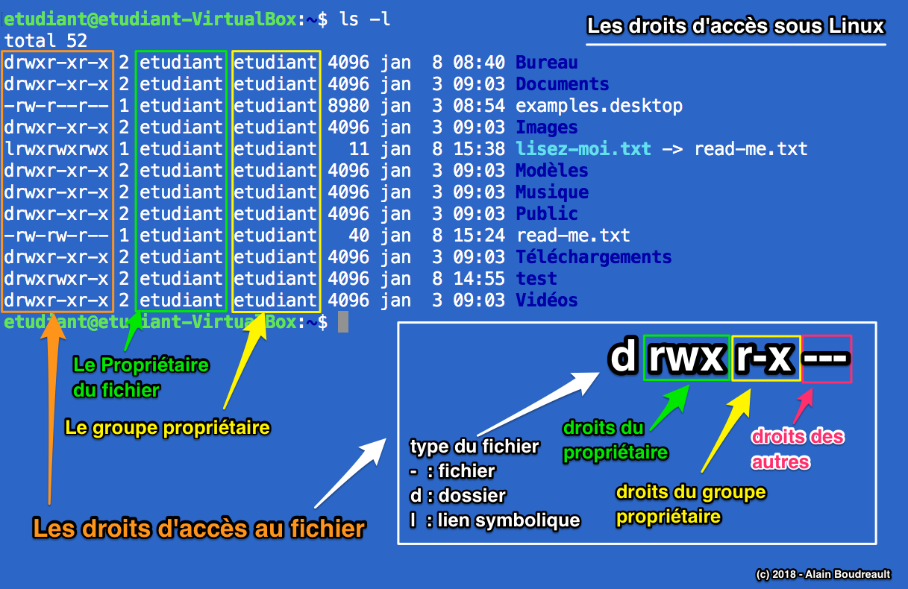

# Commandes Linux

*Document converti depuis [ve2cuy.com/420-3c3](https://ve2cuy.com/420-3c3/?page_id=2191) — dernière modification : 2024-09-04*

---

# Contenu


- Connexion ssh
- Le dossier de l’utilisateur: **~/**
- Les commandes; **clear**, **ls**, **cp**, **mv**, **rm**, **touch**, **cat**, **man**, **sudo** et **ln**
- Droits d’accès aux fichiers: **– (rw-)(r- -)(- – -)**
- Ajout d’un nouvel utilisateur; **adduser**, **su**, sudo, passwd
- Les commandes; **chmod**, **umask**, **chown** et **chgrp**
- Installation de nouvelles applications: **apt-get**
- Téléchargement à partir du Web: **wget, git, curl**

# Objectif général

Faire un retour sur les principes de base et commandes requises pour l’administration d’une station Linux.

# Prérequis

- Avoir installer ‘Ubuntu Server’ dans une machine virtuelle.

---

# 1 – Liste des commandes

| commande | exemple | description |
| --- | --- | --- |
| ls | ls   ls -l  ls / -lR  ls -a  ls -ld — */ | Afficher le contenu d’un dossier  Afficher une liste détaillée  Afficher les fichiers de / des sous dossiers  Afficher les fichiers + ceux débutants par un .  Afficher seulement les dossiers |
| ~       .    .. | cd ~  cp /projet1/ ~    ./uneApp    ls ../.. | Aller au dossier de travail  Copier le dossier /projet1 vers le dossier de travail    Exécuter une cmd du dossier courant    Afficher les fichiers du dossier 2 niveaux plus haut |
| touch | touch fichier1.txt  touch fichier2.txt fichier3.html  echo Bonjour TIM > hello.txt    echo Hello world >> hello.txt | Créer un fichier vide  Créer deux (2) fichiers vides  Créer un fichier à partir du résultat d’une commande  Ajouter du contenu à un fichier |
| cp | cp ./fichier1 /home/toto/  cp a1 a2 a3 ../test2  cp a? ../test  cp a* /home/toto | Copier un fichier ou un dossier  Copier plusieurs fichiers  Copier des fichiers de 2 car débutant par ‘a’  Copier tous les fichiers débutant par ‘a’ |
| mv | mv index.html /var/www/html/  mv nom.txt nouveauNom.txt  mv /home/bob/ /tmp/ | Déplacer un fichier  Renommer un fichier  Déplacer un dossier |
| rm  rm -r | rm plusbesoin.html  rm -R ./unDossierCourant  rm -i a*      sudo apt install testdisk | Effacer un fichier  Effacer un dossier  Effacer les fichiers débutant par ‘a’ avec confirmation (-i)    Récupérer des fichiers effacés. |
| ln -s | ln -s nomFichier nomLien | Créer un lien symbolique |
| adduser  deluser | sudo adduser fred  sudo deluser coco | Ajouter un nouvel utilisateur  Effacer un utilisateur |
| adduser      deluser | sudo adduser toto sudo      sudo deluser toto sodo | Ajouter toto au groupe des ‘sudoers’. Par la suite, toto pourra utiliser la commande ‘sudo’    Retirer l’utilisateur d’un groupe |
| users | users    cat /etc/passwd | Afficher les utilisateurs connectés au serveur.    Afficher tous les utilisateurs du système. |
| addgroup | sudo addgroup design | Créer un nouveau groupe |
| groups | groups    groups toto    cat /etc/group | Afficher les groupes de l’utilisateur courant.    Afficher les groupes de l’utilisateur nommé.    Afficher tous les groupes du système. |
| delgroup | sudo delgroup design | Effacer un groupe |
| chmod | chmod a+r /public/lisezmoi.MD  a=all, u=user, g=group, o=other    chmod -R 750 /var/www/*    chmod u+x,g+rw,a+r lisez-moi.txt      find . -type f -exec chmod 622 — {} + | Modifier les droits d’accès à un fichier – tous en lecture    user=rwx, group=rx, other=rien sur tous les fichiers dans /var/www    r=4  w=2  x=1    https://fr.m.wikipedia.org/wiki/Chmod |
| umask | umask 002 | Suite à cette commande, les nouveaux fichiers auront le masque de droits 775 (rwxrwxr-x) |
| chown  chgrp | chown toto /dossier/unFichier  chgrp etudiant unFichier  chown toto:toto unFichier | Modifier le propriétaire d’un fichier  Modifier le groupe d’un fichier  Modifier le proprio et le groupe d’un fichier |
| uname | uname -a | Afficher des informations sur la distribution Linux |
| nano | nano unFichier.txt | Créer et/ou Éditer un fichier |
| cat | cat /etc/group | Afficher le contenu d’un fichier |
| apt-get | apt install mc tree    apt install gnuchess    apt install lynx    apt install neofetch    apt update    apt upgrade    apt remove lynx –purge    apt list filtre    apt list –installed  apt list –upgradable    apt install ./package_name.deb | Installer une application  Ici, nous installons ‘[midnight commander](https://fr.wikipedia.org/wiki/Midnight_Commander)‘ et tree    Installer un jeu d’échec : gnuchess –graphic (e4)    Installer un fureteur Web pour la console    Mise à jour des dépôts de paquets (package). Les paquets contiennent les programmes d’installation.    Mise à jour de la distribution Linux (même nombre entier de la version)    Supprimer une application     Lister des applications pouvant être installées |
| wget      curl | wget -c http://wordpress.org/latest.tar.gz      curl wttr.in    curl https://cheat.sh/ls | Télécharger un fichier à partir d’Internet      Obtenir un contenu Web.    Obtenir des exemples d’utilisation d’une commande. |
| tar | tar -xvzf latest.tar.gz    tar -zcvf nom_archive.tar.gz dossier_a_compresser | Décompresser et désarchiver un dossier.    Compresser un dossier |
| git | git clone https://github.com/creativetimofficial/bootstrap4-cheatsheet | Télécharger un projet à partir d’un dépôt git    * Tester dans une session MacOS |
| man | man ls | Consulter la documentation d’une application (programme) |
| top    ps      kill | top    ps  ps -a    kill PID (-9) | Afficher les processus en cours d’exécution    Afficher les processus de l’utilisateur courant  Afficher tous les processus courants    Forcer l’arrêt du processus no PID |
| >        |          & | ls . > resultat.txt  echo « toto labrosse » > labrosse      ls -R /var/log | more  ls -R /var/log | less  ls -R / 2>/dev/null | grep .txt >ext-txt.liste    ls -Rl / >liste.txt 2>/dev/null &  ls -Rl / >liste.txt 2>erreurs.txt & | Envoyer la sortie d’une commande vers un fichier      Envoyer la sortie d’une commande vers l’entrée d’une autre commande        Exécuter une commande en arrière plan  0= input, 1=output, 2=error |
| Installer sshd | sudo apt-get install openssh-server | Installer le démon de connexion ssh |
| service | sudo service –status-all  sudo service apache2 status | Afficher tous les services  Afficher l’état d’un service |
| systemctl | sudo systemctl enable sendmail  sudo systemctl disable vsftpd | Activer un service  Désactiver un service |
| rsync | sudo rsync -avz * root@24.225.129.79:/root/bd-sql | Copier tous les fichiers du dossier courant vers le serveur à l’adresse IP 129.79    https://linux.die.net/man/1/rsync |
| ss | sudo ss -tulpn | grep LISTEN | Afficher tous les ports IP à l’écoute par un processus |
| usermod | usermod -a -G sudo toto | [Documentation](http://www.man-linux-magique.net/man8/usermod.html) |
| scp | scp username@de_host:file.txt /dossier/local/    scp index.html etudiant@192.168.2.211:/home/etudiant/ | [Documentation](https://haydenjames.io/linux-securely-copy-files-using-scp/) |
| lsblk    mount      umount | lsblk    sudo mount /dev/sr0 mnt  ls mnt    umount mnt | Afficher les disques:    NAME MAJ:MIN RM SIZE RO TYPE MOUNTPOINTS  sda 8:0 0 25G 0 disk  ├─sda1 8:1 0 1M 0 part  ├─sda2 8:2 0 2G 0 part /boot  └─sda3 8:3 0 23G 0 part  └─ubuntu–vg-ubuntu–lv 252:0 0 11,5G 0 lvm /  sr0 11:0 1 1024M 0 rom      Mount: Monter le CD du lecteur sr0    Voir la docum de mtab et fstab. |
| lsusb | lsusb | Afficher les ports USB:    Bus 001 Device 001: ID 1d6b:0001 Linux Foundation 1.1 root hub  Bus 001 Device 002: ID 80ee:0021 VirtualBox USB Tablet  Bus 002 Device 001: ID 1d6b:0002 Linux Foundation 2.0 root hub |
| env    source | export unevariable= »texte »    source /etc/apache2/envvars | Définir une variable d’environnement.     Définir des var renseignées dans un fichier. |
| df | df -Th | Afficher l’utilisation des disques. |
| lspci, lscpu, lshw |  | Différentes commandes pour afficher des détails matériels. |

---

### E1 – Modification de l’invite de commande:

```
# Placer les lignes suivantes dans le fichier ~/.bash_prompt

BRACKET_COLOR="\[\033[38;5;35m\]"
CLOCK_COLOR="\[\033[38;5;35m\]"
JOB_COLOR="\[\033[38;5;33m\]"
PATH_COLOR="\[\033[38;5;33m\]"
LINE_BOTTOM="\342\224\200"
LINE_BOTTOM_CORNER="\342\224\224"
LINE_COLOR="\[\033[38;5;248m\]"
LINE_STRAIGHT="\342\224\200"
LINE_UPPER_CORNER="\342\224\214"
END_CHARACTER="|"

tty -s &amp;&amp; export

PS1="$LINE_COLOR$LINE_UPPER_CORNER$LINE_STRAIGHT$LINE_STRAIGHT$BRACKET_COLOR[$CLOCK_COLOR\t$BRACKET_COLOR]$LINE_COLOR$LINE_STRAIGHT$BRACKET_COLOR[$JOB_COLOR\j$BRACKET_COLOR]$LINE_COLOR$LINE_STRAIGHT$BRACKET_COLOR[\H:\]$PATH_COLOR\w$BRACKET_COLOR]\n$LINE_COLOR$LINE_BOTTOM_CORNER$LINE_STRAIGHT$LINE_BOTTOM$END_CHARACTER\[$(tput sgr0)\] "

# Ajouter la ligne suivante dans le fichier ~/.bashrc
source ~/.bash_prompt
```

---

### E2 – Supprimer le mot de passe pour la commande sudo

```
# Faire un backup du fichier sudoers:
sudo cp /etc/sudoers /etc/sudoers.bak
# Éditer le fichier avec visudo
sudo visudo

#sous cette ligne,
root ALL=(ALL:ALL) ALL

#Ajouter le contenu suivant (remplacer username par votre utilisateur):
username ALL=(ALL:ALL) NOPASSWD: ALL

#Augmenter le délai (en minutes):
Defaults timestamp_timeout=30
# Il est possible de désactiver le mot de passe pour une seule commande:
username ALL=(ALL:ALL) NOPASSWD: /chemin/vers/la_commande
```

NOTE: Si un mot de passe est encore demandé après cette modification, il faudra alors retirer l’utilisateur du groupe sudo.

---

### E3 – Quelques Alias utiles

```
alias speedtest='curl -s https://raw.githubusercontent.com/sivel/speedtest-cli/master/speedtest.py | python3 -'
alias installer="sudo apt install -y"
alias meteo="curl wttr.in"
alias meteo2="curl wttr.in/saint-jerome?lang=fr"
```

---

## tmux

|  |  |  |
| --- | --- | --- |
| Sessions | tmux | Créer une session |
|  | ctrl + b d | Détacher la session en cours |
|  | tmux attach | Rejoindre la session |
| Panneaux | ctrl + b % | Séparer à la verticale |
|  | ctrl + b « | Séparer à l’horizontal |
|  | ctrl + b z | Min/Max |
|  | ctrl + b flèches | Passer à un autre panneau |
|  | ctrl + b x | Fermer le panneau courant |
| Fenêtre | ctrl + b c | Créer une fenêtre |
|  | ctrl + b , | Renommer la fenêtre |
|  | ctrl + b n | Changer de fenêtre |
|  | ctrl + b & | Fermer la fenêtre courante |

---

# 2 – Droits d’accès au système de fichiers

Linux propose un système relativement simple de droits d’accès aux ressources du système.

**Premièrement**, **le système reconnait l’accès aux fichiers à trois catégories d’utilisateurs**:

1. Le propriétaire du fichier – **user**
2. Le groupe propriétaire du fichier – **group**
3. Et tous les autres – **other**

Les droits d’accès du propriétaire d’un fichier (généralement celui qui a créé le fichier) peuvent être différents des droits du groupe propriétaire et des droits de tous les autres.

Par exemple,

- Le **propriétaire** du fichier ‘**topSecret.doc**‘ pourrait avoir le droit de le **lire** et de le **modifier**.
- Le **groupe propriétaire** du fichier ‘**topSecret.doc**‘ pourrait avoir le droit de **seulement le lire**.
- Et **les autres**, **aucun accès au fichier**, ni lecture ni écriture.

**Deuxièmement**, **le système propose une liste courte de droits**:

**A)** Pour un **fichier** il est possible de:

1. Lire le contenu d’un fichier – **r**ead
2. Modifier le contenu d’un fichier – **w**rite
3. Exécuter un fichier qui contient un programme (application) – e**x**ecute

**B)** Pour un **dossier** il est possible de:

1. Voir le contenu du dossier – **r**ead
2. Créer de nouveaux fichiers/dossiers – **w**rite
3. Traverser (cd – entrer à l’intérieur) le dossier – e**x**ecute

# Voici un schéma résumant les concepts de base




**Lecture complémentaire ->**  [Permissions Unix](https://fr.wikipedia.org/wiki/Permissions_UNIX)

**ASTUCE**: Pour Ubuntu, il est possible de renseigner des droits d’accès à un niveau plus précis en utilisant les fonctions ACL. Voir la section 4 et la documentation [ici](https://help.ubuntu.com/community/FilePermissionsACLs).

---

# Partie 3 – Modifications de l’accès à une ressource

Linux propose une série de commandes permettant de:

1. **Consulter les propriétaires **(ayants droits)**et les droits d’accès à un fichier: ls -l**
2. **Modifier le propriétaire et le groupe d’un fichier: chown et chgrp**
3. **Modifier les droits d’accès à un fichier: chmod**
4. **Créer un nouvel utilisateur ou un nouveau groupe:** **adduser**

Pour être en mesure d’expérimenter avec ces notions, nous avons ajouter un nouvel utilisateur à notre système.

**Action 3.1** – Créer l’utilisateur ‘toto’

```
etudiant@etudiant-VirtualBox:~$ sudo adduser toto

[sudo] Mot de passe de etudiant&nbsp;: 
Ajout de l'utilisateur «&nbsp;toto&nbsp;» ...
Ajout du nouveau groupe «&nbsp;toto&nbsp;» (1001) ...
Ajout du nouvel utilisateur «&nbsp;toto&nbsp;» (1001) avec le groupe «&nbsp;toto&nbsp;» ...
Entrez le nouveau mot de passe UNIX : 
Retapez le nouveau mot de passe UNIX : 
passwd&nbsp;: le mot de passe a été mis à jour avec succès
Modification des informations relatives à l'utilisateur toto
Entrez la nouvelle valeur ou «&nbsp;Entrée&nbsp;» pour conserver la valeur proposée
	Nom complet []: 
	N° de bureau []: 
	Téléphone professionnel []: 
	Téléphone personnel []: 
	Autre []: 
Ces informations sont-elles correctes&nbsp;? [O/n] 
etudiant@etudiant-VirtualBox:~$ 
```

**Action 3.2** – Tester l’accès au compte ‘toto’ avec la commande ‘**login**‘

```
etudiant@etudiant-VirtualBox:~$ sudo login toto
Mot de passe : 
Dernière connexion : mercredi 10 janvier 2018 à 14:52:05 EST sur pts/1
Welcome to Ubuntu 17.10 (GNU/Linux 4.13.0-21-generic x86_64)

toto@etudiant-VirtualBox:~$ users
etudiant etudiant toto

toto@etudiant-VirtualBox:~$ pwd
/home/toto

toto@etudiant-VirtualBox:~$ ls . -l
total 12
-rw-r--r-- 1 toto toto 8980 jan 10 14:42 examples.desktop

toto@etudiant-VirtualBox:~$ cd ..

toto@etudiant-VirtualBox:/home$ ls -l
total 8
drwxr-xr-x 18 etudiant etudiant 4096 jan 10 14:40 etudiant
drwxr-xr-x  3 toto     toto     4096 jan 10 14:52 toto
toto@etudiant-VirtualBox:/home$

toto@etudiant-VirtualBox:/home$ exit
déconnexion
etudiant@etudiant-VirtualBox:~$ 
```

> Remarquer l’invite qui passe de ‘etudiant@etudiant-VirtualBox:’ à ‘toto@etudiant-VirtualBox:’

La commande ‘exit’ a fermé la session de ‘toto’ et nous sommes retourné à la session de ‘etudiant’.

**Action 3.3** – Exécuter la série de commandes suivante:

```
etudiant@etudiant-VirtualBox:~$ mkdir mesFichiers 

etudiant@etudiant-VirtualBox:~$ cd mesFichiers/

etudiant@etudiant-VirtualBox:~/mesFichiers$ touch fichier1 fichier2 fichier3

etudiant@etudiant-VirtualBox:~/mesFichiers$ ls -l
total 0
-rw-rw-r-- 1 etudiant etudiant 0 jan 10 15:20 fichier1
-rw-rw-r-- 1 etudiant etudiant 0 jan 10 15:20 fichier2
-rw-rw-r-- 1 etudiant etudiant 0 jan 10 15:20 fichier3
etudiant@etudiant-VirtualBox:~/mesFichiers$
```

En analysant les droits d’accès aux fichiers courant, nous constatons que ‘other’ a la capacité de lire le contenu des fichiers.

Nous allons retirer ce droit de lecture à ‘other’.

**Action 3.4** – Exécuter la série de commandes suivante:

```
etudiant@etudiant-VirtualBox:~/mesFichiers$ chmod o-r fichier1

etudiant@etudiant-VirtualBox:~/mesFichiers$ ls -l
total 0
-rw-rw---- 1 etudiant etudiant 0 jan 10 15:20 fichier1
-rw-rw-r-- 1 etudiant etudiant 0 jan 10 15:20 fichier2
-rw-rw-r-- 1 etudiant etudiant 0 jan 10 15:20 fichier3

etudiant@etudiant-VirtualBox:~/mesFichiers$ chmod o-r fichier?

etudiant@etudiant-VirtualBox:~/mesFichiers$ ls -l
total 0
-rw-rw---- 1 etudiant etudiant 0 jan 10 15:20 fichier1
-rw-rw---- 1 etudiant etudiant 0 jan 10 15:20 fichier2
-rw-rw---- 1 etudiant etudiant 0 jan 10 15:20 fichier3

etudiant@etudiant-VirtualBox:~/mesFichiers$
```

> ‘fichier?’ veux dire, un fichier dont le nom commence par ‘fichier’ suivi d’un caractère quelconque.

---

## 4 – SUID, GUID et le Sticky Bit

Les attributs spéciaux tels que SUID, SGID et le Sticky Bit jouent un rôle crucial dans la gestion des permissions sous Linux, en offrant des contrôles supplémentaires sur l’exécution des fichiers et la gestion des répertoires. Voici une explication détaillée de chacun de ces attributs :

### 4.1. SUID (Set User ID)

**Définition** : Lorsque le bit SUID est défini sur un fichier exécutable, le fichier est exécuté avec les privilèges de son propriétaire, plutôt qu’avec ceux de l’utilisateur qui lance le programme. Cela permet à un utilisateur normal d’exécuter des programmes avec des privilèges élevés si nécessaire.

- **Symbole** : `s` ou `S` dans le champ des droits d’exécution du propriétaire.
- **Exemple** : `-rwsr-xr-x`
- Ici, `s` dans la position des droits d’exécution du propriétaire indique que le bit SUID est défini.

**Usage Courant** : Souvent utilisé pour des programmes comme `passwd`, qui doivent modifier des fichiers système sensibles comme `/etc/passwd`.

**Exemple de Commande** :  
Pour ajouter le bit SUID à un fichier exécutable :

```
chmod u+s /chemin/vers/fichier
```

Pour enlever le bit SUID :

```
chmod u-s /chemin/vers/fichier
```

### 4.2. SGID (Set Group ID)

**Définition** : Lorsque le bit SGID est défini sur un fichier exécutable, le fichier est exécuté avec les privilèges du groupe propriétaire du fichier, plutôt qu’avec ceux du groupe de l’utilisateur qui lance le programme. Lorsqu’il est défini sur un répertoire, les nouveaux fichiers créés dans ce répertoire héritent du groupe du répertoire plutôt que du groupe primaire de l’utilisateur.

- **Symbole** : `s` ou `S` dans le champ des droits d’exécution du groupe.
- **Exemple** : `-rwxr-sr-x` pour les fichiers, `drwxr-sr-x` pour les répertoires.
- Ici, `s` dans la position des droits d’exécution du groupe indique que le bit SGID est défini.

**Usage Courant** : Utilisé pour des programmes qui doivent s’exécuter avec les privilèges du groupe et pour les répertoires où vous souhaitez que les fichiers créés aient un groupe spécifique.

**Exemple de Commande** :  
Pour ajouter le bit SGID à un fichier ou un répertoire :

```
chmod g+s /chemin/vers/fichier
```

Pour enlever le bit SGID :

```
chmod g-s /chemin/vers/fichier
```

### 4.3. Sticky Bit

**Définition** : Le Sticky Bit est principalement utilisé sur les répertoires. Lorsqu’il est défini, seuls le propriétaire du fichier ou le superutilisateur (root) peuvent supprimer ou renommer les fichiers à l’intérieur de ce répertoire. Les autres utilisateurs ne peuvent pas modifier ou supprimer les fichiers créés par d’autres utilisateurs.

- **Symbole** : `t` ou `T` dans le champ des droits d’exécution des autres utilisateurs.
- **Exemple** : `drwxrwxrwt`
- Ici, `t` dans la position des droits d’exécution des autres utilisateurs indique que le Sticky Bit est défini.

**Usage Courant** : Utilisé pour les répertoires temporaires comme `/tmp` où les utilisateurs doivent pouvoir écrire des fichiers mais ne devraient pas supprimer les fichiers des autres utilisateurs.

**Exemple de Commande** :  
Pour ajouter le Sticky Bit à un répertoire :

```
chmod +t /chemin/vers/repertoire
```

Pour enlever le Sticky Bit :

```
chmod -t /chemin/vers/repertoire
```

### Résumé des Symboles des Droits Spéciaux

- **SUID** : `rwsr-xr-x` (le `s` remplace le `x` dans la position du propriétaire)
- **SGID** : `rwxr-sr-x` (le `s` remplace le `x` dans la position du groupe)
- **Sticky Bit** : `drwxrwxrwt` (le `t` remplace le `x` dans la position des autres)

Ces attributs permettent de gérer la sécurité et les permissions de manière plus fine et plus sécurisée dans un environnement multi-utilisateur, en offrant des moyens pour les utilisateurs et les administrateurs de contrôler les accès et les opérations sur les fichiers et répertoires.

**Note**: Modifier le SUID: chmod u+s temp/

**Note**: Afficher tous les fichiers avec le ‘sticky bit’:  sudo find /  -perm /1000

**Note**: Afficher tous les fichiers avec le SUID: sudo find /  -perm /4000

---

## 5 – Les droits étendus

Les droits étendus, également appelés attributs de fichiers étendus, sont des métadonnées supplémentaires que vous pouvez associer à des fichiers ou des répertoires sous Linux. Ces attributs offrent des contrôles plus granulaires que les droits d’accès traditionnels (lecture, écriture, exécution) que nous avons discutés précédemment. Voici un aperçu de ces droits étendus :

### Types d’Attributs Étendus

1. **Attributs de Système de Fichiers** : Ceux-ci sont utilisés pour contrôler divers aspects du comportement des fichiers au niveau du système de fichiers.

- **`i` (immutable)** : Un fichier marqué comme immutable ne peut être modifié, supprimé ou renommé, même par son propriétaire. C’est utile pour protéger les fichiers critiques.
- **`a` (append-only)** : Un fichier avec cet attribut peut seulement être ouvert en mode ajout. Il ne peut pas être modifié ou supprimé, mais de nouvelles données peuvent être ajoutées à la fin du fichier.
- **`d` (no dump)** : Ce fichier ne sera pas inclus lors des sauvegardes effectuées avec la commande `dump`.
- **`e` (extent format)** : Utilisé principalement par les systèmes de fichiers modernes pour optimiser la gestion de l’espace disque.

1. **Contrôles d’Accès Accru (ACLs)** : ACLs permettent d’étendre les permissions au-delà des simples droits utilisateur, groupe et autres.

- **ACLs** peuvent être utilisées pour attribuer des permissions spécifiques à des utilisateurs ou groupes individuels sur un fichier ou répertoire.

### Manipuler les Attributs Étendus

- **`lsattr`** : Affiche les attributs étendus des fichiers.
- Exemple : `lsattr fichier.txt`
  - Cela pourrait renvoyer quelque chose comme :`----i-------e-- fichier.txt`
  - Ici, `i` indique que le fichier est immutable.
- **`chattr`** : Change les attributs étendus des fichiers.
- Exemple pour rendre un fichier immutable :  
  `bash sudo chattr +i fichier.txt`
- Exemple pour supprimer l’attribut immutable :  
  `bash sudo chattr -i fichier.txt`

### Contrôles d’Accès Accru (ACLs)

- **`getfacl`** : Affiche les ACLs d’un fichier ou d’un répertoire.
- Exemple : `getfacl fichier.txt`
  - Cela pourrait renvoyer quelque chose comme :`# file: fichier.txt # owner: alice # group: staff user::rw- user:bob:rw- group::r-- mask::rw- other::r--`
- **`setfacl`** : Modifie les ACLs d’un fichier ou d’un répertoire.
- Exemple pour ajouter une ACL permettant à `bob` de lire et écrire un fichier :  
  `bash setfacl -m u:bob:rw fichier.txt`
- Exemple pour supprimer une ACL :  
  `bash setfacl -x u:bob fichier.txt`

### Avantages des Attributs Étendus et ACLs

1. **Sécurité Accrue** : Les attributs comme `i` et `a` permettent une protection plus stricte contre les modifications non autorisées.
2. **Flexibilité des Permissions** : Les ACLs offrent un contrôle plus fin que les permissions traditionnelles, permettant des configurations spécifiques pour différents utilisateurs et groupes.
3. **Gestion Fine des Ressources** : Les attributs permettent une gestion plus efficace des ressources système, comme l’exclusion de certains fichiers des sauvegardes automatiques.

Les droits étendus et ACLs sont particulièrement utiles dans des environnements multi-utilisateurs ou des systèmes nécessitant des contrôles de sécurité sophistiqués. Ils permettent d’adapter les permissions et la gestion des fichiers aux besoins spécifiques de l’organisation ou de l’administrateur système.

---

Référence supplémentaire: <https://doc.ubuntu-fr.org/tutoriel/console_commandes_de_base>

**Atelier suivant:** [Installation d’une pile AMP sur un serveur Linux.](Ajout-d-une-pile-AMP.md)

---

Document rédigé par Alain Boudreault – version 2024.08.28

---

[⬅️ Retour à la liste des documents](../README.md)
