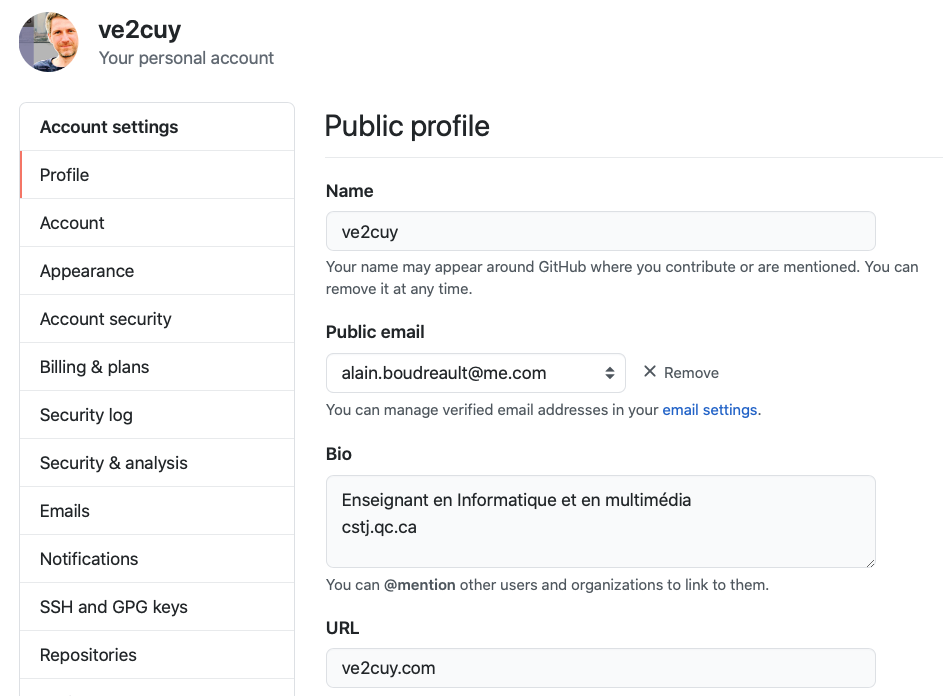
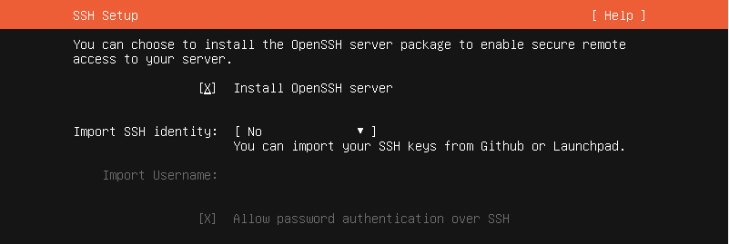
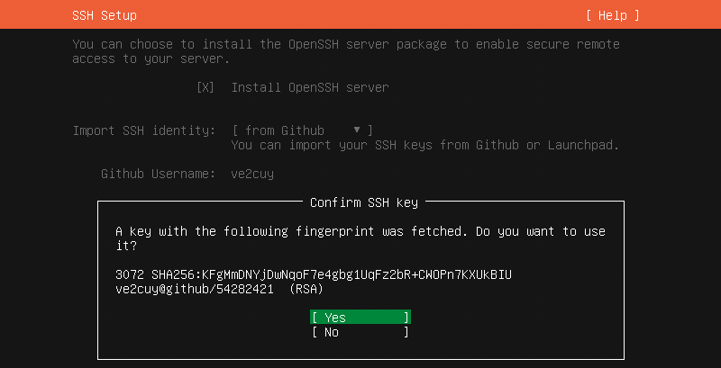
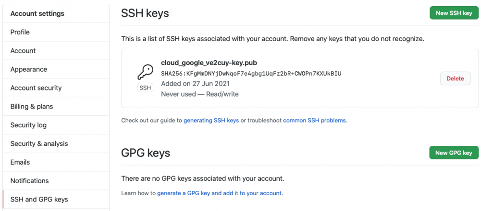
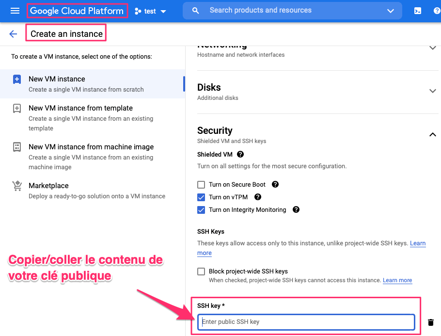

# Configuration et utilisation de ssh

*Document converti depuis [ve2cuy.com/420-3c3](https://ve2cuy.com/420-3c3/?page_id=1492) — dernière modification : 2024-03-18*

---

## Contenu


- **Accès à distance;**telnet, ssh
- **Le protocole SSH**– Historique, openSSH, openSSH-server
- **Gestion des clés**– la commande ***ssh-keygen***  
  – clés publique/privée  
  – le dossier  **~/.ssh**  
  – le fichier **~/.ssh/authorized_keys**– Installer une clé à distance: ***ssh-copy-id***

---

## 1 – Historique

[](https://www.youtube.com/watch?v=OHBdKM7s5V4)

▶️ *Vidéo :* [SSH History with Tatu Ylonen](https://www.youtube.com/watch?v=OHBdKM7s5V4)

Référence:

- <http://www.openssh.com/history.html>
- <https://www.ssh.com/academy/ssh>

---

## 2 – Gestion des clés

2.1 – Générer une paire de clés privée/publique, utilisation de la commande ssh-keygen

État du dossier de l’utilisateur avant de générer la paire:

```
# Avant de générer la paire, pas de dossier .ssh

alain@srv-test-02:~$ ssh-keygen
Generating public/private rsa key pair.
Enter file in which to save the key (/home/alain/.ssh/id_rsa): 

Created directory '/home/alain/.ssh'.
# 'Enter' sans passphrase
Enter passphrase (empty for no passphrase):
Enter same passphrase again: 

# Résultat:

Your identification has been saved in /home/alain/.ssh/id_rsa
Your public key has been saved in /home/alain/.ssh/id_rsa.pub
The key fingerprint is:
SHA256:h3cUCymb5knNH1sMlhnlSzqIaE7PNbAeAQBmTfEUBY4 alain@srv-test-02
The key's randomart image is:
+---[RSA 3072]----+
|  +++o=+. ..o=.  |
| o  .= .. ..=+   |
|    E o o* .ooo  |
|       .=*oo.oo. |
|      ++S.*.++.  |
|     + +o= oo.   |
|      . +        |
|                 |
|                 |
+----[SHA256]-----+

$ ls .ssh

alain@srv-test-02:~$ ls -l .ssh/
total 8
-rw------- 1 alain alain 2602 Sep  3 20:14 id_rsa
-rw-r--r-- 1 alain alain  571 Sep  3 20:14 id_rsa.pub

$
```

> Il est possible de générer différents formats de clés:
>
> $ ssh-keygen -t dsa | ecdsa | ecdsa-sk | ed25519 | ed25519-sk | rsa
>
> Voir: https://goteleport.com/blog/comparing-ssh-keys/

Passphrase permet de protéger la clé privée avec un mot de passe.

2.2 – Copier la clé publique vers un autre système, la commande ssh-copy-id:

```
alain@srv-test-02:~$ ssh-copy-id alain@192.168.56.100
/usr/bin/ssh-copy-id: INFO: Source of key(s) to be installed: "/home/alain/.ssh/id_rsa.pub"
The authenticity of host '192.168.56.100 (192.168.56.100)' can't be established.
ECDSA key fingerprint is SHA256:ORFd/GQxcF82h6O1BeWSJKlyE1J8VSw4SVERuFbKSA4.
Are you sure you want to continue connecting (yes/no/[fingerprint])? 

/usr/bin/ssh-copy-id: INFO: attempting to log in with the new key(s), to filter out any that are already installed
/usr/bin/ssh-copy-id: INFO: 1 key(s) remain to be installed -- if you are prompted now it is to install the new keys
alain@192.168.56.100's password: 
```

Il sera maintenant possible d’ouvrir une session ssh à partir de ce nouveau système sans avoir à fournir de mot de passe.

2.3 – Utilisation de la clé pour ouvrir une session ssh:

```
# Note: aucun mot de passe ne sera demandé:
alain@srv-test-02:~/.ssh$ ssh alain@192.168.56.100
Welcome to Ubuntu 20.04.2 LTS (GNU/Linux 5.4.0-81-generic x86_64)
```

2.4 – Désactiver d’accès ssh par mot de passe sur le serveur srv02:

```
# Fichier: /etc/ssh/sshd_config
# To disable tunneled clear text passwords, change to no here!
# --> Pour désactiver l'accès ssh par mot de passe, 
# Ajouter ou placer la ligne suivante en commentaire ou bien, remplacer le 'yes' par 'no'
#PasswordAuthentication yes
PasswordAuthentication no
# NOTE: Selon la version d’Ubuntu, il est possible que le paramètre soit dans un fichier (50-cloud-init.conf) dans le dossier sshd_confing.d.

# Ajouter ou placer la ligne suivante en commentaire ou bien, remplacer le 'yes' par 'no'
ChallengeResponseAuthentication no
```

2.5 – Redémarrer le service sshd:

```
sudo systemctl restart sshd
```

2.6 – Tester la connexion ssh avec un autre compte:

```
toto@srv-test-02:~$ ssh alain@192.168.56.100
alain@192.168.56.100: Permission denied (publickey).
toto@srv-test-02:~$ 
```

Note: srv02 n’est plus accessible en session ssh avec mot de passe. Il faut absolument posséder la clé privé pour ouvrir une connexion ssh.

---

## 3 – Le fichier *~/.ssh/config*, configuration pour ssh

```
# Au besoin, créer le dossier ~/.ssh
mkdir -p ~/.ssh && chmod 700 ~/.ssh

# Créer le fichier de configuration ssh
touch ~/.ssh/config

# Ajuster les droits d'accès (seul l'utilisateur doit y avoir accès)
chmod 600 ~/.ssh/config

# Éditer le fichier ~/.ssh/config
nano ~/.ssh/config

# ---------------------------------------
# Host nomHost

Host srv02
# Host srv*
    HostName 192.168.56.100
    User alain
    Port 22

# Param à utiliser si plus d'une clé privée:
#   IdentityFile ~/.ssh/uneCle.key

# Renseigner les options du journal de connexion (/var/log/auth.log)
# https://en.wikibooks.org/wiki/OpenSSH/Logging_and_Troubleshooting
#   LogLevel INFO

# Compresser le stream (pour les liens lents)
#   Compression yes

# ---------------------------------------

# Tester:
~$ ssh srv02

# Pour surcharger des options du fichier config:
$ ssh -o "User=root" srv02

# Pour annuler toutes les options du fichier config:
$ ssh -F /dev/null srv02

# ----------------------------------------
# Verbaliser une connexion ssh:
$ ssh -v srv02
```

Ordre de lecture des options de connexion ssh:

1. Ligne de commande
2. ~/.ssh/config
3. /etc/ssh/ssh_config

---

## 4 – Publier une clé publique sur gitHub



---

## 5 – Importation de la clé.pub lors de l’installation d’un serveur Ubuntu





Permette au compte ‘root’ un accès ssh (très mauvaise idée ?)

```
# Fichier: /etc/ssh/sshd_config
PermitRootLogin yes
```

---

## Utilisation d’une clé avec une VM de cloud.google

La clé pour être associée à une VM lors de la création de cette dernière:



## Se connecter à la VM via ssh en utilisant la clé privée

```
ssh -i ~/.ssh/id_rsa_pour_google_cloud_projet_test adresse_ip_publique_de_la_VM
```

---

[⬅️ Retour à la liste des documents](../README.md)
