# Épreuve Synthèse – 2024

*Document converti depuis [ve2cuy.com/420-3c3](https://ve2cuy.com/420-3c3/?page_id=2531) — dernière modification : 2024-12-22*

---

# Déployer des services en nuage


### Version 1.0

---

## Pondération

**50 + 20 pour le journal de bord**

## Remise

**14 décembre**, 23h05

👉 Une remise avant le 6 **décembre 23h05**, donnera 10% de plus à la note. Par exemple, 80 -> 88, 95 -> 100%

---

## Mise en situation

Dans ce projet, il faudra déployer, dans le réseau Internet, deux serveurs et des applications de type AMP.

Le point de départ étant un site WordPress, sécurisé, proposant un menu vers les différentes applications.

Voici un exemple,

[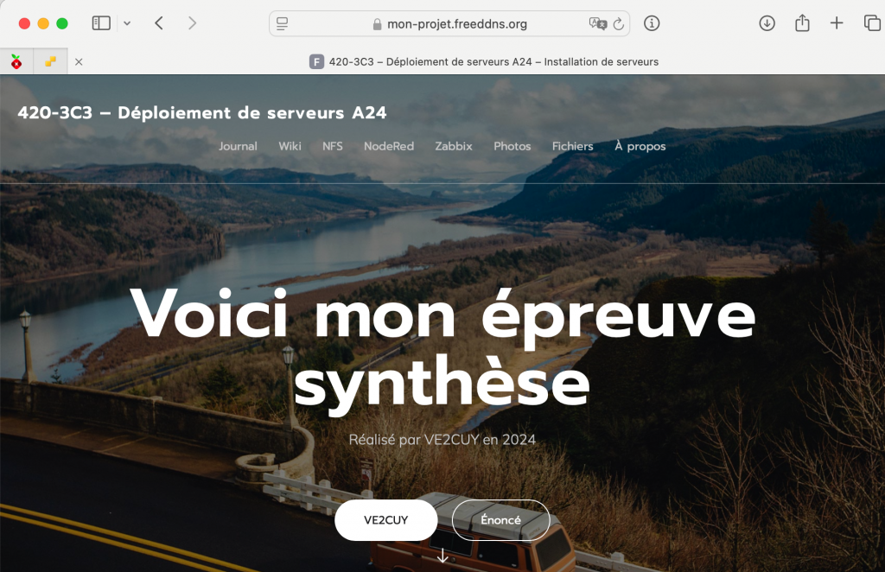](https://mon-projet.freeddns.org)

**NOTE**: L’image est un lien vers une version fonctionnelle du projet.

---

## Énoncé

Il faut créer, installer et assurer la configuration des éléments suivants;

1. Deux serveurs Linux sous [cloud.google.com](https://console.cloud.google.com), avec l’utilisateur **sysadmin**:**sudoer**
2. [WordPress](https://wordpress.org/download/) sur le site principal, accès HTTPS
3. [Zabbix](https://www.zabbix.com/download?zabbix=5.4&os_distribution=ubuntu&os_version=20.04_focal&db=mysql&ws=apache) – Surveillance d’un parc de serveurs
4. [NodeRed](https://nodered.org/docs/getting-started/raspberrypi) – Application de gestion IOT
5. [MediaWiki](https://www.mediawiki.org/wiki/MediaWiki) – Application de Wikipédia
6. [Lychee](https://lycheeorg.github.io/docs/installation.html) – Gestionnaire de photos
7. Un service [FTP](Installation-d-un-serveur-FTP.md) (anonyme)
8. Un service [NFS](NFS-Installation-et-utilisation.md) (sur le serveur-nfs)
9. Deux paires de [Clés SSH ,](Configuration-et-utilisation-de-ssh.md) une pour le compte principal, une pour le compte **sysadmin**.
10. Un journal de bord, sous wordpress, protégé par un mot de passe
11. Un nom de domaine sous [noip](https://www.noip.com) ou [dynu](https://www.dynu.com)
12. [Lynis](https://packages.cisofy.com/community/) – Outil diagnostique de serveurs Linux.

---

**NOTE**: Dans ce document, les items marqués de l’icône ‘👉’, **sont facultatifs** et donnent des points supplémentaires.

---

### ✋ ATTENTION À VOS MOTS DE PASSE, VOTRE PROJET EST DANS LE RÉSEAU INTERNET NE PAS UTILISER ‘PASSWORD‘ COMME MOT DE PASSE, POUR AUCUN SERVICE

---

## 1 – Dans un projet **cloud.google** nommé **projet4203c3**

Créer deux VM **Ubuntu 24.04:**

- **Première VM** :
  - nom: **serveur01**
  - spec: 2 CPU, 4GoRAM, disque 30 GO
  - Ajouter un utilisateur ‘**sysadmin**‘ membre du groupe ‘sudo’
    - clé ssh pour sysadmin, nommée avec votre matricule
- **Deuxième VM**:
  - nom: **serveur-nfs**
  - spec: 1 CPU, 1GO, disque 10 GO
  - Ajouter un utilisateur ‘**sysadmin**‘ membre du groupe ‘sudo’
    - Utiliser la clé ssh de sysadmin, générée pour serveur01

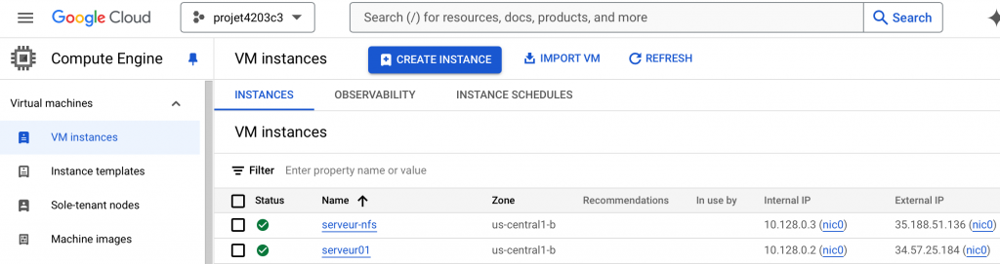

---

**Il faut générer une paire de clés de connexion ssh , nommées** ‘votreMatricule’**, pour l’utilisateur sysadmin.**

**Associer la clé publique aux deux VM. Il faut tester la clé à partir d’une session ‘ssh’.**

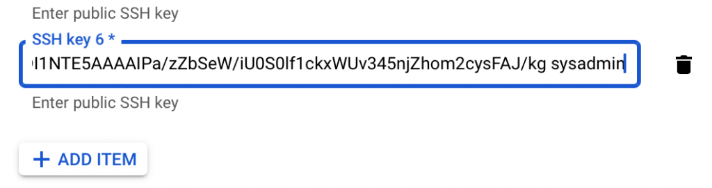

**NOTE: Il faudra m’envoyer la clé privée du compte sysadmin pour la correction du projet.**

---

## 1.1 – Serveur01


---

Sur **serveur01**, mettre en place un site web **WordPress** proposant un menu offrant les options suivantes:

- **À propos** -> Une page pour vous présenter
- **Zabbix** -> pour lancer Zabbix
  - **https**://zabbix.es-matricule.gleeze.com
- **Fichiers** -> Une page pour renseigner sur l’accès au serveur FTP
- **NFS** -> Pour afficher une page web hébergée sur un volume NFS
  - **https**://nfs.es-matricule.gleeze.com
- **NodeRed** -> pour lancer Node-Red
  - **http**://es-matricule.gleeze.com:1880
- **Journal** -> pour afficher votre journal de bord
  - URL: **https**://mon-journal.es-matricule.gleeze.com
- **Wiki** -> pour lancer MediaWiki
  - URL: **https**://wiki.es-matricule.gleeze.com
- **Photos** -> pour lancer Lychee
  - URL: **https**://photos.es-matricule.gleeze.com

✋ **NOTE IMPORTANTE ->**  Sauf pour **Node-RED**, tous les accès sont de type **[HTTPS](https://ve2cuy.com/420-21e/index.php/installation-dun-certificat-signe-sur-un-hote-virtuel-apache2/)**.

---

### 1.2 – Associer l’adresse IP externe de serveur01 à un nom de domaine.

**Vous pouvez utiliser [noip.com](http://noip.com) ou [dynu.com](https://www.dynu.com) pour les noms de domaine.**

- Pour noip.com, il faut utiliser le nom de domaine suivant: **es-votre-matricule.hopto.org**
- Pour [dynu.com](https://www.dynu.com/ControlPanel/AddDDNS), il faut utiliser le nom de domaine suivant: **es-votre-matricule.gleeze.com**

Voici un exemple sous dyne.com

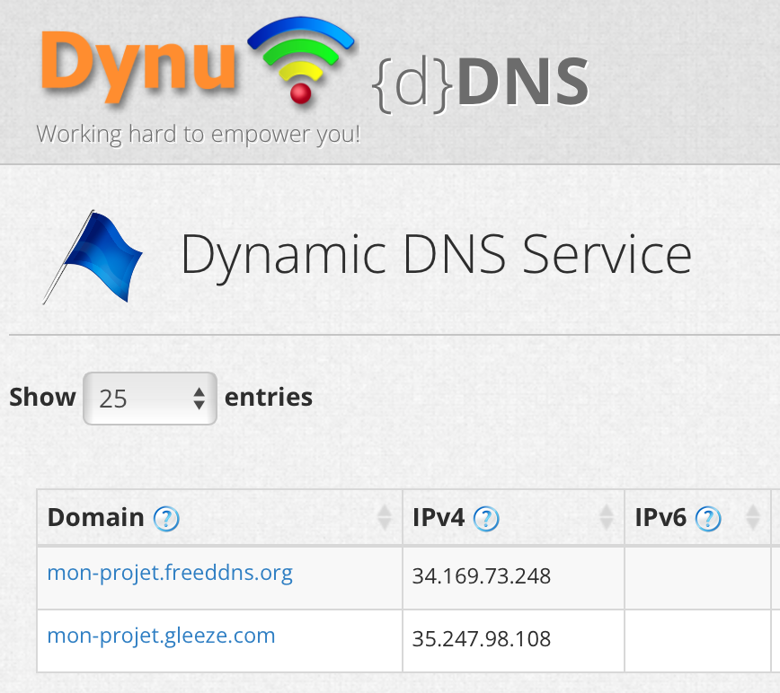

**NOTE**: Le champ IPv4 renseigne l’adresse IP externe de la VM serveur01.

---

### 1.3 – Voici comment personnaliser un menu sous WordPress (6.7) -> [lien](https://wordpress.com/support/menus/add-links-to-a-menu/)

🔗 [VideoPress Video Player](https://video.wordpress.com)

**NOTE IMPORTANTE**: Il faut utiliser le nom de domaine de votre site pour faire l’installation de WordPress et non pas inscrire l’adresse IP de la VM dans le fureteur, sans quoi, WordPress risque de ne pas fonctionner correctement.

---

## 1.4 – Serveur-nfs


Mettre en place un partage NFS, sur **serveur-nfs**, en lecture seulement, du dossier /projet-session, qui sera utilisé par un hôte virtuel web de serveur01, nommé **nfs.es-matricule.gleeze.com**, pour son contenu Web.

C-A-D:

Un requête sur **https://nfs.es-matricule.gleeze.com** doit afficher un contenu stocké sur **serveur-nfs**.

Par exemple,

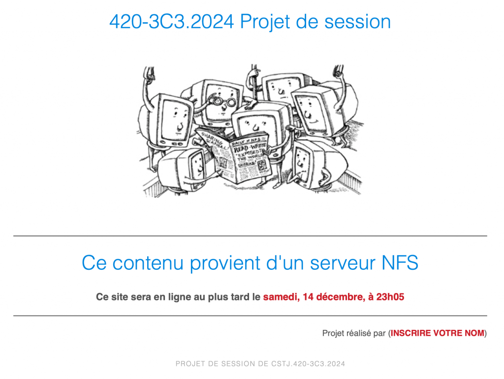

Ce contenu est stocké sur le **serveur-nfs**. Par contre, le site web est défini sur le **serveur01**.

Vous devez programmer la page d’accueil pour ce site Web.

👉 De plus, il faut renseigner une règle, dans le fichier **.htaccess** de ce site, pour une erreur **404**.

✋ **NOTE IMPORTANTE**: Il **ne faut pas** installer apache2 sur le **serveur-nfs**!

😳 **ATTENTION**: Le point 1.4 a une pondération importante dans la grille de correction.

---

### Les applications à installer (autre que WordPress) sur serveur01

- Node-RED
- Zabbix
- MediaWiki
- [Lychee](https://github.com/LycheeOrg/Lychee)
- [Lynis](https://packages.cisofy.com/community/)
- vsftpd (voir mon document [ici](Installation-d-un-serveur-FTP.md))

C’est à vous de faire les recherches nécessaires pour les étapes d’installation de **Zabbix**, **MediaWiki**, **NodeRed, Lychee et Lynis** sur le serveur de votre projet. **Documenter votre démarche dans le journal de bord**.

---

## 2 – Node-Red


L’application **Node-Red** est utilisée pour le contrôle d’objets connectés (Internet des objets – IOT).

Pour l’installation de **Node-Red**, il faut utiliser la méthode avec [le script](https://nodered.org/docs/getting-started/raspberrypi) conçu pour le Raspberry PI. Il fonctionne parfaitement sous Ubuntu 24.04.

Node-Red doit démarrer automatiquement avec le serveur.

Pensez à ouvrir le port de fonctionnement de Node-RED dans les règles du par feu du projet.

Il faut protéger l’accès à **Node-RED** avec un compte utilisateur ‘**projet123**‘ et un mot de passe ‘**123projet**‘.

✋ **ATTENTION**: Si **Node-RED** est installé par une autre méthode que celle mentionnée ici, **ce module ne sera pas corrigé**.

Pare feu Google Cloud – Rappel

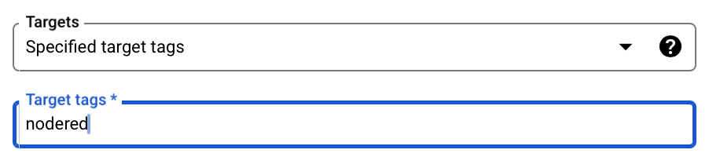

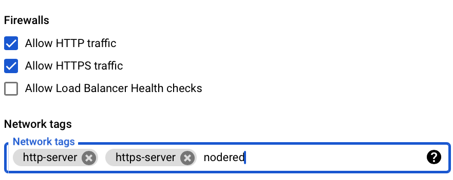

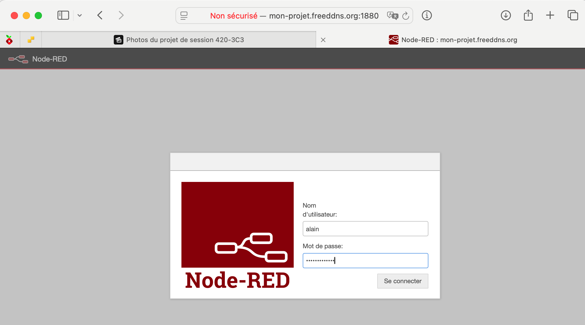

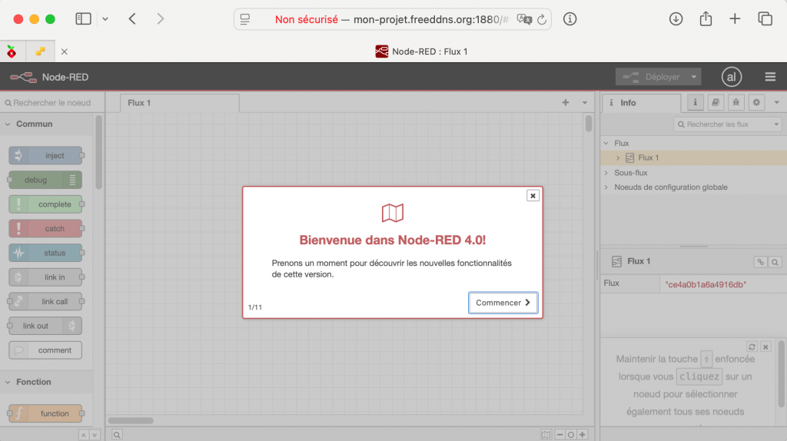

```
ATTENTION:  Ne pas installer avec le compte root ou avec la commande 'sudo'.

Erreur: 
# bash <(curl -sL ...)
  --> User votre_utilisateur not in sudoers group. Exiting

Il sera nécessaire d'ajouter votre compte utilisateur dans le groupe 'sudo' pour exécuter le script d'installation de NodeRED:
```

---

## 2.1 – 👉 Défi supplémentaire Node-RED (pour 3 points)

Sécuriser le site avec un certificat. C-A-D, n’y avoir accès qu’en utilisant le préfix https://.

Les directives sont disponibles sur le site de Node-RED à l’adresse [suivante](https://nodered.org/docs/user-guide/runtime/securing-node-red#enabling-https-access).

---

## 3 – Zabbix


Zabbix est un outil qui permet de centraliser le monitoring d’un parc de serveur.

Les instructions pour son installation sont disponibles [ici](https://www.zabbix.com/download?zabbix=7.0&os_distribution=ubuntu&os_version=24.04&components=server_frontend_agent&db=mysql&ws=apache).

---

### Voici quelques informations qui pourraient être utiles pour l’installation de Zabbix.

L’installation de Zabbix propose un bon défi. Plusieurs étapes sont requises pour mener à bien l’opération.

- Ajout d’un dépôt de paquets d’installation (wget, dpkg -i zabbix-release_latest+ubuntu24.04_all.deb)
- Installation de plusieurs paquets (apt install zabbix-server-mysql zabbix-frontend-php)
- Création manuelle, via le client mySQL, d’une BD ainsi qu’un utilisateur (create database zabbix, …)
- Importation du schéma de la BD, une très longue opération – (zcat /usr/share/zabbix-sql-scripts)
- Modification du fichier de configuration de Zabbix (nano /etc/zabbix/zabbix_server.conf)
- Redémarrage des différents services.

```
# Les instructions d'installation de Zabbix indique de passer au compte root avant de suivre la procédure avec la commande
# su -
# Il faudra avant, renseigner un mot de passe sur le compte root de serveur01:

sudo passwd root
# Entrer le nouveau mot de passe ...

# Puis, connectez-vous au compte root avec la commande suivante:
su -
```

Dans les étapes d’installation, **la commande suivante**:

```
zcat /usr/share/zabbix-sql-scripts/mysql/server.sql.gz | mysql --default-character-set=utf8mb4 -uzabbix -p zabbix
```

**prend de nombreuses minutes. Il faut être TRÈS TRÈS patient 🙃**

Si jamais la commande était interrompue avant la fin, il faudra effacer les tables dans la BD Zabbix et recommencer.

Dans le cas de l’erreur suivante:

```
ERROR 1419 (HY000) at line 2493: You do not have the SUPER privilege and binary logging is enabled (you *might* want to use the less safe log_bin_trust_function_creators variable)
```

Il faut effacer toutes les tables de la BD Zabbix et exécuter la commande suivante:

```
mysql -u root -p

SET GLOBAL log_bin_trust_function_creators = 1;

exit;

# Et refaire la commandez zcat ...
```

L’installation de Zabbix est fonctionnelle si vous obtenez l’écran suivant dans l’application:

**NOTE**: Le compte/password par défaut est ‘**Admin/zabbix**‘.

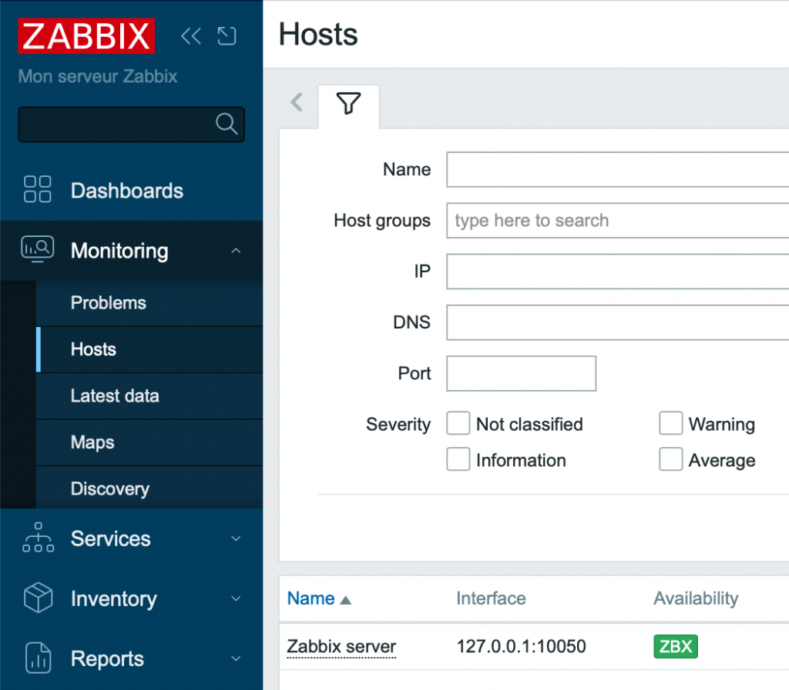

---

**NOTE**: Si ‘ZBX’ sous Availabity n’est pas **vert**, il y a probablement un problème de connexion à la BD zabbix. Si c’est le cas, il faudra vérifier le contenu des fichiers suivants:

```
 nano /etc/zabbix/web/zabbix.conf.php
 nano /etc/zabbix/zabbix_server.conf
```

Après un certain moment, Zabbix devrait présenter des graphiques d’utilisation des ressources du serveur.

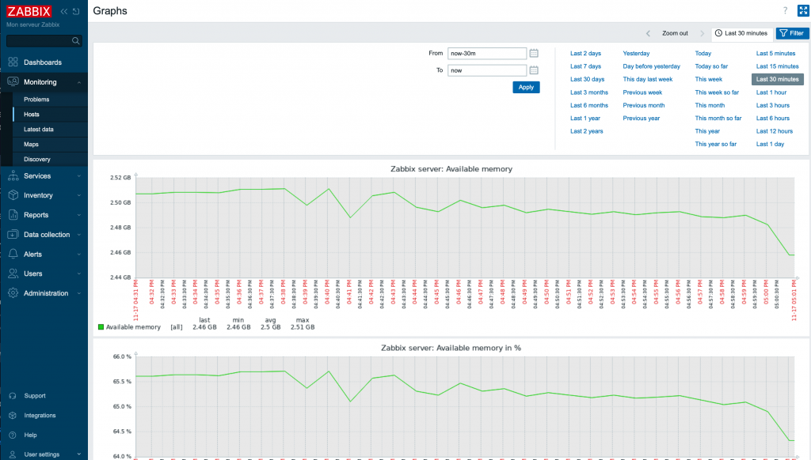

---

## 3.1 – 👉 Défi supplémentaire Zabbix (pour 4 points)

Ajouter le serveur-ftp dans le domaine de surveillance de Zabbix

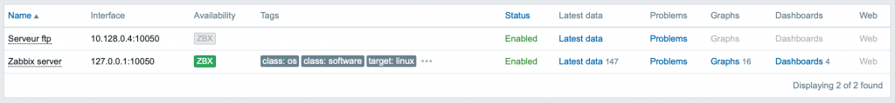

**NOTE**: Pour obtenir les points supplémentaires, il faut que le ‘LABEL’ **ZBX** du **serveur-ftp** soit en vert.

---

## 4 – MediaWiki


### MediaWiki est l’application qui fait rouler Wikipedia.

Son code source est libre de droits et il est possible de l’installer sur un serveur pour pouvoir tenir un Wiki local.

Voici le lien vers le site de [MediaWiki](https://www.mediawiki.org/wiki/MediaWiki).

Le site propose un lien vers le code source et des instructions d’installation.

**NOTE**: Il faudra créer un utilisateur/BD mySQL pour procéder à l’installation.

---

## 5 – Lychee


Lychee est une application, libre de droits, qui permet de monter une collection de photos.

L’application utilise ‘**composer**‘ et ‘**npm**‘ pour gérer ses dépendances **php** et **node.js.** Elle utilise aussi une base de données pour stocker les images et les collections. C’est base de données peut-être **MySQL** si son fichier de configuration le précise.

Voici le lien vers le dépôt Github de [Lychee](https://github.com/LycheeOrg/Lychee).

Le dépôt propose le code source et des instructions d’installation.

**NOTE**: Il faudra créer un utilisateur/BD mySQL avant de procéder à la migration avec ‘**composer**‘ .

---

### Voici quelques informations qui pourraient être utiles pour l’installation de Lychee.

```
# Obtenir le code source de Lychee
git clone lé_dépôt_de_lychee

# Installer les outils nécessaires à l'installation de Lychee 
apt install composer npm

# Suivre les instructions disponibles sur le dépôt GitHub.

### En cas d'erreur suivante:

  --> npm  "overrides":  "rollup":  Invalid comparator

  a) Trouver une solution sur le Net

  # Si vous ne trouvez pas de solution pour l'erreur, alors cette modification va permettre de terminer       l'installation:
  
# Supprimer la section suivante du fichier package.json :

,
    "overrides": {
        "rollup": "npm:@rollup/wasm-node"
    }

# Ce qui devrait permettre de:

$ npm install

added 335 packages, and audited 336 packages in 11s

63 packages are looking for funding
  run `npm fund` for details

1 high severity vulnerability

To address all issues, run:
  npm audit fix

$ npm audit fix

# Il restera à renseigner les variables dans le fichier .env

APP_URL= (L'URL défini dans le fichier .conf du site virtuiel)
DB_CONNECTION=mysql
DB_HOST= (L'adresse du serveur MySQL)
DB_PORT= (Le port de MySQL)
DB_DATABASE=
DB_USERNAME=
DB_PASSWORD=

# Et de lancer la migration avec 'composer'
```

---

## 6 – Journal de bord (20%)


Le lien ‘**Journal**‘ du site principal doit pointer sur une deuxième installation de WordPress, dans un site de type ‘hote virtuel’ et sécurisé par un certificat (certbot).

Le contenu du journal bord doit-être protégé par un mot de passe (***à fournir à l’enseignant lors de la remise***).

Il faut tenir dans ce journal de bord toutes les étapes de réalisation de l’épreuve synthèse:

- dates de réalisation,
- comptabilité des heures de réalisation par module,
- commandes effectuées,
- justification des règles de pare feu,
- recherches,
- difficultés rencontrées,
- stratégies de résolution de problèmes,
- solutions,
- codes sources,
- captures d’écrans,
- …

---

**ATTENTION**: Ne pas inscrire de mots de passe dans le journal de bord.

**NOTE IMPORTANTE**: Le journal compte pour 20% de la note finale, il doit donc être bien étoffé. Un résumé de 5 lignes ne vaudra que 1/20.

---

## 6.1 – Voici un exemple d’un journal de bord

[](https://mon-journal.mon-projet.freeddns.org)

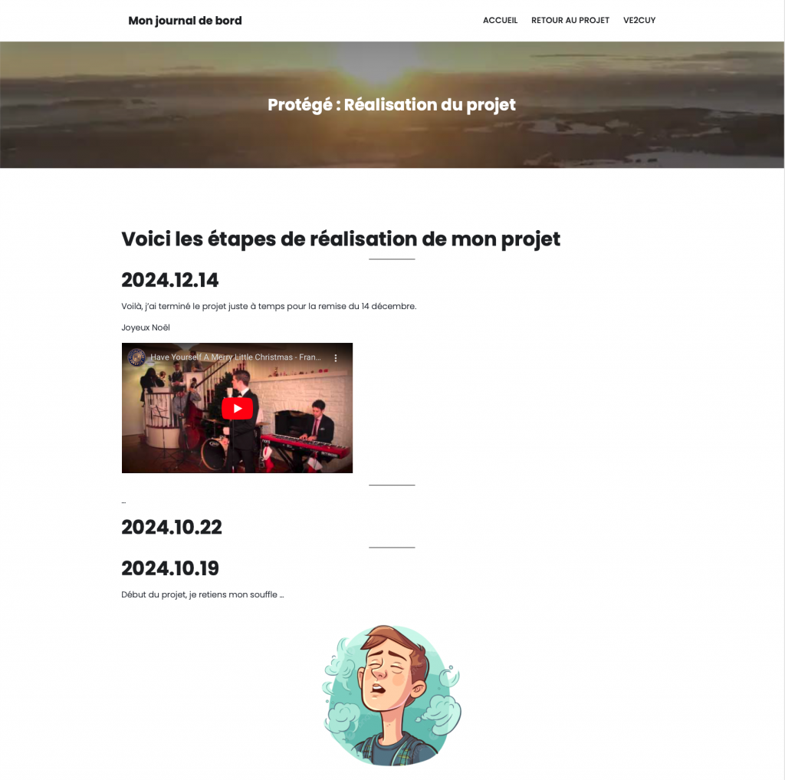

---

## 7 – Lynis


Lynis est un outil ‘open source’ d’analyse des failles de sécurité d’un serveur Linux. Le dépôt public git est disponible [ici](https://github.com/CISOfy/lynis).

Il est possible d’installer cet outil de deux façons :

- en installant un paquet: yum, [apt](https://packages.cisofy.com/community/), …
- en clonant le projet: git clone …

---

### Installer [Lynis](https://packages.cisofy.com/community/)

---

### 7.1 – Analyser les failles du système

```
$ sudo lynis audit system
```

### 7.2 – Extrait d’une analyse

```
[+] Initializing program
------------------------------------
  - Detecting OS...                                           [ DONE ]
  - Checking profiles...                                      [ DONE ]

  ---------------------------------------------------
  Program version:           3.0.6
  Operating system:          Linux
  Operating system name:     Ubuntu
  Operating system version:  20.04
  Kernel version:            5.11.0
  Hardware platform:         x86_64
  Hostname:                  projet-session-420-3c3-1
  ---------------------------------------------------
  Profiles:                  /etc/lynis/default.prf
  Log file:                  /var/log/lynis.log
  Report file:               /var/log/lynis-report.dat
  Report version:            1.0
  Plugin directory:          /usr/share/lynis/plugins
  ---------------------------------------------------
  Auditor:                   [Not Specified]
  Language:                  en
  Test category:             all
  Test group:                all
  ---------------------------------------------------
  - Program update status...                                  [ SKIPPED ]

[+] System tools
------------------------------------
  - Scanning available tools...
  - Checking system binaries...

[+] Plugins (phase 1)
------------------------------------
 Note: plugins have more extensive tests and may take several minutes to complete
  
  - Plugins enabled                                           [ NONE ]

[+] Boot and services
------------------------------------
  - Service Manager                                           [ systemd ]
  - Checking UEFI boot                                        [ ENABLED ]
  - Checking Secure Boot                                      [ DISABLED ]
  - Checking presence GRUB2                                   [ FOUND ]
    - Checking for password protection                        [ NONE ]
  - Check running services (systemctl)                        [ DONE ]
        Result: found 25 running services
  - Check enabled services at boot (systemctl)                [ DONE ]
        Result: found 54 enabled services
  - Check startup files (permissions)                         [ OK ]
  - Running 'systemd-analyze security'
        - apache2.service:                                    [ UNSAFE ]
        - apport.service:                                     [ UNSAFE ]
        - atd.service:                                        [ UNSAFE ]
        - chrony.service:                                     [ EXPOSED ]
```

---

### 7.2 – Implémenter 5 recommandations pour augmenter le ‘Hardening index’

```
Lynis security scan details:

  Hardening index : 70 [##############      ]
  Tests performed : 255
  Plugins enabled : 0
```

### 7.3 – Extrait de la liste des recommandations

```
* Consider hardening system services [BOOT-5264] 
    - Details  : Run '/usr/bin/systemd-analyze security SERVICE' for each service
      https://cisofy.com/lynis/controls/BOOT-5264/

* Default umask in /etc/login.defs could be more strict like 027 [AUTH-9328] 
      https://cisofy.com/lynis/controls/AUTH-9328/

* Purge old/removed packages (1 found) with aptitude purge or dpkg --purge command. This will cleanup old configuration files, cron jobs and startup scripts. [PKGS-7346] 
      https://cisofy.com/lynis/controls/PKGS-7346/

* Install Apache mod_evasive to guard webserver against DoS/brute force attempts [HTTP-6640] 
      https://cisofy.com/lynis/controls/HTTP-6640/

  * Install Apache modsecurity to guard webserver against web application attacks [HTTP-6643] 
      https://cisofy.com/lynis/controls/HTTP-6643/

  * Consider hardening SSH configuration [SSH-7408] 
    - Details  : AllowTcpForwarding (set YES to NO)
      https://cisofy.com/lynis/controls/SSH-7408/
```

---

## 8 – Serveur FTP

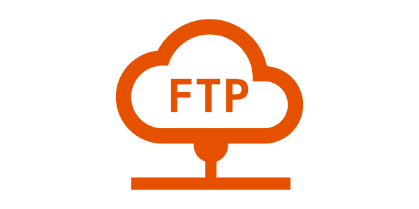

Il faut installer, sur le **serveur01**, le service **vsftpd**, offrant une connexion exclusivement de type **Anonymous**, sans mot de passe.

Un fois connecté, via par exemple FileZilla, **Anonymous** devra avoir accès, pour téléchargement, un fichier ‘lisez-moi.txt’ qui contient votre nom et matricule.

Voir ici pour un retour sur les [concepts](Installation-d-un-serveur-FTP.md).

---

## 9 – Règles du pare feu Google Cloud


Par défaut, l’accès à des ports autres que 22, 80 et 443 est bloqué par les règles de pare feu des projets cloud.google.

Cette contrainte bloquera l’accès, par exemple, au port de Node-RED:1880.

Il est possible d’ajouter des règles supplémentaires au niveau du projet ou d’un VM avec les TAGs.

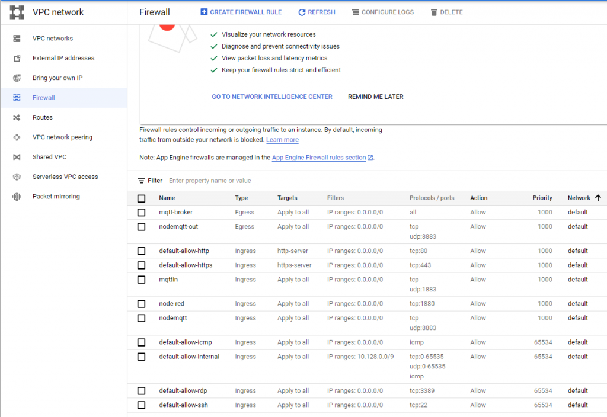

---

## 10 – **Directives de** remise

Le projet est à livrer au plus tard le samedi, **14 décembre** 2024, avant **23h05**.

Renseigner un fichier texte avec les informations suivantes:

1. L’URL de votre projet
2. Les accès (user:psw) aux services;
   - mysql (compte root)
   - wordpress (les deux)
   - Zabbix (Info dans ce document)
   - Node-RED (Info dans ce document)
   - Lychee
   - MediaWiki
3. La clé privée du compte **sysadmin**. Le fichier doit porter votre matricule comme nom.
4. la commande ssh d’accès au serveur. Par exemple;
   - **ssh -i ~/.ssh/unecle unCompte@nomDomaineDuServeur**
5. La liste des cinq (5) recommandations implémentés suite aux recommandations de **Lynis**
   - Une capture du **Hardening index** avant l’implémentation
   - Une capture du **Hardening inde**x après l’implémentation

**À confirmer ->** Déposer le fichier dans LÉA

---

## 11 – Grille de correction (en rédaction)

| Section | Description | Pondération | Points |
| --- | --- | --- | --- |
| Les VM |  | **5** |  |
|  | Respect des spécifications |  | 2 |
|  | Clé ssh pour sysadmin |  | 2 |
|  | Utilisation d’un DNS |  | 1 |
| WordPress principal |  | **5** |  |
|  | HTTPS – Chiffrement TLS |  | 0,5 |
|  | Page à propos |  | 1,5 |
|  | Éléments du menu |  | 2 |
|  | Page d’explications d’accès à ftp |  | 1 |
| WordPress journal |  | **2** |  |
|  | HTTPS – Chiffrement TLS |  | 0,5 |
|  | URL: https://mon-journal.votre-domaine.com |  | 0,5 |
|  | Accès à l’accueil sans mot de passe |  | 1 |
| Zabbix |  | **6** |  |
|  | Fonctionnalité |  | 6 |
| NFS |  | **6** |  |
|  | Mise en place du service sur serveur-nfs |  | 1 |
|  | Montage automatique sur serveur01 (fstab) |  | 0,5 |
|  | Chiffrement tls, url: nfs.votre-domaine.com |  | 0,5 |
|  | Gestion du 404 avec .htaccess |  | 1 |
|  | index.html original |  | 1 |
|  | Fonctionnalité |  | 2 |
| NodeRED |  | **5** |  |
|  | Non respect de la méthode d’installation | -5 |  |
|  | Fonctionnalité, démarrage automatique du service |  | 3 |
|  | Fenêtre de login |  | 1 |
|  | Règle de pare feu |  | 1 |
| Lychee |  | **6** |  |
|  | HTTPS – Chiffrement TLS |  | 0,5 |
|  | URL: https://photos.votre-domaine.com |  | 0,5 |
|  | Fonctionnalité |  | 4 |
|  | Contenu – Ajouter quelques photos |  | 1 |
| FTP |  | **4** |  |
|  | Accès anonyme en lecture seule |  | 1 |
|  | Accès à ‘lisez-moi.txt’ et son contenu |  | 1 |
|  | Fonctionnalité |  | 2 |
| MediaWiki |  | **5** |  |
|  | HTTPS – Chiffrement TLS |  | 0,5 |
|  | URL: https://wiki.votre-domaine.com |  | 0,5 |
|  | Fonctionnalité |  | 4 |
| Lynis |  | 5 |  |
|  | Fonctionnalité |  | 1 |
|  | Implémentation de 5 recommandations Liste dans la remise |  | 4 |
| Fichiers de remise |  | **1** | 1 |
| Journal |  | **20** |  |
|  | Protection par mot de passe |  | 2 |
|  | Qualité du contenu |  | 18 |
|  |  |  |  |
| --- | --- | --- | --- |
|  | Total | /70 | /70 |
|  | Défi supplémentaire Node-RED | **3** |  |
|  | Défi supplémentaire Zabbix | **4** |  |
|  | Remise avant le 6 décembre 23h05 | **+10%** |  |
|  | Grand Total | 77/70 | /70 |

**NOTE**: Les défis supplémentaires permettent d’avoir un résultat supérieur à 70.

---

## 12 – Projets des étudiant(e)s

|  |  |  |
| --- | --- | --- |
| Matricule | Nom | URL du projet |
| ve2cuy | Solution du prof (présentement hors ligne) | [mon-projet.freeddns.org](http://mon-projet.freeddns.org) |
| 1868687 | 🎄- Beauchamp, Antoine | [es-1868687.gleeze.com](http://es-1868687.gleeze.com) |
| 1191869 | 🎄- Bebnowski-Lavoie, Guillaume | [es-1191869.gleeze.com](http://es-1191869.gleeze.com) |
| 6227790 | 🎄- Buttet-Allard, Alexandre | [es-6227790.gleeze.com](http://es-6227790.gleeze.com) |
| 6223355 | 🎄 – Cliche, Thomas | [es-6223355.hopto.org](http://es-6223355.hopto.org) |
| 1938852 | 🎄- Fallu, Esteban | [es-1938852.gleeze.com](http://es-1938852.gleeze.com) |
| 2386023 | 🎄- Gauthier, Étienne | [es-2386023.gleeze.com](http://es-2386023.gleeze.com) |
| 2393320 | 🎄- Giang, Ronn | [es-2393320.hopto.org](http://es-2393320.hopto.org) |
| 6226374 | 🎄- Gosselin-Beaudoin, Xavier | [es-6226374.gleeze.com](http://es-6226374.gleeze.com) |
| 2071623 | 🎄- Grenier, Anthony | [es-2071623.gleeze.com](http://es-2071623.gleeze.com) |
| 2375397 | 🎄- Kemp, Adam | [es-2375397.hopto.org](http://es-2375397.hopto.org) |
| 1712268 | 🎄- Lajeunesse, Layah | [es-1712268.hopto.org](http://es-1712268.hopto.org) |
| 2383950 | Lalonde, Félix | [es-2383950.ddnsgeek.com](https://es-2383950.ddnsgeek.com) |
| 2176750 | 🎄- Lamonde, Louis | [es-2176750.gleeze.com](http://es-2176750.gleeze.com) |
| 6224915 | 🎄- Lamoureux, Samaël | [es-6224915.gleeze.com](http://es-6224915.gleeze.com) |
| 1958267 | ☔️🎄 – Lopera Cuesta, Juan-Manuel | [es-1958267.gleeze.com](http://es-1958267.gleeze.com) |
| 2156548 | 🎄- Mechmachi, Achraf | [es-2156548.hopto.org](http://es-2156548.hopto.org) |
| 2246747 | 🎄- Mesiti, William | [es-2246747.gleeze.com](http://es-2246747.gleeze.com) |
| 2388879 | 🎄- Messavussu, Claude Junior | [es-2388879.hopto.org](http://es-2388879.hopto.org) |
| 1701738 | ☔️🎄 – Mirville, Lens Emmanuel | [es-1701738.gleeze.com](http://es-1701738.gleeze.com) |
| 6239687 | 🎄- Pierre Patrick Tamo | [es-6239687.gleeze.com](http://es-6239687.gleeze.com) |
| 2077933 | 🎄- Oubad, Adam | [es-2077933.gleeze.com](http://es-2077933.gleeze.com/) |
| 1533177 | 🎄- Roy, Charles-Étienne | [es-1533177.gleeze.com](http://es-1533177.gleeze.com) |
| 6238992 | 🎄- Tizanou Ndé, James Béranger | [es-6238992.gleeze.com](http://es-6238992.gleeze.com) |
| 2369089 | 🎄 – Vidal, Jolan | [es-2369089.hopto.org](http://es-2369089.hopto.org) |
| 6181512 | 🎄- Zakhour, Georges | [es-6181512.gleeze.com](http://es-6181512.gleeze.com) |
|  |  |  |

☔️ – Projet non accessible, 🗝️ clé ssh invalide, 🎄- Corrigé


---

###### FIN DU DOCUMENT

---

[⬅️ Retour à la liste des documents](../README.md)
