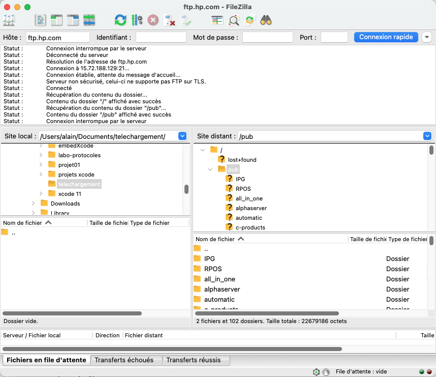
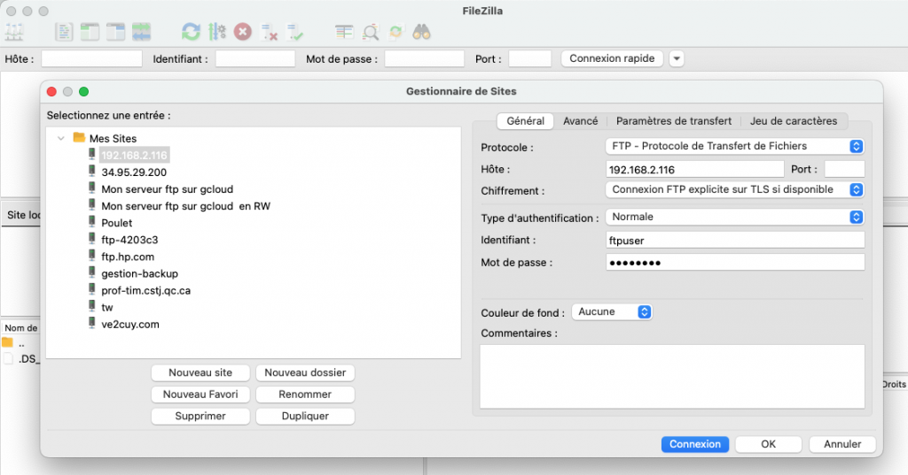
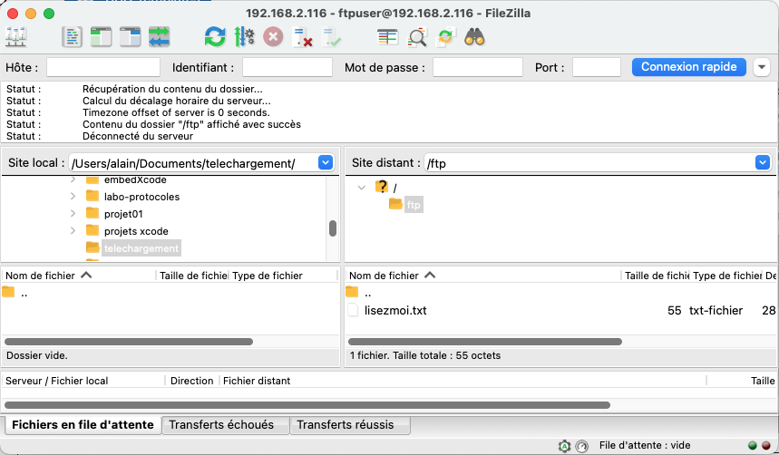
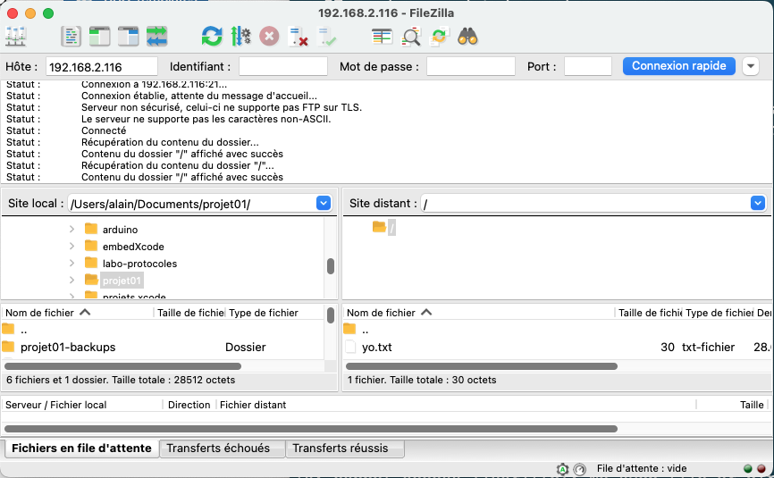
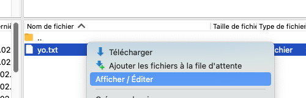
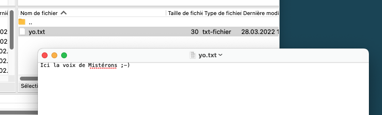

# Installation d’un serveur FTP sous Linux

*Document converti depuis [ve2cuy.com/420-3c3](https://ve2cuy.com/420-3c3/?page_id=1460) — dernière modification : 2024-10-23*

---


---

## 1 – Protocole FTP

### Définition

(*1) **File Transfer Protocol** (protocole de transfert de fichier), ou **FTP**, est un protocole de communication destiné au partage de fichiers sur un réseau **[TCP/IP](https://fr.wikipedia.org/wiki/Suite_des_protocoles_Internet)**. Il permet, depuis un ordinateur, de copier des fichiers vers un autre ordinateur du réseau, ou encore de supprimer ou de modifier des fichiers sur cet ordinateur.

**Ce mécanisme de copie est souvent utilisé pour alimenter un site web hébergé chez un tiers** **et pour mettre à jour les micrologociels (firmware) d’équipements tel que téléphones IP, commutateurs, routeurs, …**

La variante de **FTP** protégée par les protocoles **SSL** ou **[TLS](https://fr.wikipedia.org/wiki/Transport_Layer_Security)** (SSL étant le prédécesseur de TLS) s’appelle **[FTPS](https://fr.wikipedia.org/wiki/File_Transfer_Protocol_Secure)**.

**FTP** obéit à un modèle client-serveur, c’est-à-dire qu’une des deux parties, le client, envoie des requêtes auxquelles réagit l’autre, appelé serveur. En pratique, le serveur est un ordinateur sur lequel fonctionne un logiciel lui-même appelé serveur **FTP**, qui rend publique une arborescence de fichiers similaire à un système de fichiers **UNIX**. Pour accéder à un serveur **FTP**, on utilise un logiciel client **FTP** (possédant une interface graphique ou en ligne de commande).

**FTP**, qui appartient à la couche application du modèle **[OSI](https://fr.wikipedia.org/wiki/Modèle_OSI)** et du modèle **[ARPA](https://fr.wikipedia.org/wiki/ARPANET)**, utilise une connexion **[TCP](https://fr.wikipedia.org/wiki/Transmission_Control_Protocol)**.  
  
Par convention, deux ports sont attribués (well known ports) pour les connexions FTP : le port **21** pour les commandes et le port **20** pour les données. Pour le **FTPS** dit implicite, le port conventionnel est le **990**.  
  
Ce protocole peut fonctionner avec **[IPv4](https://fr.wikipedia.org/wiki/IPv4)** et **[IPv6](https://fr.wikipedia.org/wiki/IPv6)**.

(*1) [Référence wikipedia](https://fr.wikipedia.org/wiki/File_Transfer_Protocol)

---

## 2 – Client ftp – FileZilla

Un des clients de connexion populaire est l’application FileZilla disponible ici:  
[FileZilla](https://filezilla-project.org)

Il existe deux types de connexions **ftp**;

1. en accès ‘**anonymous**‘
2. avec un **nom de login**.

**Dans ce laboratoire**, nous apprendrons à effectuer la configuration de ces **deux types de connexion**.

---

**Action 2.1** – Télécharger et installer [FileZilla](https://filezilla-project.org) sur votre poste de travail.

**Voici quelques serveurs ftp à tester en mode ‘anonymous’ avecFileZilla.**

- www1.club.cc.cmu.edu
- ftp.keldysh.ru

**Action 2.2** – Ouvrir une session ftp sur le serveur  [ftp.hp.com](ftp://ftp.hp.com)



---

## 3 – Serveurs d’index ftp

Voici une liste de moteurs de recherches spécialisés pour la localisation de contenu disponible via le protocole ftp:

- <http://archie.icm.edu.pl>
- <http://www.freewareweb.com>
- <http://www.filesearching.com>
- [searchfps.net](https://www.searchftps.net)

**Action 3.1** – Utiliser un de ces moteurs de recherche pour localiser des documents de type .cpp

---

## 4 – Installation du serveur ftp ‘vsftpd’ sous Linux

**Étape 4.1** – Mise à jour de l’index des applications et installation de ‘vsftpd’

```
sudo apt update && sudo apt install vsftpd

---

Les NOUVEAUX paquets suivants seront installés :
  vsftpd
0 mis à jour, 1 nouvellement installés, 0 à enlever et 37 non mis à jour.
Il est nécessaire de prendre 115 ko dans les archives.
Après cette opération, 338 ko d'espace disque supplémentaires seront utilisés.
Réception de :1 http://us.archive.ubuntu.com/ubuntu focal/main amd64 vsftpd amd64 3.0.3-12 [115 kB]
115 ko réceptionnés en 0s (459 ko/s)
Préconfiguration des paquets...
Sélection du paquet vsftpd précédemment désélectionné.
(Lecture de la base de données... 194261 fichiers et répertoires déjà installés.)
Préparation du dépaquetage de .../vsftpd_3.0.3-12_amd64.deb ...
Dépaquetage de vsftpd (3.0.3-12) ...
Paramétrage de vsftpd (3.0.3-12) ...
Created symlink /etc/systemd/system/multi-user.target.wants/vsftpd.service → /lib/systemd/system/vsftpd.service.
vsftpd.conf:1: Line references path below legacy directory /var/run/, updating /var/run/vsftpd/empty → /run/vsftpd/empty; please update the tmpfiles.d/ drop-in file accordingly.
Traitement des actions différées (« triggers ») pour man-db (2.9.1-1) ...
Traitement des actions différées (« triggers ») pour systemd (245.4-4ubuntu3.3) ...
```

**Étape 4.2** –  Vérification de l’état du nouveau service:

```
$ systemctl status vsftpd
# Ou
$ sudo service vsftpd status

---

etudiant@etudiant-VirtualBox:~/formatif$ cd ..
etudiant@etudiant-VirtualBox:~$ sudo service vsftpd status
● vsftpd.service - vsftpd FTP server
     Loaded: loaded (/lib/systemd/system/vsftpd.service; enabled; vendor preset: enabled)
     Active: active (running) since Tue 2020-12-08 13:51:29 EST; 5min ago
   Main PID: 26881 (vsftpd)
      Tasks: 1 (limit: 2318)
     Memory: 484.0K
     CGroup: /system.slice/vsftpd.service
             └─26881 /usr/sbin/vsftpd /etc/vsftpd.conf
Dec 08 13:51:29 etudiant-VirtualBox systemd[1]: Starting vsftpd FTP server...
Dec 08 13:51:29 etudiant-VirtualBox systemd[1]: Started vsftpd FTP server.
```

**Étape 4.3** – Création d’un compte ‘ftp’

```
sudo adduser ftpuser
# Password = password ?
```

**Étape 4.4** – Au besoin, bloquer l’accès ‘ssh’ à l’utilisateur ftp.

```
$ sudo nano /etc/ssh/sshd_config
# Ajouter ceci dans le fichier /etc/ssh/sshd_config:
DenyUsers ftpuser
# Redémarrer le 'deamon' sshd
$ sudo service sshd restart
```

**Étape 4.5** – Créer un dossier de connexion pour l’utilisateur ‘ftpuser’, par exemple ‘/ftp’

```
sudo mkdir /ftp
```

**Étape 4.6** – Modifier le propriétaire du dossier /ftp

```
sudo chown ftpuser:ftpuser /ftp
```

**Étape 4.7** – Modifier le dossier ‘home’ de l’utilisateur ‘ftpuser’ pour /ftp

```
# Méthode 1 - Éditer le fichier /etc/passwd
ftpuser:x:1001:1001:,,,:/ftp:/bin/bash

# Méthode 2 - Utiliser la commande usermod
$ sudo usermod -d /ftp ftpuser
```

**Étape 4.**8 – Ajouter un fichier ‘lisezmoi.txt’ dans le dossier /ftp

```
$ sudo nano /ftp/lisezmoi.txt

Ceci est le dossier de téléchargement du serveur FTP
```

---

**Étape 5** – Modifier le fichier ‘vsftpd.conf’

```
sudo nano /etc/vsftpd.conf
# Uncomment this to enable any form of FTP write command.
# L'option suivante va permettre le téléversement de fichiers
write_enable=YES
```

**Étape 5.1** – Redémarrer le service

```
sudo service vsftpd restart
```

**Étape 5.2** – Établir une connexion au serveur FTP




**Action 5.3** – Effectuer un téléversement ?

---

## 6 – **Laboratoire**

Ajouter un compte **ftpweb** avec comme dossier ‘home’ = **/var/www/html** et permettre le **téléversement** FTP de fichier vers ce dossier.

**NOTE**: Au besoin, installer apache2 avant de réaliser le laboratoire.

---

## 7 – Connexion anonyme sur un serveur FTP

**Action 7.1** – Préparation de l’environnement de téléchargement

```
# 1 - Créer un répertoire pour le téléchargement FTP anonyme
sudo mkdir -p /var/ftp/pub

# 2 - Renseigner le propriétaire et le groupe à 'nobody' et 'nogroup'
sudo chown nobody:nogroup /var/ftp/pub

# 3 - Renseigner un fichier de départ dans le dossier de téléchargement
# Note: la commande 'tee' permet de créer un fichier à partir de la redirection '|'.  
#  Il n'est pas possible de faire 'sudo echo ... > /var/ftp/pub/test.txt' 
echo "Ici la voix de Mistérons ;-)" | sudo tee /var/ftp/pub/yo.txt
```

**Action 7.2** – Réaliser la configuration de l’accès FTP anonyme

```
sudo nano /etc/vsftpd.conf

# --- Début de la configuration anonyme

# 1 - Permettre l'accès anonyme
# Allow anonymous FTP? (Disabled by default).
# Note: Remplacer 'NO' par 'YES'
anonymous_enable=YES

# 2 - Renseigner le dossier de téléchargement FTP anonyme
anon_root=/var/ftp/pub

# Pas de mot de passe en connexion anonyme
no_anon_password=YES

# Show the user and group as ftp:ftp, regardless of the owner.
hide_ids=YES

# Limit the range of ports that can be used for passive FTP
pasv_min_port=40000
pasv_max_port=50000

# --- Fin de la configuration anonyme
```

**Action 7.3** – Redémarrer le service **vsftpd**

```
sudo systemctl restart vsftpd

# Note: Il est aussi possible de redémarrer le service de cette façon:
sudo service vsftpd restart
```

**Action 7.4** – Tester l’accès anonyme





---

Référence [vsftpd](https://doc.ubuntu-fr.org/vsftpd) pour Ubuntu

---

###### Document préparé par Alain Boudreault – révision 2024.10.23

---

[⬅️ Retour à la liste des documents](../README.md)
