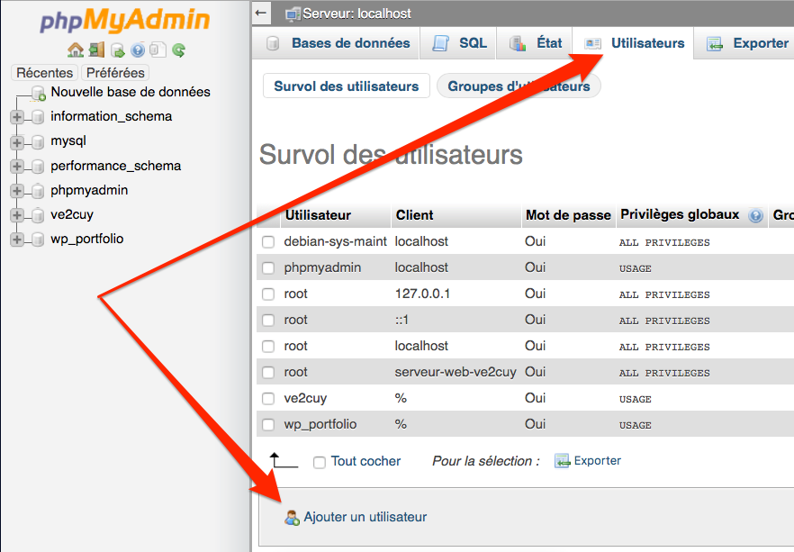
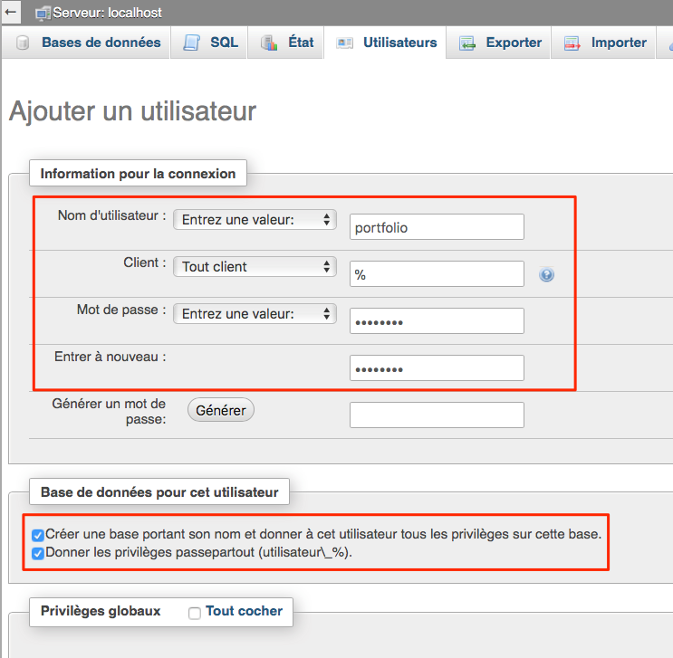
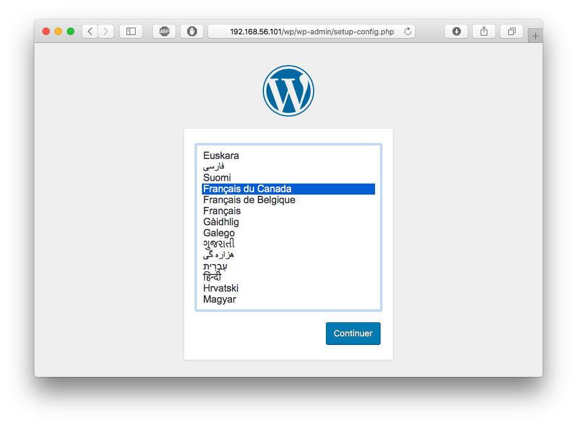
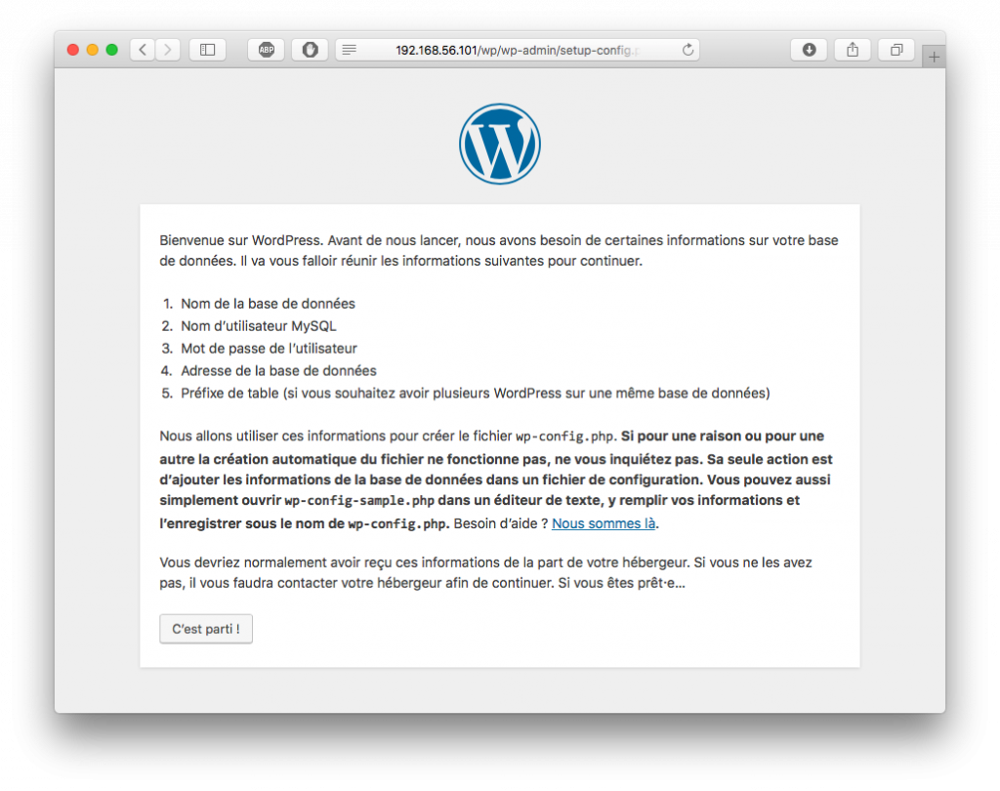
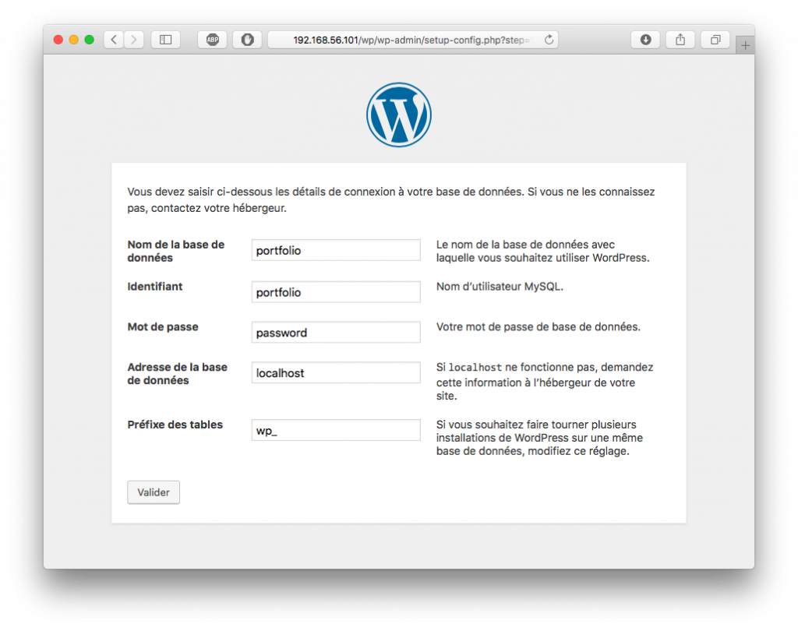
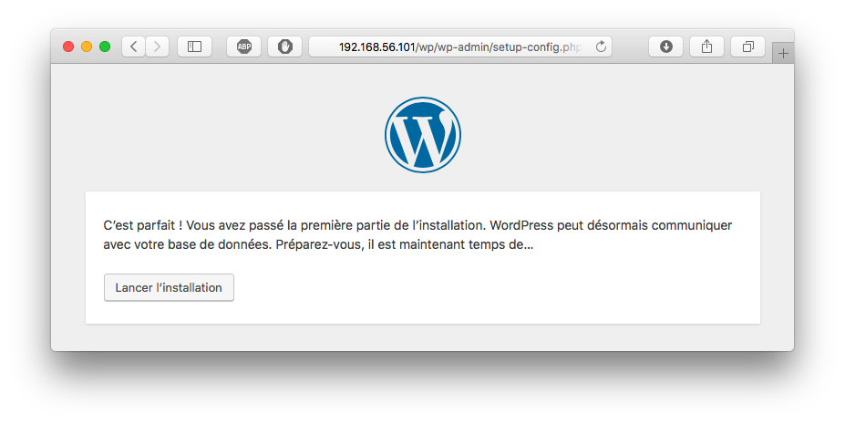
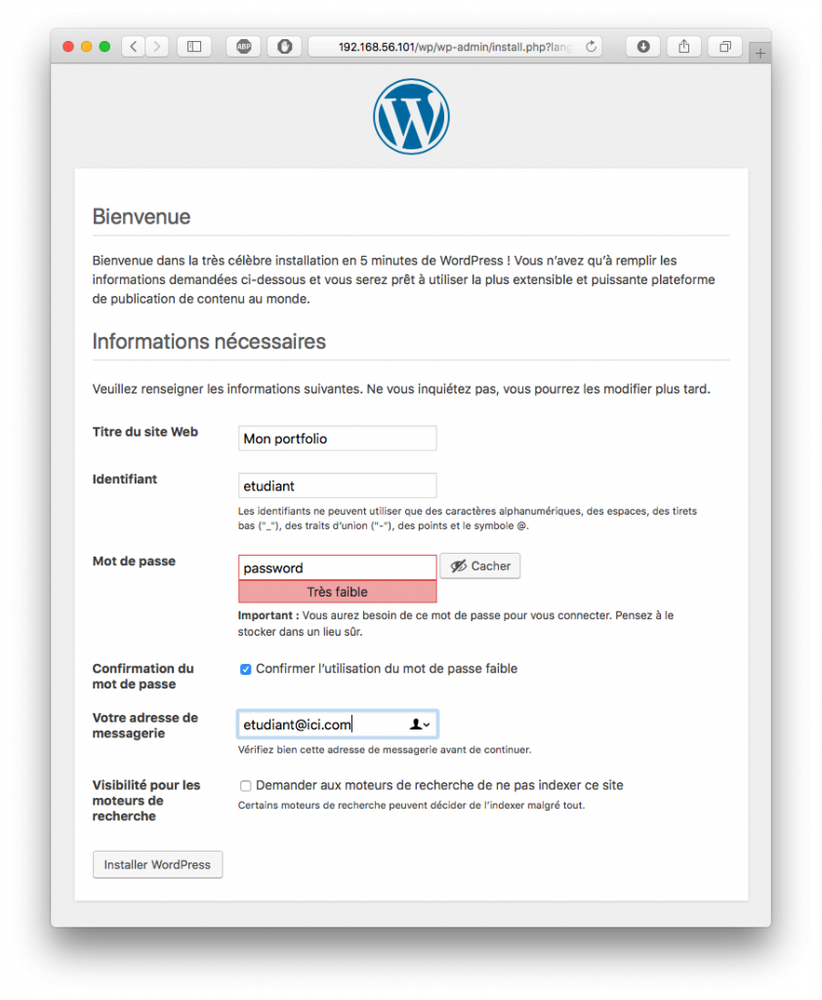
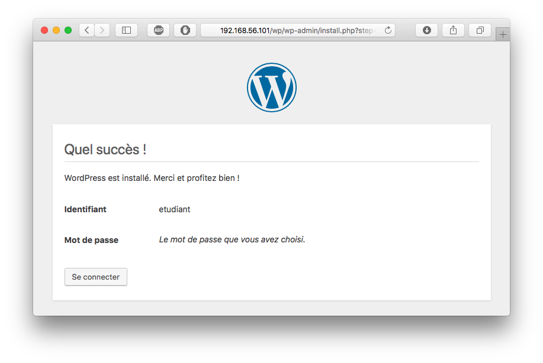
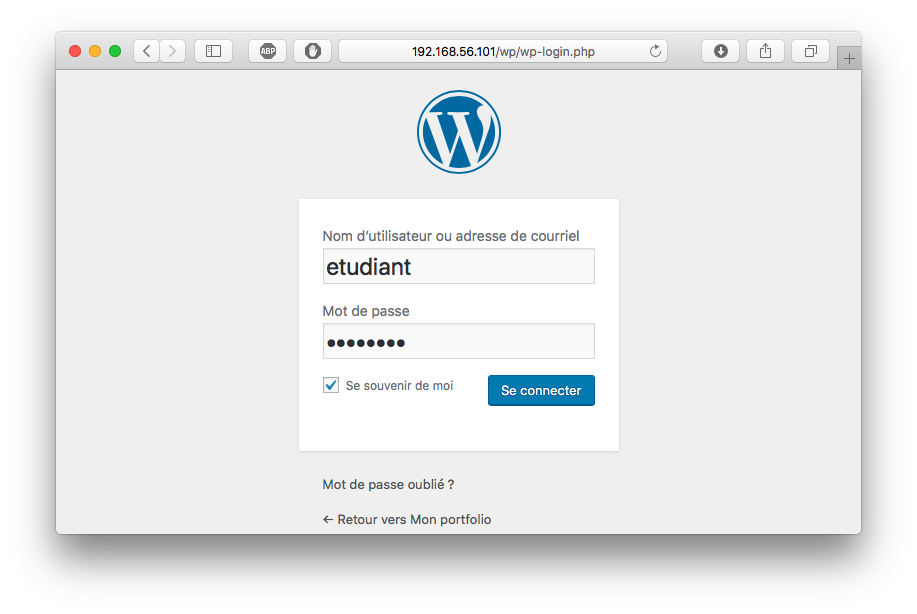
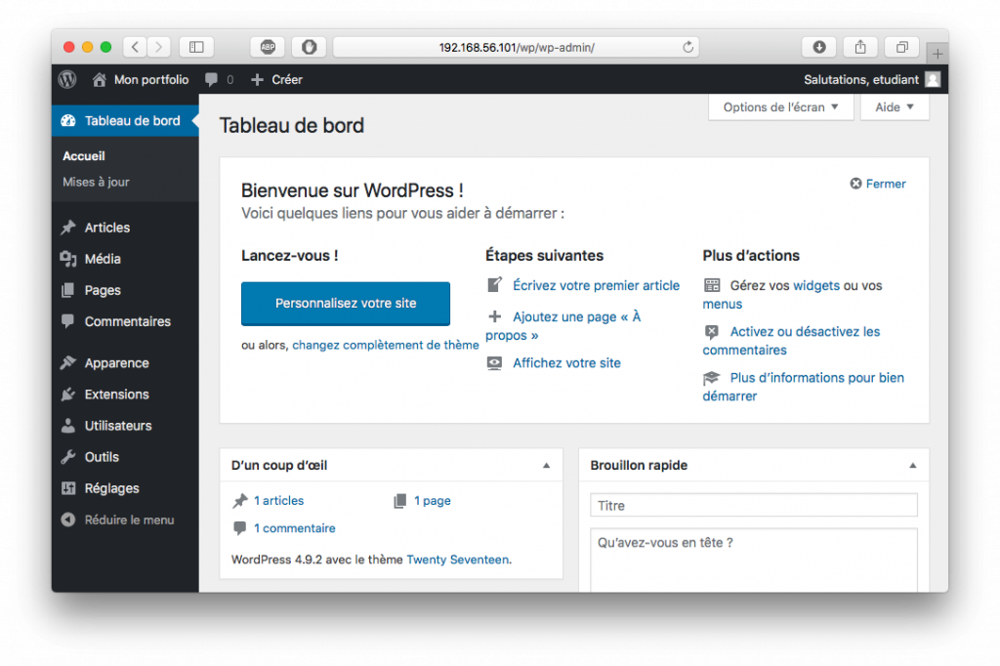

# Installer WordPress

*Document converti depuis [ve2cuy.com/420-3c3](https://ve2cuy.com/420-3c3/?page_id=926) — dernière modification : 2024-10-02*

---

# Contenu


- Installer WordPress sur un serveur LAMP.
- Installer les modules php requis.
- Créer un utilisateur et une BD pour la gestion de WP.
- Télécharger la dernière version de WordPress.
- Décompresser l’archive.
- Déplacer WordPress vers le dossier racine du serveur Web.
- Renseigner les droits d’accès à l’application.
- Lancer le programme de configuration de WordPress.
- Se connecter au site WP nouvellement crée.
- Labo

---

# Objectif général

À la suite de cet atelier, le participant devrait être en mesure d’installer et d’effectuer la configuration de base  – sur un serveur LAMP –  de l’application WordPress.

# Prérequis

- Avoir complété l’atelier ‘[Pile AMP](Ajout-d-une-pile-AMP.md)‘

---

**Mise en contexte**

**Action 1** – Installer les modules php requis par WordPress

```
sudo apt-get install php7.0 php7.0-mysql libapache2-mod-php7.0 php7.0-cli php7.0-cgi php7.0-gd
```

**Note**: Selon la distribution Linux, ces modules pourraient déjà être installés.

**Action 2** – Créer, avec phpmyadmin, un utilisateur et une BD pour les contenus et la gestion de WordPress



**Note**: Si **phpMyAdmin** n’est pas disponible, il est possible d’utiliser la ligne de commande pour créer la BD WP:

> ```
> $ mysql -u root -p
> CREATE USER 'portfolio'@'localhost' IDENTIFIED BY 'password';
> CREATE DATABASE portfolio;
> ​GRANT ALL PRIVILEGES ON portfolio.* TO 'portfolio'@'localhost' IDENTIFIED BY 'password';
> ​FLUSH PRIVILEGES;
> ​EXIT;
> ```

Ou

> ```
> CREATE USER 'wp'@'%' IDENTIFIED WITH caching_sha2_password BY '***';GRANT USAGE ON *.* TO 'wp'@'%';ALTER USER 'wp'@'%' REQUIRE NONE WITH MAX_QUERIES_PER_HOUR 0 MAX_CONNECTIONS_PER_HOUR 0 MAX_UPDATES_PER_HOUR 0 MAX_USER_CONNECTIONS 0;CREATE DATABASE IF NOT EXISTS `wp`;GRANT ALL PRIVILEGES ON `wp`.* TO 'wp'@'%';GRANT ALL PRIVILEGES ON `wp\_%`.* TO 'wp'@'%';
> ```

**Action 2.1** – Renseigner les propriétés du nouvel utilisateur:

- nom: **portfolio**
- m-d-p: **password**
- cocher: **Créer une BD portant son nom**
- cocher: **Donner les privilèges** [passepartout](https://www.youtube.com/watch?v=figqUaxP-nQ)



**Action 3** – À partir de la console de commandes, obtenir du web, la version la plus récente de WordPress:

```
wget -c http://wordpress.org/latest.tar.gz
```

**Ou une version précise: [wp-releases](https://wordpress.org/download/releases/)**

**Action 4** – Décompresser l’archive de WordPress:

```
tar -xzvf latest.tar.gz
```

**Action 5** – Déplacer WordPress vers le dossier racine du serveur Apache:

```
sudo mv wordpress /var/www/html
```

**Action 6** – Changer le propriétaire des fichiers de l’application WordPress pour www-data:

```
sudo chown -R www-data:www-data /var/www/html/wordpress
```

**Action 7** (**Facultatif)** – Sécuriser l’accès aux fichiers de l’application WordPress:

```
​sudo chmod o-r /var/www/html/wordpress -R
```

---

### Effectuer la configuration de départ du nouveau site WordPress

**Action 8** – Suivre l’URL suivante dans un fureteur:

```
http://192.168.56.101/wordpress

// Note: Il faut utiliser l'adresse IP de votre serveur.
```

**Action 9** – Sélectionner la langue du site WP



**Action 10** – Suivre les étapes à l’écran



**Action 11** – Renseigner les paramètres de configuration



**Action 12** – Valider le tout!



**Action 13** – Renseigner le titre du site et le compte de l’administrateur





**Action 14** – Tester le login sous le compte de l’administrateur du site:

 

**Voilà, notre site WordPress est installé et fonctionnel**

**Nous apprendrons à le gérer dans un prochain module.**

---

### Références

https://www.digitalocean.com/community/tutorials/how-to-install-wordpress-on-ubuntu-20-04-with-a-lamp-stack-fr

** https://help.ubuntu.com/lts/serverguide/wordpress.html

**Note**:  Pour Ubuntu 22.04 voir [ici](https://www.digitalocean.com/community/tutorials/how-to-install-wordpress-on-ubuntu-22-04-with-a-lamp-stack).

---

[⬅️ Retour à la liste des documents](../README.md)
