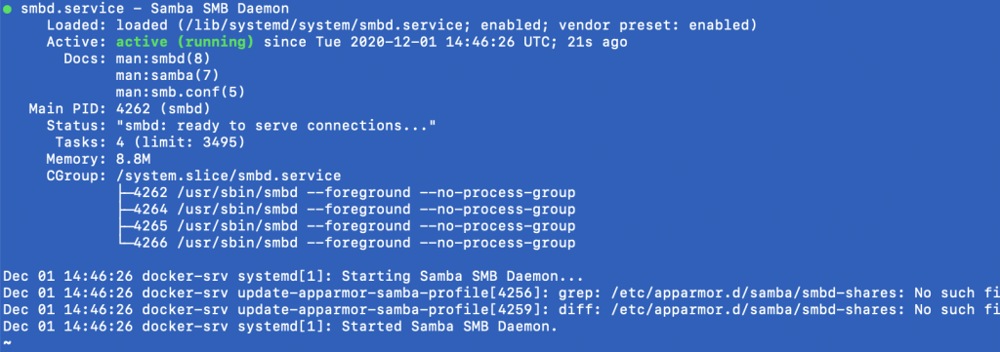
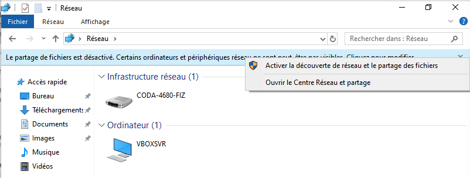
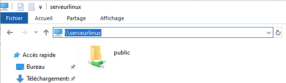
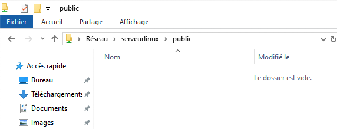
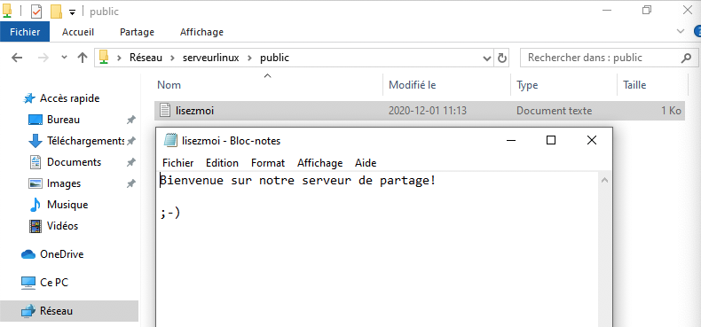
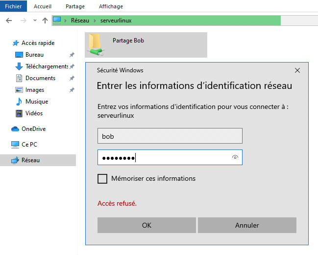

# Mise en place d’un serveur SMB

*Document converti depuis [ve2cuy.com/420-3c3](https://ve2cuy.com/420-3c3/?page_id=1361) — dernière modification : 2024-03-18*

---

## Partage réseau de dossiers et de fichiers sous Linux

---

### **Étape 1** – Renseigner une référence de nom, sous windows, pour le serveur Linux

Dans un premier temps, nous allons configurer windows pour pouvoir utiliser un nom (de domaine) au lieu de l’adresse IP de la station Linux.

```
# NOTE:  Il faut ouvrir cmd.exe en mode Administrateur 
# pour être en mesure d'éditer le fichier suivant.
notepad C:\\Windows\System32\drivers\etc\hosts

-----

adr-ip-du-serveur-linux            serveurlinux.localhost           serveurlinux

Par exemple,

192.168.2.12                       serveurlinux.localhost           serveurlinux
```

### **Étape 2** – Tester une connexion ‘ssh’ au serveur Linux en utilisant le nom attribué à l’étape précédente.

```
c:> ssh etudiant@serveurlinux
```

### **Étape 3** – Activer le partage de fichiers et l’exploration réseau sous Windows 10

Pour être en mesure de localiser notre serveur SMB, il faut activer le partage de fichiers et la découverte réseau sous Windows.

**Action 3.1** – **Ouvrir cmd.exe en mode Administrateur**

```
// Pour la version française de Windows
netsh advfirewall firewall set rule group="Partage de fichiers et d’imprimantes" new enable=yes
netsh advfirewall firewall set rule group="Découverte de réseau" new enable=Yes

Attention au caractère ’

// Pour la version anglaise de Windows
netsh advfirewall firewall set rule group="File and Printer Sharing" new enable=Yes
netsh advfirewall firewall set rule group="Network Discovery" new enable=Yes

// Pour rechercher une règle du par feu
netsh advfirewall firewall show rule name=all | findstr imprimante
```

**Note**: Attention au caractère ’ de la commande précédente!  Voir [ici](https://superuser.com/questions/1115639/how-to-activate-file-and-printer-sharing-from-the-command-line-on-a-french-windo).

Optionnel ->

### **Étape 4** – Renseigner une référence de nom, sous Linux, pour la station Windows

**Action 4.1** – *sudo nano /etc/hosts*

```
192.168.2.10         monwindows.localhost       monwindows
```

### **Étape 5 –**Vérifier la fonctionnalité du nom pour la station Windows

```
$ ping monwindows
```

### **Étape 6** – Installer Samba sous Linux

Le ‘[deamon](https://fr.wikipedia.org/wiki/Daemon_(informatique))‘ samba est un service qui propose l’implémentation du protocole [SMB](https://fr.wikipedia.org/wiki/Server_Message_Block), utilisé par Windows pour assurer le partage des fichiers et des dossiers dans le voisinage réseau.

```
sudo apt update
sudo apt install samba
```

Après l’installation, le service ‘samba’ devrait rouler.  Note, il sera lancé automatiquement à chaque redémarrage du serveur.

**Action 6.1** – Utiliser la commande suivante pour vérifier s’il s’exécute:

```
sudo systemctl status smbd
```

Ce qui devrait afficher un résultat semblable à ceci:



**Note**: Il y a deux erreurs de configuration (no such file …) qui seront corrigées à l’étape suivante.

### **Étape 7** – Réaliser la configuration de Samba

**Action 7.1** – Renommer, avant modifications,  le fichier de configuration de Samba:

```
sudo mv /etc/samba/smb.conf{,.backup}

// Note:  {} va retourner la concaténation de "/etc/samba/smb.conf" et ".backup" donc "/etc/samba/smb.conf.backup" comme deuxième paramètres de la commande cp.

// Il aurait aussi été possible de soumettre:

sudo mv /etc/samba/smb.conf /etc/samba/smb.conf.backup
```

**Action 7.2** – Éditer un nouveau fichier de configuration de Samba

```
sudo nano /etc/samba/smb.conf
```

Et y inscrire les  lignes suivantes:

```
[global]
server string = Serveur de partage
workgroup = WORKGROUP
security = user
map to guest = Bad User
name resolve order = bcast host
;netbios name = SUPERLINUX
;server string = Mon serveur Samba version %v


[Dossier public]
path = /partages/fichiers_public
public = yes
writeble = yes
```

**NOTE:** Si l’ordinateur où roule samba a plus d’une carte réseau, il est possible que le processus smb se connecte à la mauvaise.  Il est possible de forcer une CIR avec:

```
interfaces = 192.168.1.1/24
```

### **Étape 8** – Créer les dossiers de partage

Nous allons maintenant créer le dossier de partage en respectant le nom que nous avons indiqué dans le fichier de configuration, l’utilisateur et le groupe pour la propriété Linux des fichiers qui y seront créés

**Action 8.1** – Exécuter les commandes suivantes:

```
sudo mkdir -p /partages/fichiers_public
# Note mkdir -p = créer le répertoire parent au besoin

# Création du compte et du groupe
sudo useradd smbuser
sudo groupadd smbgroup

# Définir le propriétaire et le groupe sur les dossiers de partage
sudo chown smbuser:smbgroup /partages -R

# Note: Nous sommes en train de renseigner un partage sans authentification.
# Alors devons nous assurer que le dossier est accessible à tous en 'rw'.
sudo chmod a+w /partages -R 

ls /partages/ -Rl
```

**Note**:  Nous n’avons pas renseigner de mot de passe pour l’utilisateur smbuser car il ne sera pas utilisé pour un login sur la station Linux.  Nous pourrions aussi inscrire /bin/false comme application par défaut dans le fichier /etc/passwd.

**Action 8.2** – Valider la syntaxe du fichier de configuration

```
testparm
```

> Press enter to see a dump of your service definitions
>
> # Global parameters
>
> [global]  
> …

Au besoin, corriger les erreurs.  Par exemple,

```
alain@docker-srv:~$ testparm

Load smb config files from /etc/samba/smb.conf
Unknown parameter encountered: "writeble"
Ignoring unknown parameter "writeble"
Loaded services file OK.
Server role: ROLE_STANDALONE
```

**Note**: Éditer le fichier et placer **writeble** par **writable**.

**Action 8.3** – Valider la syntaxe à nouveau avec la commande **testparm**.

### **Étape 9** – Redémarrer le service smbd

```
sudo systemctl restart smbd
```

### **Étape 10** – Tester notre nouveau serveur de fichiers public.

**Action 10.1** – Explorateur de fichiers Windows, section ‘Réseau’, activer, au besoin, le partage réseau:



**Action 10.2** – Dans « Réseau », inscrire le nom du serveur Linux dans la barre d’adresse:



**Note**:  Il faut inscrire \\ devant l’adresse IP ou le nom de la machine à connecter.

**Action 10.3** – Traverser le dossier de partage ‘public’.



**Action 10.4** – Placer un nouveau fichier dans le dossier de partage

```
sudo nano  /partages/lisezmoi.txt

-----

Bienvenue sur notre serveur de partage!

;-)
```

**Action 10.5** – Actualiser la fenêtre de l’explorateur de fichiers Windows et éditer le fichier **lisezmoi.txt** et enregistrer**.**



**Action 10.5.2** – Créer un nouveau dossier ´test’

**Action 10.6** – Vérifier les modifications au système de fichier Linux dans le dossier de partage.

```
alain@docker-srv:~$ ls /partages/ -Rl
/partages/:
total 4
drwxr-xr-x 3 ??????? ??????? 4096 Dec  2 20:32 fichiers_public

/partages/fichiers_public:
total 8
-rw-rw-rw- 1 ??????? ???????   21 Dec  2 20:27 lisezmoi.txt.txt
drwxrwxr-x 2 ??????? ??????? 4096 Dec  2 20:27 test

/partages/fichiers_public/test:
total 0
```

**Note**: Remarquez le propriétaire et le groupe!

**Action 10.7** – Forcer le nom du propriétaire, ajouter les lignes suivantes dans le fichier smb.conf

```
force user = smbuser
force group = smbgroup
```

**Action 10.8** – Redémarrer Samba, créer un nouveau fichier avec l’explorateur de fichiers puis vérifier les attributs du fichier dans Linux (rwx?).

**Action 10.9** – Forcer le masque de création, ajouter les lignes suivantes dans le fichier smb.conf

```
create mask = 0666
;force create mode = 0664
directory mask = 0775
;force directory mode = 0775
```

**Action 10.10** – Redémarrer Samba, créer un nouveau fichier avec l’explorateur de fichiers puis vérifier les attributs du fichier dans Linux (rwx?).

**Note:**Quelle est la différence?

**Action 10.10** – Refaire Action 10.9 et 10.10 en enlevant les deux commentaires.

Voilà, nous avons partagé un dossier accessible sans l’utilisation d’un profil de login.  Tous ont accès à la ressource sans identification.

---

## Laboratoire 1

1. Vous devez mettre en place un partage SMB, sans authentification, du dossier /partages/documents-lecture-seule.
2. Le nom de partage est ‘Dossier protege’
3. Il ne doit pas être possible de créer des dossiers, des fichiers ou de pourvoir modifier les fichiers présents.
4. Ne pas utiliser de directives inutiles dans le fichier smb.conf.
5. Créer un fichier texte dans le dossier ‘documents-lecture-seule.’
6. Valider le partage en mode lecture seule sous windows.

---

## Module 2 – Partager des ressources privées

**Note**: Il faut rétablir le fichier de configuration original smb.conf avant de débuter le module.

```
sudo cp /etc/samba/smb.conf.backup /etc/samba/smb.conf
```

### **Étape 11** – Nous allons partager des ressources SMB qui ne seront accessibles que suite à une identification de l’utilisateur.

**Action 11.1** – Créer le compte ‘bob’

```
#Création du dossier protégé par mot de passe
sudo accuser bob

# mot de passe = password
# Login sous bob et créer un répertoire de partage

bob@docker-srv:~$ mkdir partage

```

**Action 11.2** – Renseigner le mot de passe de l’utilisateur ‘bob’ pour le service Samba

```
# smbpasswd -a = ajouter un nouvel utilisateur samba
sudo smbpasswd -a bob
```

### **Étape 12** – Renseigner le nouveau partage dans le fichier smb.conf

```
$ sudo nano /etc/samba/smb.conf

# Ajouter ce bloc à la fin du fichier
[Partage Bob]
path = /home/bob/partage
valid users = bob
# Pour permettre l'accès aux membre du groupe 'etudiants':
; valid user = @etudiants
read only = no
```

**Action 12.1** – Redémarrer le service

```
sudo systemctl restart smbd nmbd
```

**Action 12.2** – Tester le nouveau partage sous Windows



Note:  Il fenêtre de login devrait apparaitre suite à un double clic sur le dossier de partage.

**Action 12.3** – En utilisant l’explorateur de windows, créer un nouveau dossier et un nouveau fichier dans le dossier de partage de Bob.

**Action 12.4** – Vérifier les droits user:group dans linux pour le nouveau dossier et le nouveau fichier.

**Action 12.5** – Corriger la situation des droits.

---

## Laboratoire 2

1. Créer le compte utilisateur ‘inventaire’ mot de passe = p1p2p3
2. Ajouter ‘inventaire’ au groupe ‘sudo’
3. Se connecter sous le compte ‘inventaire’ et créer le répertoire ‘~/inv2028’
4. Définir un mot de passe SMB pour ‘inventaire’, passwd =  abcdef
5. Définir un partage SMB en lecture/écriture au répertoire ‘inv2028’ – nom de partage ‘Document pour Inventaire’ pour les utilisateurs ‘bob’ et ‘inventaire’.
6. Tester le partage du dossier ‘inventaire’ sous windows en utilisant le compte Bob puis le compte Inventaire.

**ATTENTION** – Sous Windows, il n’est pas possible d’être connecté sur plusieurs dossiers de partage en utilisant des comptes différents.  Il faut déconnecter le partage avant de passer à un autre utilisateur.

---

Commandes utiles

```
smbclient -L localhost
sudo pdbedit -L -v
```

Activer la diffusion des noms de serveurs SMB sous Ubuntu 20.x – [lien](https://devanswers.co/discover-ubuntu-machines-samba-shares-windows-10-network/)

Référence [Samba](https://www.samba.org/samba/docs/using_samba/ch09.html)

[FreeNAS](https://www.freenas.org) – Un serveur de fichiers gratuit et très populaire.

Prochain Laboratoire:

> [How To Install an FTP server (vsftpd) on Ubuntu 20.04](https://devanswers.co/install-ftp-server-vsftpd-ubuntu-20-04/)

🔗 [“How To Install an FTP server (vsftpd) on Ubuntu 20.04” — DevAnswers.co](https://devanswers.co/install-ftp-server-vsftpd-ubuntu-20-04/embed/#?secret=TPLIn70EQK)

---

###### Document préparé par Alain Boudreault pour les étudiants du cours 420-3C3 – Révision 1

---

[⬅️ Retour à la liste des documents](../README.md)
