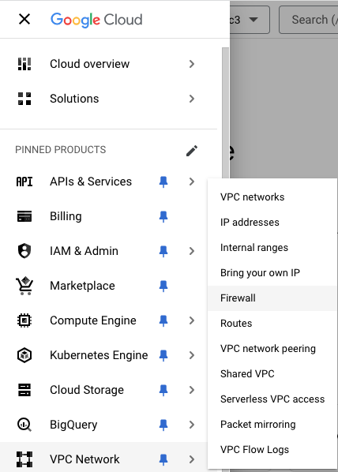
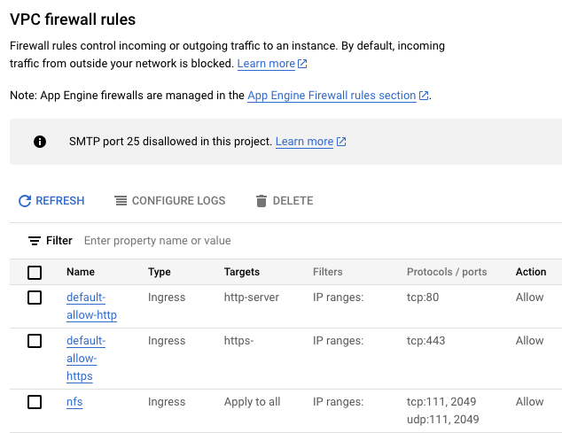

# NFS – Installation et utilisation

*Document converti depuis [ve2cuy.com/420-3c3](https://ve2cuy.com/420-3c3/?page_id=2511) — dernière modification : 2024-11-13*

---

.


.

---

## 1 – Le protocole NFS

NFS, ou **Network File System**, est un protocole de partage de fichiers en réseau développé par Sun Microsystems dans les années 1980. Il permet à un ordinateur (appelé *client*) d’accéder à des fichiers stockés sur un autre ordinateur (appelé *serveur*) via un réseau, comme si ces fichiers étaient stockés localement sur le client. NFS est particulièrement utilisé dans les environnements UNIX et Linux, bien qu’il existe également des implémentations pour d’autres systèmes d’exploitation.

### Principes de fonctionnement :

1. **Partage de fichiers à distance** : Le serveur met à disposition certains répertoires ou fichiers, et le client peut les monter (les rendre accessibles) comme s’ils faisaient partie de son propre système de fichiers local.
2. **Montage réseau** : Pour accéder à un répertoire partagé via NFS, le client « monte » ce répertoire sur son propre système de fichiers. Cela signifie qu’il l’intègre dans sa hiérarchie de fichiers locale, ce qui permet d’y accéder comme si les fichiers se trouvaient sur un disque local.
3. **Transparence** : NFS vise à rendre l’accès aux fichiers partagés aussi transparent que possible pour l’utilisateur, en permettant une interaction avec les fichiers comme si ils étaient locaux.
4. **Protocoles de communication** : NFS fonctionne généralement sur le protocole RPC (Remote Procedure Call), ce qui permet de réaliser des appels à des fonctions à distance sur un autre ordinateur.

### Versions de NFS :

Il existe plusieurs versions de NFS, dont les principales sont :

- **NFSv2** : La version originale de NFS, introduite en 1989. Elle utilise des protocoles simples mais présente des limitations en termes de sécurité et de performance.
- **NFSv3** : Introduite en 1995, elle offre de meilleures performances et des fonctionnalités améliorées comme la gestion des fichiers de grande taille.
- **NFSv4** : Lancée en 2000, cette version introduit des améliorations significatives, telles que des mécanismes de sécurité intégrés (authentification Kerberos), des performances accrues et une gestion plus fine des verrous de fichiers.

### Avantages de NFS :

- **Simplicité d’utilisation** : Les utilisateurs peuvent accéder aux fichiers partagés de manière transparente, sans avoir besoin de gérer les détails de la communication réseau.
- **Centralisation** : Permet de centraliser les données sur un serveur, ce qui facilite la gestion des fichiers, des sauvegardes et des mises à jour.
- **Évolutivité** : NFS permet à un grand nombre de clients d’accéder simultanément aux fichiers partagés sans trop de complexité.

### Inconvénients de NFS :

- **Sécurité** : Les versions plus anciennes de NFS (comme NFSv2) n’ont pas de mécanismes de sécurité solides, ce qui les rend vulnérables aux attaques. NFSv4, en revanche, améliore considérablement la sécurité avec des mécanismes d’authentification comme Kerberos.
- **Performance** : La performance dépend beaucoup de la qualité du réseau et de la configuration du serveur, ce qui peut entraîner des ralentissements si ces éléments ne sont pas optimisés.

### Cas d’usage :

- **Environnements UNIX/Linux** : NFS est largement utilisé dans les environnements UNIX ou Linux pour partager des fichiers entre différentes machines.
- **Serveurs de stockage** : Les entreprises utilisent souvent NFS pour gérer les données partagées dans des environnements de serveurs de fichiers.
- **Cluster computing** : NFS peut être utilisé pour partager des données entre les nœuds d’un cluster de calcul.

En résumé, NFS est une solution efficace et populaire pour le partage de fichiers sur un réseau, avec une forte intégration dans les environnements UNIX/Linux.

---

## 2 – Installation

Pour utiliser NFS il faut avoir accès à 1) un serveur offrant l’accès NFS et 2) un client permettant la connexion et l’utilisation de NFS.

## 2.1 – Installation du service NFS sur un serveur Ubuntu

```
# 1 - Sur le serveur
# Installer le service nfs
sudo apt update
sudo apt install nfs-kernel-server

# Créer un répertoire de partage
sudo mkdir /var/nfs/420-3C3 -p
sudo chown nobody:nogroup /var/nfs/420-3C3

# Ajouter du contenu à partager
# sudo echo "Ici la voix des Mistérons" > /var/nfs/420-3C3/coucou.txt

# Publier le dossier de partage
sudo nano /etc/exports
/var/nfs/420-3C3  *(rw,sync,no_subtree_check,all_squash,anonuid=65534,anongid=65534,insecure)

# Redémarrer le service nfs
sudo systemctl restart nfs-kernel-server

# Ou:

sudo exportfs -a
# Si le pare feu est activé alors ouvrir le port nfs:
sudo ufw allow from client_ip to any port nfs
```

## 2.1.2 – Règle de pare feu sur une plateforme en nuage

Dans le cas d’un service NFS proposé sur un serveur roulant en nuage, il faudra probablement renseigner une règle de pare feu pour les ports utilisés par NFS (111 UDP/TCP et 2049 UDP/TCP )

Voici un exemple sur **Google Cloud**:

Option -> Menu de navigation -> VPC Network -> Firewall



Option:




---

## 2.2. – Installation et utilisation du client NFS sur un poste Ubuntu

```
# 2 - Sur le client (Ubuntu)

sudo apt install nfs-common
sudo mount -t nfs 35.247.98.108:/var/nfs/420-3C3 /home/user/nfs/
# NOTE 35.247.98.108 est l'adresse d'un serveur hypothétique qui offre une connexion nfs.

# Le dossier de montage doit exister et être vide sinon son contenu de sera pas disponible pendant la session.
```

Référence: [NFS+Ubuntu](https://ubuntu.com/server/docs/network-file-system-nfs)

---

[⬅️ Retour à la liste des documents](../README.md)
