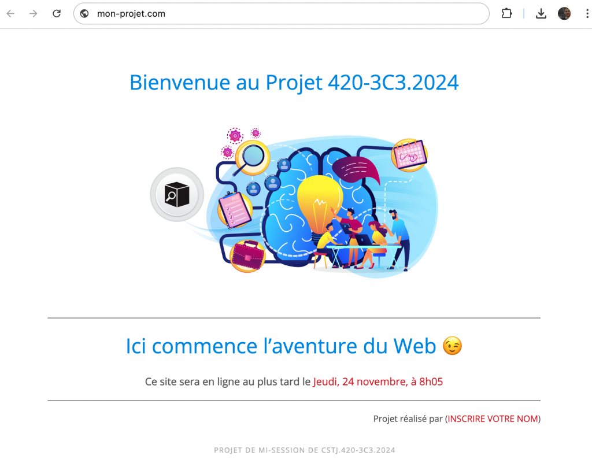
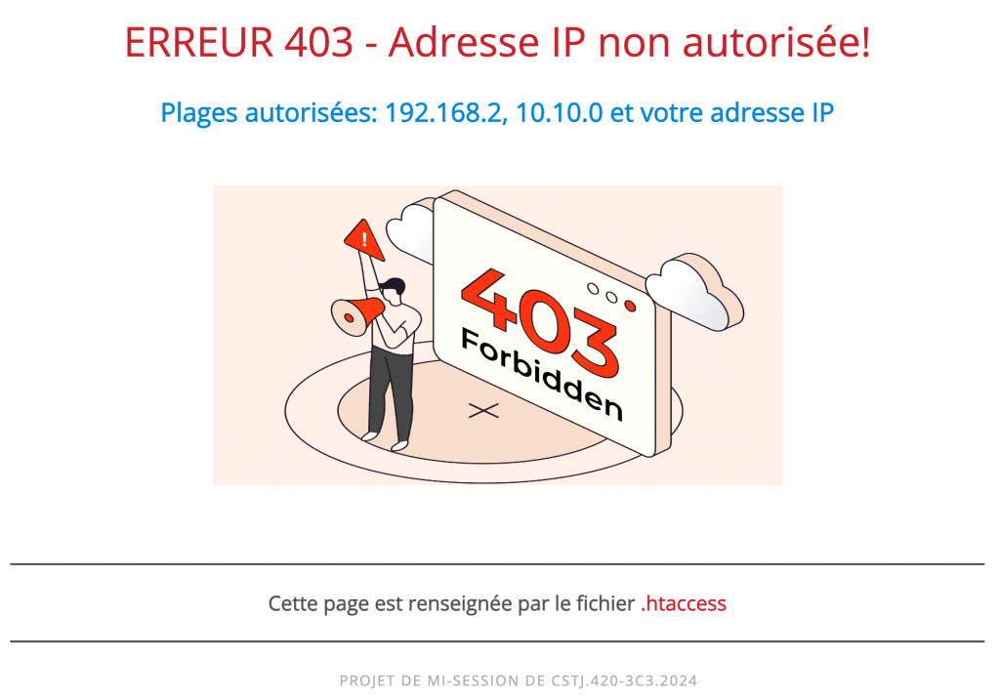
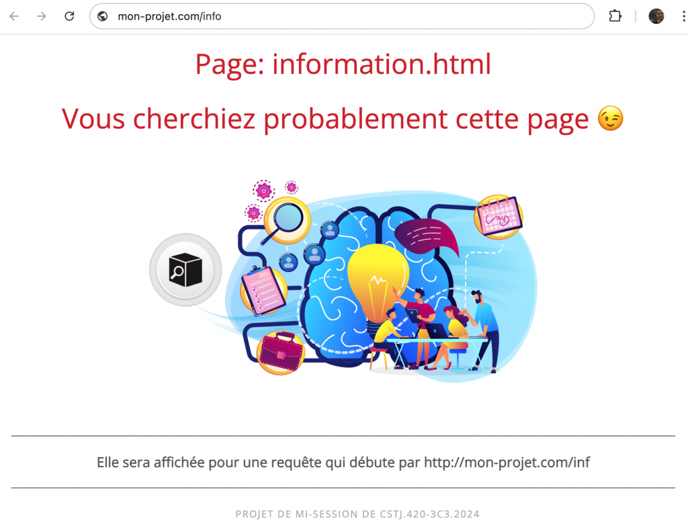
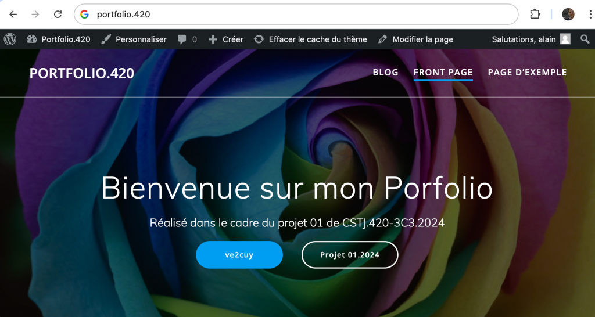
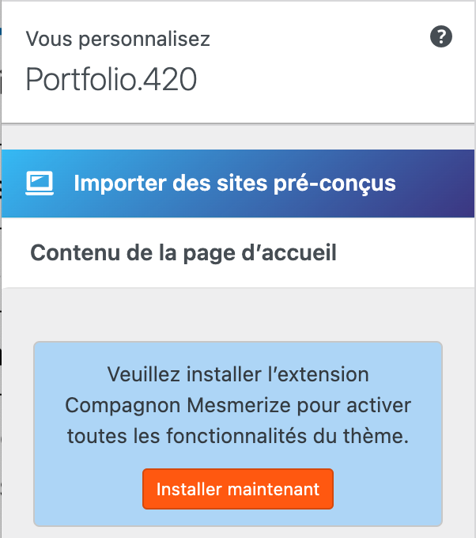
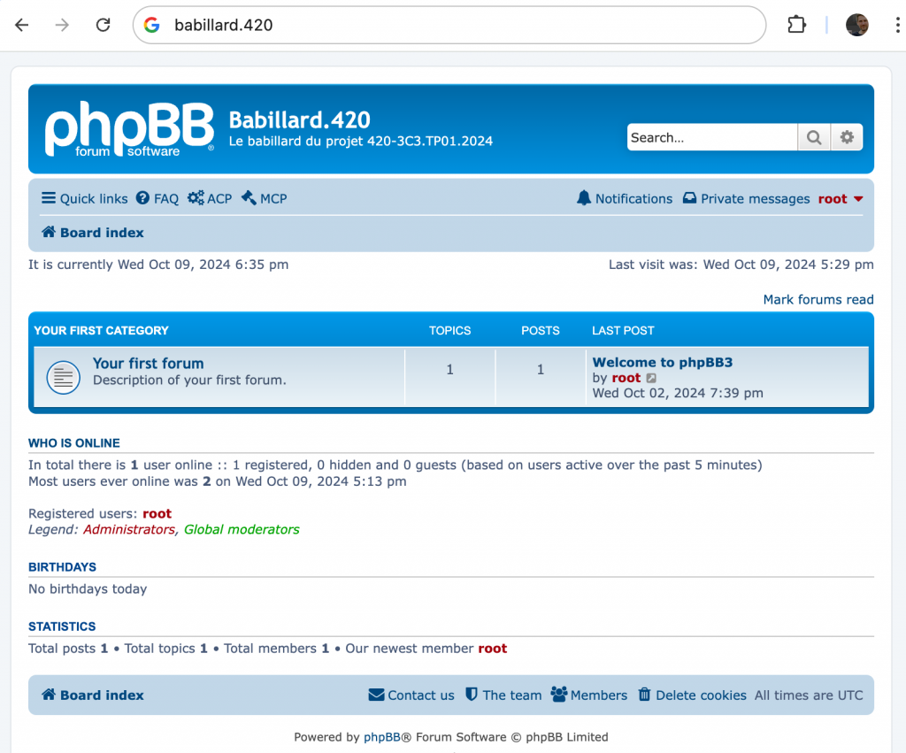
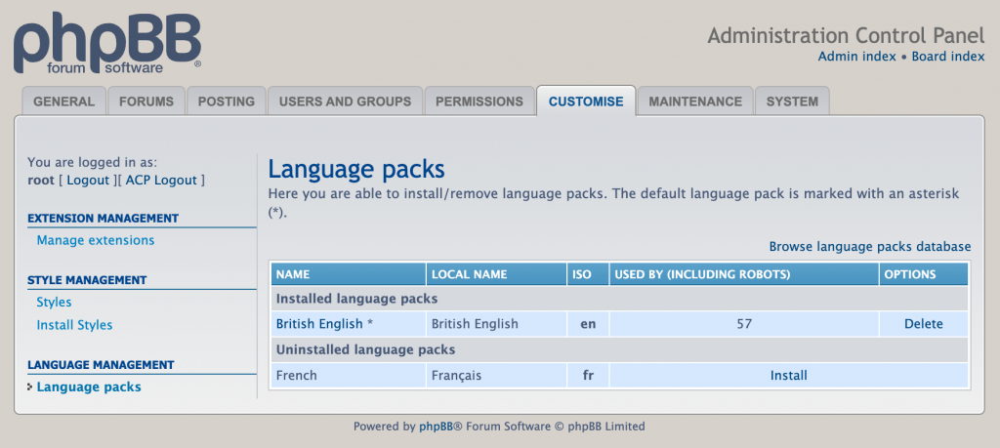
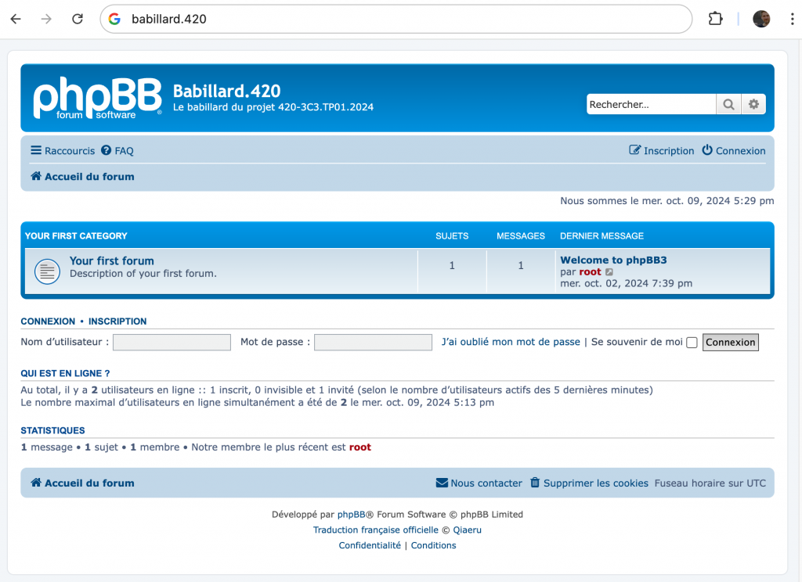

# Projet 01 – A2024

*Document converti depuis [ve2cuy.com/420-3c3](https://ve2cuy.com/420-3c3/?page_id=2391) — dernière modification : 2024-12-19*

---

## ÉNONCÉ


---

## **Pondération** : 30% **Date de remise** : Jeudi, 24 octobre, **au plus tard 8h05**

**NOTE:** Les projets remis après 8h05 seront refusés.

---

## Mise en situation

Mettre en place une infrastructure **LAMP** qui permet la publication de trois (3) sites Web répondant à un nom de domaine spécifique. Certains détails de configuration du serveur Linux seront précisés.

---

## 1 – Spécification de la VM VirtualBox:

- Nom de la VM: **TP01_2024**
- Nom du serveur: **serveur3c3**
- 2 CPU
- 4 Go Ram
- Disque de 16 Go – **Attention** de ne pas renseigner une taille fixe. Cela utilisera de l’espace inutile lors de la copie de la VM sur la clé USB.
- Réseau: Pont (bridge)
- Ubuntu server **24.04.1 LTS (à télécharger au besoin du site ubuntu)**
  - Compte de l’installation: **sysadmin**, mot de passe **‘password**‘
  - Installer open **ssh**
- **Ajouter** un compte **webadmin** (mot de passe: **password**) et ajouter le au groupe **sudo**
- **Installer** une pile **A.M.P.**
  - **mysql** -> mot de passe du compte **root** = ‘**password’**
- Apache2 **NE DOIT PAS DÉMARRER** de façon automatique au démarrage du serveur.

---

Le service **apache2 va publier trois (3) sites web;**

- le site par **défaut** (http://mon-projet.com – [fichiers de départ](https://github.com/ve2cuy/420-3C3-TP01.2024))
- le site **http://portfolio.com** (WordPress [6.6.2](https://wordpress.org/wordpress-6.6.2.tar.gz))
- le site **http://babillard.com** ([phpBB](https://www.phpbb.com))

---

## 2 – Le site par défaut

Voici le détail du site par **défaut**.

Étant donné une entrée DNS (fichier hosts) ‘**mon-projet.com**‘ vers l’adresse IP du serveur, saisir **mon-projet.com** ou bien l’adresse IP du serveur dans un fureteur, devrait afficher la page suivante:

## 2.1 – Capture d’écran du site par défaut



**2.1.2 – IMPORTANT**: Il faut éditer le fichier html pour y inscrire votre nom au bas de la page.

### 2.1.3 – Dossier d’installation

Les fichiers du site web par défaut doivent-être installés dans le dossier **/var/www/html/public_html**

### 2.1.4 – Les fichiers requis pour déployer ce site sont –> [ici](https://github.com/ve2cuy/420-3C3-TP01.2024)

---

## 2.2 – Erreur 404 (page non trouvée)

Si l’URL du site web par défaut contient le nom d’un document invalide, par exemple, http://mon-projet.com/document-invalide.html, la page suivante sera affichée:


**Astuce** 😉

```
AllowOverride All
```

---

## 2.3 – Erreur 403, accès non autorisé

Le site par défaut doit autoriser les accès qu’à partir des plages d’adresses IP suivantes:

- 192.168.2
- 10.10.0
- Votre adresse IP (celle de votre poste de travail et non pas l’adresse du serveur).

Un requête à partir d’une adresse autre que celles autorisées affichera la page suivante:



---

## 2.4 – Redirection vers information.html

Pour toutes requêtes qui débutent par http://mon-projet/inf, il faut programmer, dans le fichier .htaccess, une redirection vers le document ‘information.html‘.



---

**Astuces** 😉

```
$ a2enmod rewrite
---
RewriteEngine On
RewriteRule ... information.html [L]
```

---

## 3 – Mise en place de portfolio.com

En utilisant WordPress, déployer un site pour votre portfolio

|  |  |
| --- | --- |
| Version de WordPress | latest |
| Dossier d’installation | /tp01/portfolio  **ATTENTION** – Ne pas installer dans le dossier /var/www mais bien à la racine dans /tp01/portfolio |
| Fichier de l’hôte virtuel | portfolio.420.conf |
| **Base de données:** Utilisateur,  Mot de passe Nom de la base de données | portfolio password portfolio |
| Compte de gestion du site WP | **admin** : **password** |
| Thème WordPress (à installer) | Un thème de votre choix, autre que le thème par défaut |
| Nom de domaine | portfolio.com |
| URL pour l’installation | **http://portfolio.com** |

Saisir **http://portfolio.com** dans un fureteur devrait afficher ceci:



Le thème sélectionné aura peut-être besoin de fichiers médias supplémentaires, il faut les installer.

Pour le thème que j’ai sélectionné dans cet exemple, j’ai dû installer l’extension ‘Mesmerize’ pour que les images s’affichent.



---

## 4 – Mise en place du babillard

En utilisant l’application **phpBB**, qui est de type A.M.P, déployer un site pour **babillard.420**

Les codes sources de **phpBB** sont disponibles –> [ici](https://www.phpbb.com/downloads/).

Astuces:

```
sudo apt install unzip

git clone ...
unzip ...
mv .. /phpbb

http://mon-projet.com/phpmyadmin ...

http://babillard
...

# Après l'installation
rm -R /phpbb/install
```

|  |  |
| --- | --- |
| Version de phpBB | 3.3.13 |
| Dossier d’installation | /phpbb  **ATTENTION** – Ne pas installer dans le dossier /var/www mais bien à la racine dans /phpbb. |
| Fichier de l’hôte virtuel | babillard.420.conf |
| **Base de données:** Utilisateur,  Mot de passe Nom de la base de données | phpbb password phpbb |
| Compte de gestion du site babillard.420 | **admin** : **password** |
| Nom de domaine | babillard.com |
| URL pour l’installation | **http://**babillard.com |

4.1 – Saisir **http://babillard.com** dans un fureteur devrait afficher ceci:



**NOTE**: Les éléments d’interface sont en anglais.

---

## 4.2 – Francisation du site

Il faut installer le module d’interface, phpBB, de langage française.

Le module est disponible [ici](https://github.com/qiaeru/phpbb-language-fr)

**Astuces 😉**

```
git clone https://github.com/qiaeru/phpbb-language-fr

...

sudo mv fr/ /var/www/html/phpBB3/language
```



4.2.1 – Avec une installation et une configuration correctes, le babillard devrait s’afficher ainsi:



**NOTE**: Vous devrez probablement faire quelques recherches pour réaliser cette étape.

---

## 5 – Remise

Il faut remettre, AU PLUS TARD, le jeudi 24 octobre 2024 – **8h05**, sur un clé de mémoire – de type USB 3,

- Le dossier de la VM
- Les fichiers:
  - hosts,
  - .htaccess (du site par défaut),
  - apache2.conf (les sections que vous avez ajoutées),
  - portfolio.420.conf,
  - babillard.420.conf,
  - 000-default.conf

---

## 6 – Grille de correction (à compléter)

| Critère | Pondération | Auto correction |
| --- | --- | --- |
| Respect des spec de la VM | 0 |  |
| Version d’Ubuntu | 0 |  |
| Compte **sysadmin** | 0 |  |
| Compte **webadmin** + groupe sudo | 0 |  |
| Installation de open ssh server | 0 |  |
| Mise en place de la pile A.M.P. | 0 |  |
| ‘apache2’ en mode ‘disable’ | 0 |  |
| Mise en place du site web par défaut  – page d’accueil   – erreur 404  – erreur 403 (adresses IP)  – Redirection vers information.html | 0 0 0 0 |  |
| Fonctionnalité du site portfolio   – Dossier d’installation  – Fonctionnalité | 0 0 |  |
| Fonctionnalité du site babillard   – Dossier d’installation  – Francisation  – Fonctionnalité | 0 0 0 |  |
| Fichiers de remise | 0 |  |
| Clé USB de type 3 et fonctionnelle | 30 |  |

Total sur 30

---

Démo à 192.168.138.226 mon-projet.com portfolio.com babillard.com

---

[⬅️ Retour à la liste des documents](../README.md)
