# 1 – Serveurs d’entreprises

*Document converti depuis [ve2cuy.com/420-3c3](https://ve2cuy.com/420-3c3/?page_id=1717) — dernière modification : 2024-03-18*

---

Les serveurs d’entreprises sont essentiellement des PC de haut niveau qui proposent de nombreuses redondances et fonctionnalités tel que;

1. plusieurs CPU (2, 4, …),
2. plusieurs blocs d’alimentation,
3. mémoire RAM de type [ECC](https://fr.wikipedia.org/wiki/Mémoire_à_code_correcteur_d%27erreurs) (*Error-Correcting Code Memory* ) sur plusieurs banques,
4. Volumes de disques en vecteurs RAID et technologie [SAS](https://fr.wikipedia.org/wiki/Serial_Attached_SCSI) (**Serial Attached SCSI**),
5. BIOS en deux copies,
6. Espace physique optimisé, U1, U2, Blade, …
7. Fonction de contrôle matériel à distance, iLO, iDRAC, …
8. Plusieurs cartes d’interface réseau embarquées sur la carte mère (2 à 4)
9. Possibilité de changer certain équipements à chaud (Hot swap) tel que les disques et le blocs d’alimentation.

---

## 1.1 – CPUs multiple sur carte mère

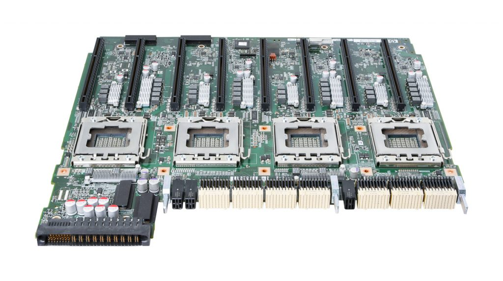

HP Proliant DL580 G7 Server CPU / Memory Board

---

## 1.2 – Blocs d’alimentation

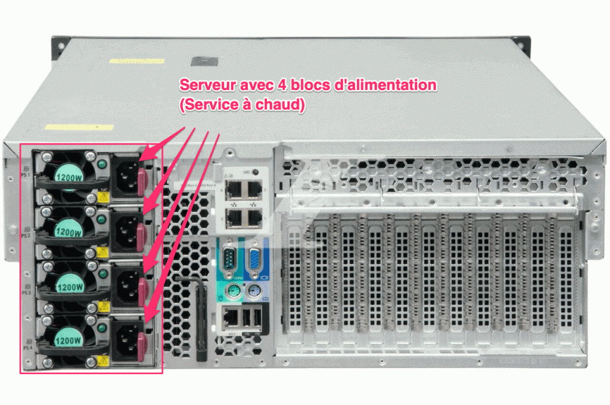

---

## 1.3 – Mémoire ECC

« Une **mémoire à code correcteur d’erreurs** (en anglais, *Error-Correcting Code Memory* ou *ECC Memory*) est un type de mémoire vive qui contient un code correcteur lui permettant de détecter et de corriger les types les plus courants de corruption de données. Ce type de mémoire est utilisé dans les ordinateurs où la corruption de données ne peut être tolérée en aucun cas, comme pour les calculs scientifiques ou financiers. Source [Wikipédia](https://fr.wikipedia.org/wiki/Mémoire_à_code_correcteur_d%27erreurs)«

Ce type de mémoire est couramment utilisé dans les serveurs d’entreprises. Il est à noté que son coût est plus élevé que la mémoire RAM conventionnelle.

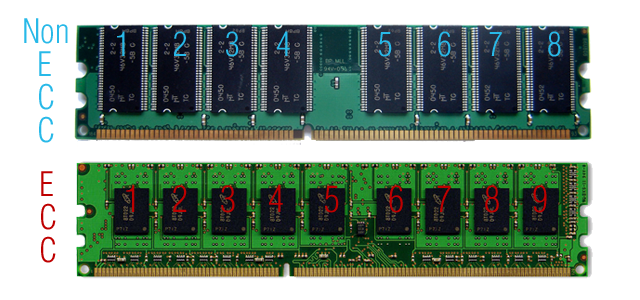

**Note**: Les connecteurs pour les barrettes mémoire RAM ECC et NON ECC ne sont pas compatibles. Par exemple, il n’est pas possible d’installer des barrettes NON ECC dans un serveur conçu pour fonctionner avec des RAM ECC.

---

---

## 1.4 – Disques – RAID, SCSI et SAS

## 1.4.1 – SCSI

**« Small Computer System Interface** (**SCSI**) est un standard définissant un bus informatique reliant un ordinateur à des périphériques ou à un autre ordinateur aujourd’hui en cours de remplacement par le SAS(Serial Attached SCSI). » Référence: [Wikipédia](https://fr.wikipedia.org/wiki/Small_Computer_System_Interface)

## 1.4.2 – SAS

« **Serial Attached SCSI** (SAS) est une technique d’interface pour disques durs, elle constitue une évolution des bus SCSI en termes de performances, et apporte le mode de transmission en série de l’interface [SATA](https://fr.wikipedia.org/wiki/Serial_ATA) (Serial Advanced Technology Attachment). » Référence: [Wikipédia](https://fr.wikipedia.org/wiki/Serial_Attached_SCSI)

## 1.4.3 – La technologie RAID

« **Redundant Array of Independent Disks** » ou « **Redundant Array of Inexpensive Disks**«

« Le **RAID** est un ensemble de techniques de virtualisation du stockage permettant de répartir des données sur plusieurs disques durs afin d’améliorer soit les performances, soit la sécurité ou la tolérance aux pannes de l’ensemble du ou des systèmes. » Source: [Wikipédia](https://fr.wikipedia.org/wiki/RAID_(informatique))

### 1.4.3.1 – RAID 0 (Striping)

Permet de créer un volume à partir de plusieurs disques.

**Avantage**, transfert rapide entre le volume et l’ordinateur.

**Désavantage**, Le bris d’un seul disque entraine la perte de toutes les données.

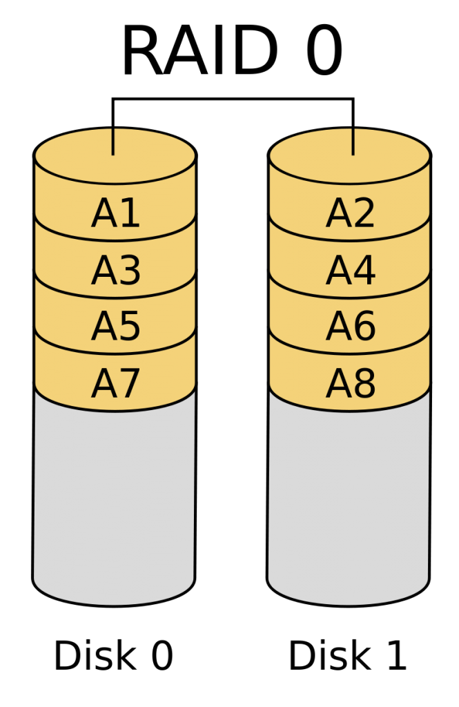

### 1.4.3.2 – RAID 1 (Mirror)

Le contenu du premier disque est copié vers le deuxième disque.

**Avantage**, la perte d’un disque n’entraine pas la perte des données.

**Désavantage**, augmentation des couts mais pas de l’espace de stockage.

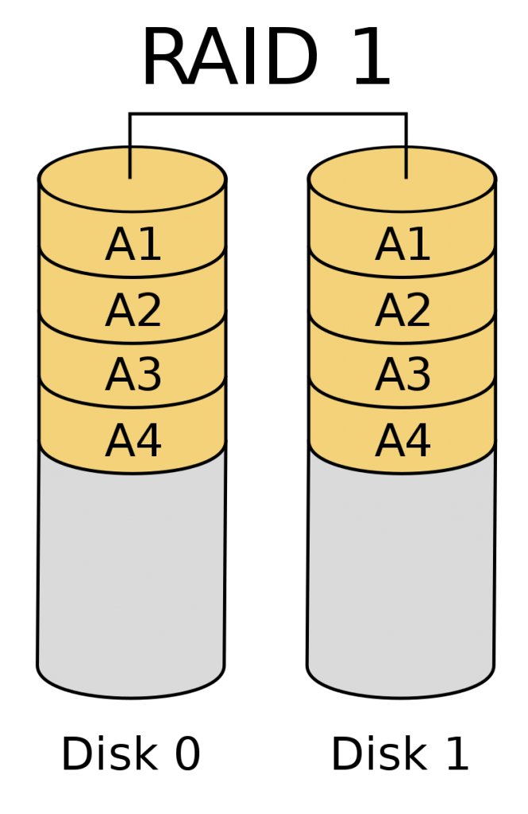

### 1.4.3.3 – RAID 10 (striping of mirrors)

**Avantage**: Rapide et sécuritaire

**Désavantage**: Coût élevé.

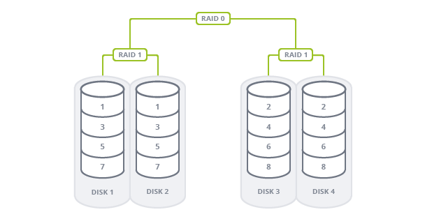

### 1.4.3.4 – RAID5 (Parity)

Un volume de stockage est créé à partir d’un minimum de 3 disques. Il n’y a pas de maximum théorique.

Par contre, RAID5 protège contre la perte d’un seul disque du vecteur de disques.

La perte d’un disque n’entrainera pas la perte de données.

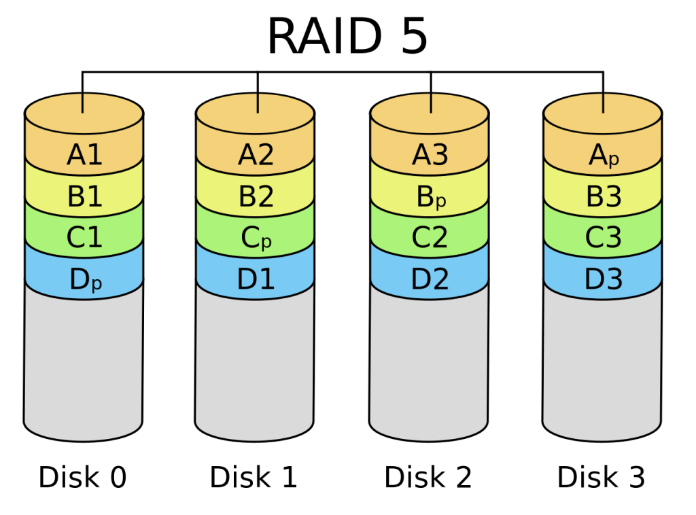

### 1.4.3.5 – RAID6 (Double parité)

Un volume de stockage est créé à partir d’un minimum de 4 disques. Il n’y a maximum 32 disques.

La perte de deux disques n’entrainera pas la perte de données.

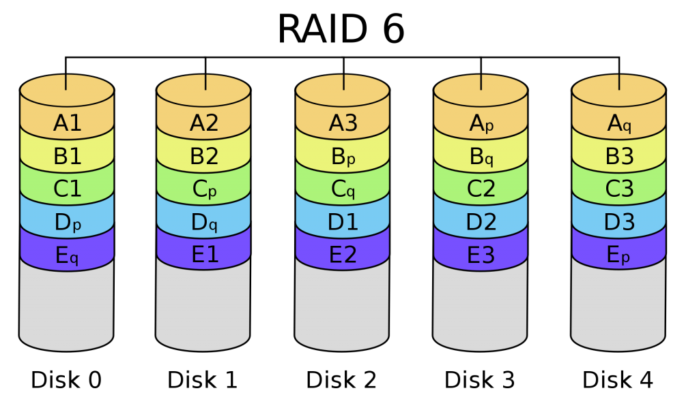

**NOTE IMPORTANTE**: Il ne faut JAMAIS considérer la technologie RAID comme étant une solution de sauvegarde – backup – des données.

---

## 1.5 – Redondance du BIOS

Règle générale, les serveurs d’entreprises proposent une redondance du BIOS système (redundant system rom). Cette fonctionnalité permet de redémarrer un système suite à une mise à jour défectueuse du BIOS système principal.

---

## 1.6 – Format physique des serveurs d’entreprises

La grande majorité des serveurs d’entreprise adopte la norme de l’unité (U) de rack pour leur format physique.

Une unité ‘U’ (1U) correspond à une dimension de 19 pouces (18,312 pouces) de large par 1,75 pouce de haut.

Par exemple, un serveur de type 2U occupera 19 pouces par 2* 1,75 pouce d’espace physique.

**Voici un serveur de type 2U:**

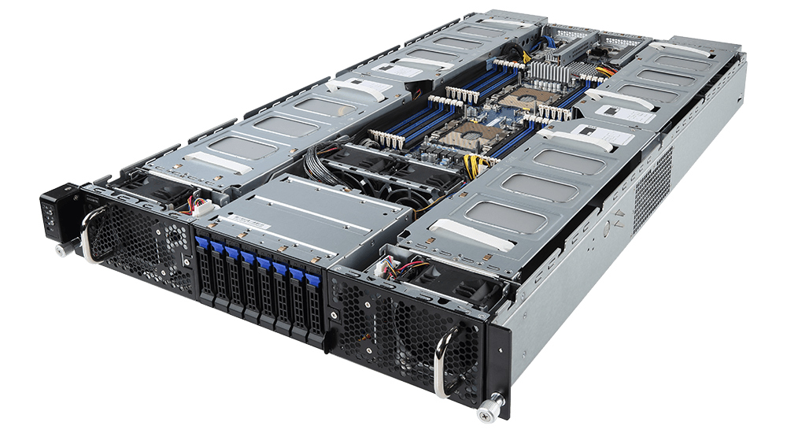

Voici un serveur de ty**pe 1U:**

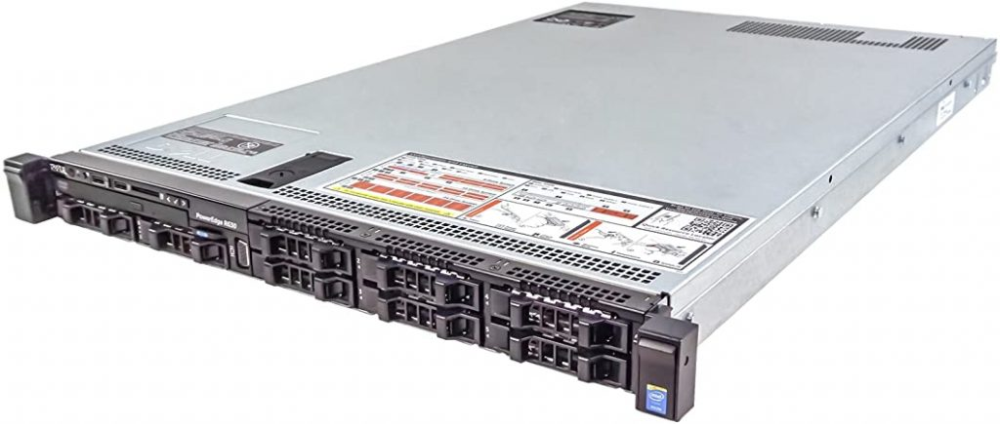

---

## 1.6.2 – Les racks de type U

Pour les installer physiquement des serveurs de type U, nous utiliserons des racks de type U.

Un rack mesure typiquement 42U1 de haut, soit un peu plus de six pieds (soit 1,8 m). Un rack de « mi-hauteur » mesure entre 18 et 22U, soit environ 3 pieds (0,9144 m).

**Voici un rack 42U1**:

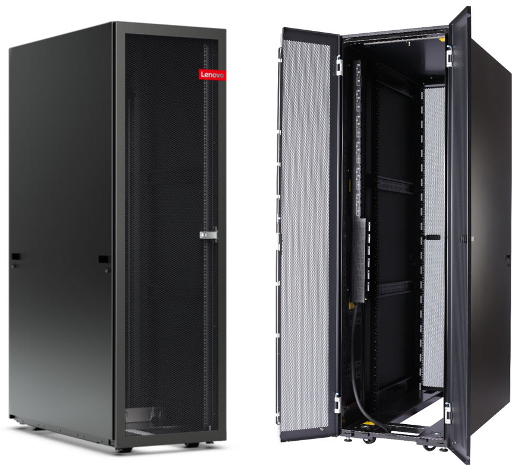

Voici un rack contenant des serveurs de type U:

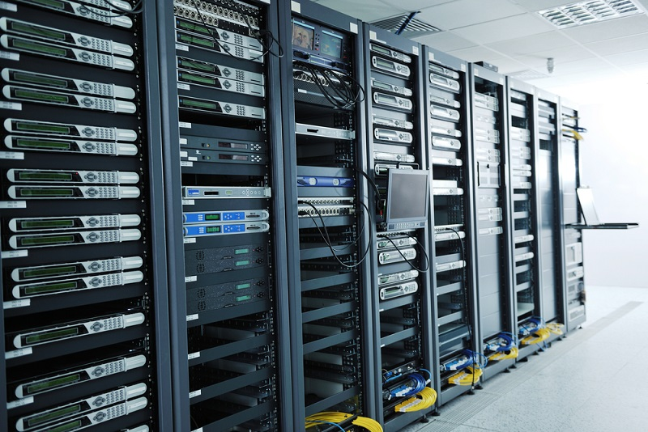

Vue de l’arrière du rack

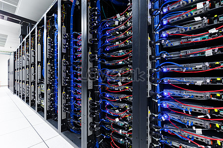

---

## 1.6.3. – Montage d’un serveur dans un rack de type U

[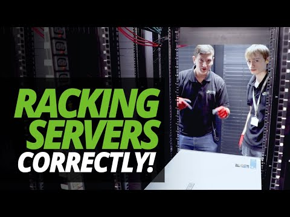](https://www.youtube.com/watch?v=wFCc3ts74pQ)

▶️ *Vidéo :* [A DAY in the LIFE of the DATA CENTRE | RACKING SERVERS with ASH & JAMES!](https://www.youtube.com/watch?v=wFCc3ts74pQ)

---

## 1.7 – Consoles de gestion à distance

- Dell ->  Integrated Dell Remote Access Controllers, ***[iDRAC](https://www.delltechnologies.com/fr-ca/solutions/openmanage/idrac.htm)***
- HP -> Integrated Lights-Out, ***[iLO](https://www.hpe.com/ca/fr/servers/integrated-lights-out-ilo.html)***

[Licence iDRAC](https://www.dell.com/support/kbdoc/en-ca/000176472/idrac-cmc-openmanage-enterprise-openmanage-integration-with-microsoft-windows-admin-center-openmanage-integration-with-servicenow-and-dpat-trial-licenses)

---

## 1.8 – Les cartes d’interface réseau (NIC)

Les serveurs d’entreprises proposent habituellement entre 2 et 4 cartes d’interface réseau à même la carte réseau.

---

## 1.9 – Remplacement à chaud (hot swap)

---

[⬅️ Retour à la liste des documents](../README.md)
