# VMware – ESXi et vCenter

*Document converti depuis [ve2cuy.com/420-3c3](https://ve2cuy.com/420-3c3/?page_id=1516) — dernière modification : 2024-03-18*

---

## 1 – Les solutions VMware

Les hyperviseurs de VMware sont abondamment utilisés en entreprise d’où la pertinence de connaitre ses solutions.

Voici un graphique présentant les parts de marché des produits de virtualisation de VMware:

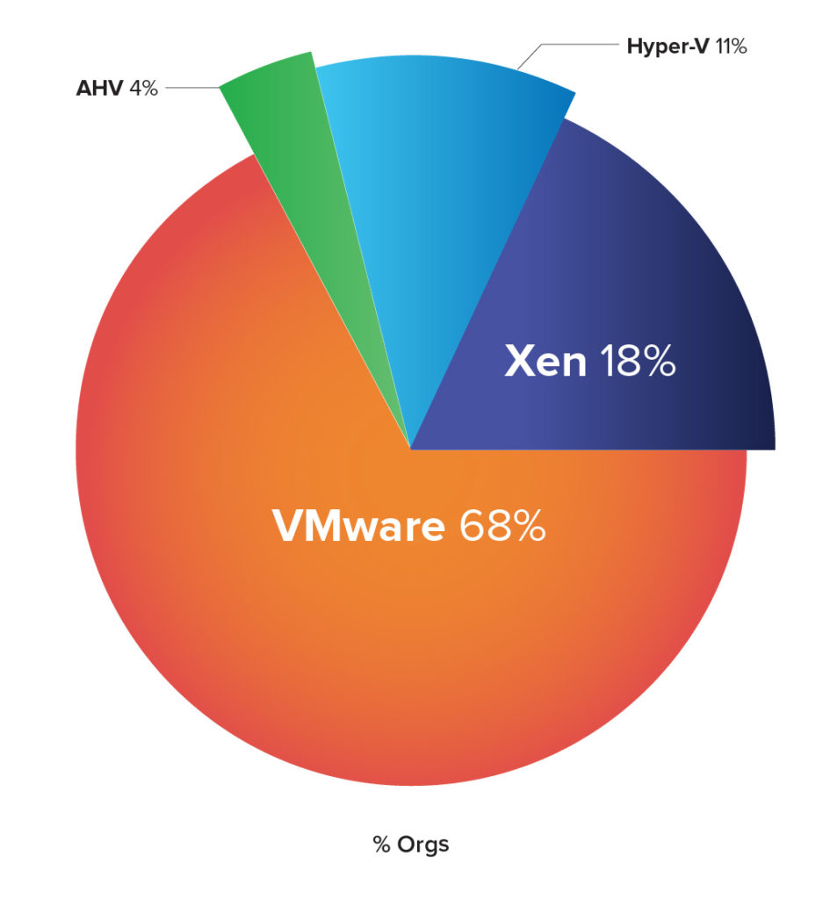

[Référence](https://www.controlup.com/resources/blog/entry/hypervisor-market-share-controlup-perspective/)

<https://medium.com/@zedr/setting-up-the-vsphere-hypervisor-on-virtualbox-78d401bcd581>

---

Le produit principale est l’hyperviseur pour métal ESXi (Elastic Sky X Integrated), nommé aussi ‘VMware vSphere Hypervisor ‘.

Il est un hyperviseur de niveau 1, c-a-d qu’il roule directement sur le matériel (bare-metal hypervisor).

Une version gratuite est disponible sur le site de la cie [VMware](https://my.vmware.com/en/web/vmware/downloads/info/slug/datacenter_cloud_infrastructure/vmware_vsphere/7_0).

---

## 2 – Ce qu’est ESXi

ESXi est habituellement installé directement sur un ordinateur, sans y avoir installé aucun autre système d’exploitation au préalable.

ESXi est un OS en soit, élaboré à partir du noyau VMKernel qui lui est basé sur POSIX, un standard de normalisation de Unix. Donc, ESXi est un système d’exploitation du même type que Linux. Il sert essentiellement à partager le matériel entre plusieurs instances de systèmes d’exploitations.

Une application web sera disponible à l’adresse IP du serveur, permettant la gestion des machines virtuelles et des ressources du serveur.

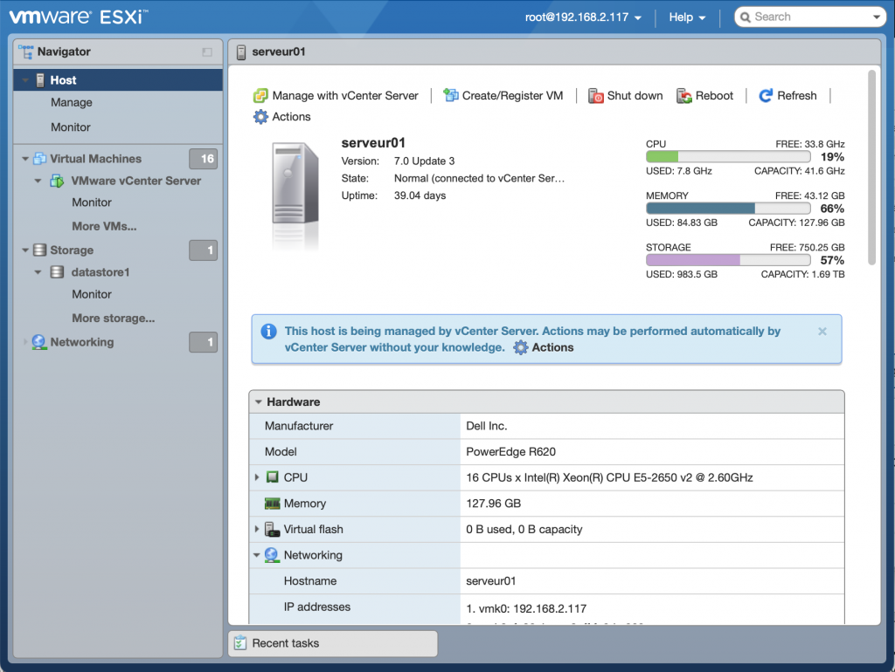

---

## 2.1 – Ce qu’est vCenter

vCenter est une application de consolidation de la gestion d’un parc de serveurs ESXi. Une seule application pour la gestion de tous les serveurs d’une organisation. Cet outil offre aussi des fonctionnalités additionnelles tel que la répartition des charges et la redondance de services.

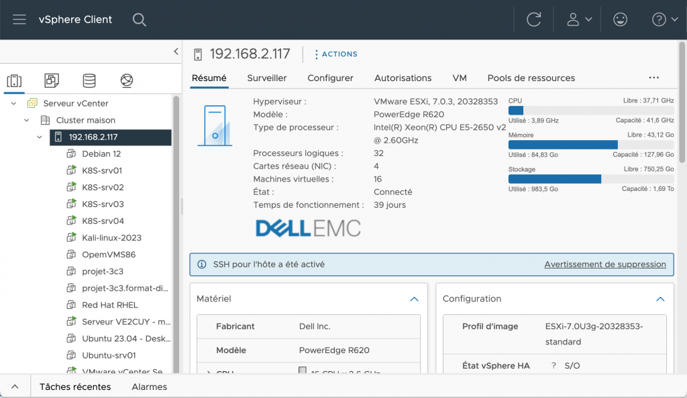

---

## 2.2 – Virtualisation de ESXi (pour tests)

Pour être en mesure de reproduire une installation d’un serveur ESXi à la maison, nous allons, dans un premier temps, installer ESXi dans un machine virtuelle.

Il existe plusieurs solutions logiciels pour créer des machines virtuelles sur PC mais la seule qui est supportée par ESXi est l’utilisation des produits ‘desktop’ de VMware.

Comme par exemple, VMware Fusion, VMware Desktop et VMware Player.

**Note**: **Sous Windows 10, il ne faut pas que Hyper-V soit activé ou que ‘Windows Subsystem for Linux’ soit installé.**

> 1 – Dans PowerShell:
>
> bcdedit /set hypervisorlaunchtype off
>
> 2 – Panneau de configuration, désinstaller WSL.

---

## 3 – Installation de ESXi

3.1 – [Télécharger le fichier ISO d’installation de ESXi version 7.0U3f](https://aboudrea.techinfo-cstj.ca/ressources/esxi73f.iso)

**NOTE**: Pour une installation directement sur un serveur, il est possible de créer une clé USB à partir du fichier ISO en utilisant l’application [Rufus](https://rufus.ie/fr/). Selon mon expérience, les programmes équivalent sous MacOS ou Linux n’ont pas permit de produire une clé USB fonctionnelle à 100%.

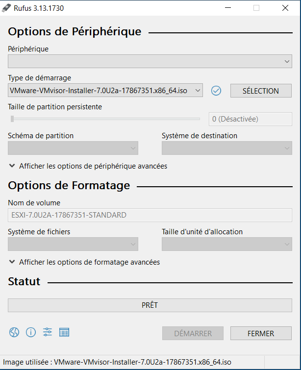

3.2 – Démarrer l’application bureau de virtualisation:

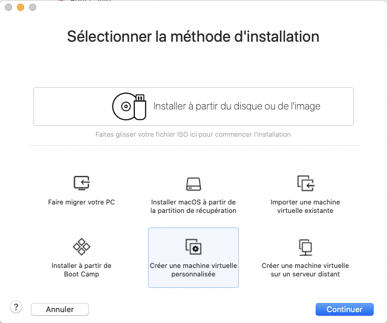
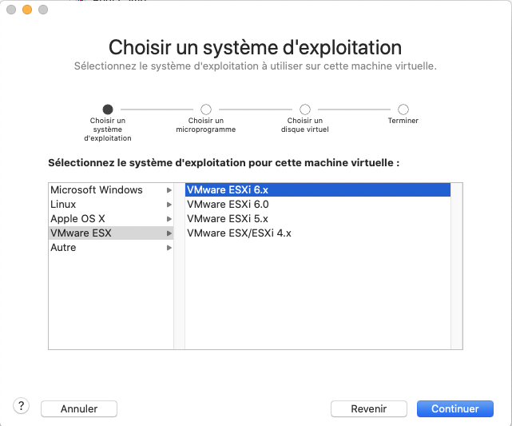
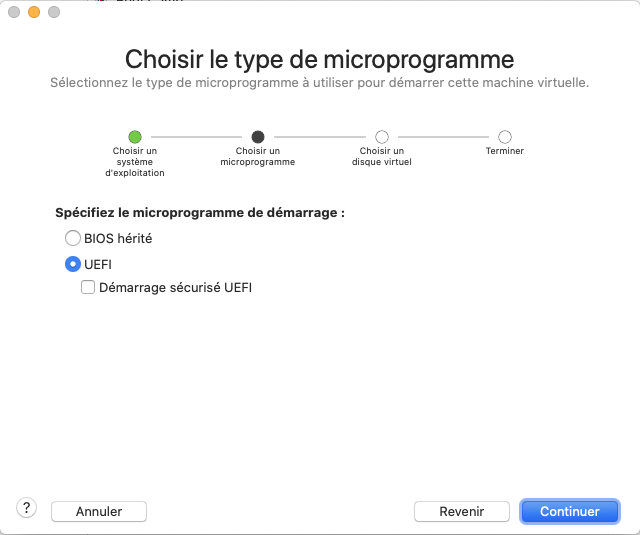
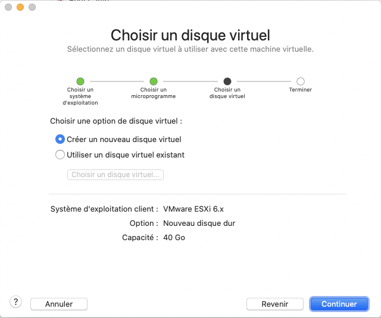
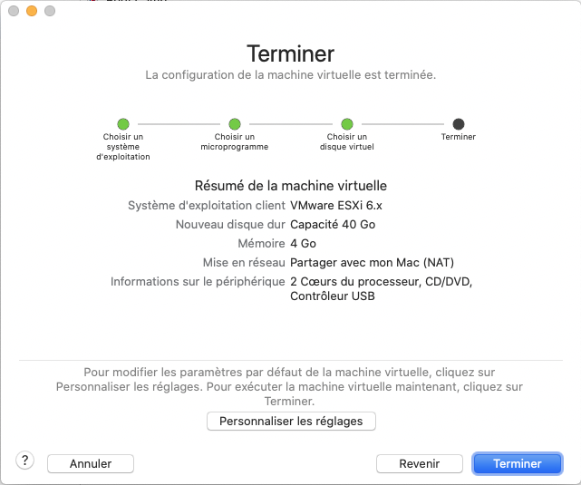

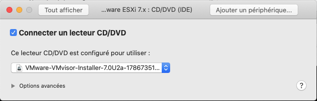

3. – Démarrer la VM

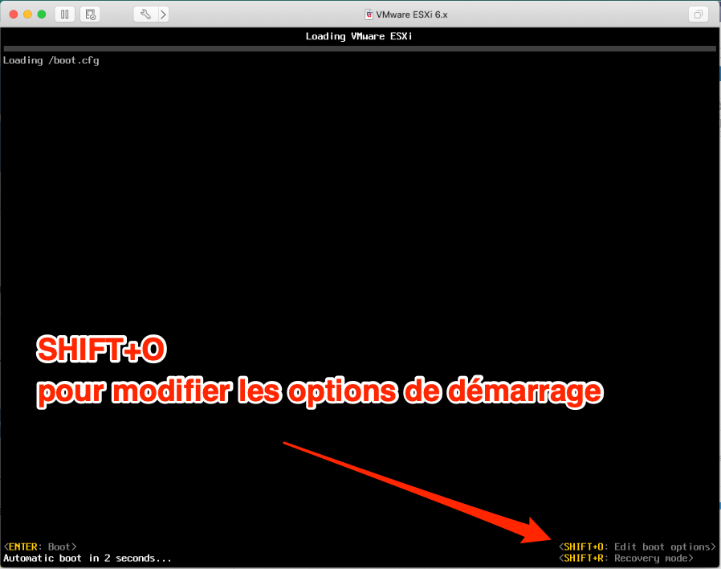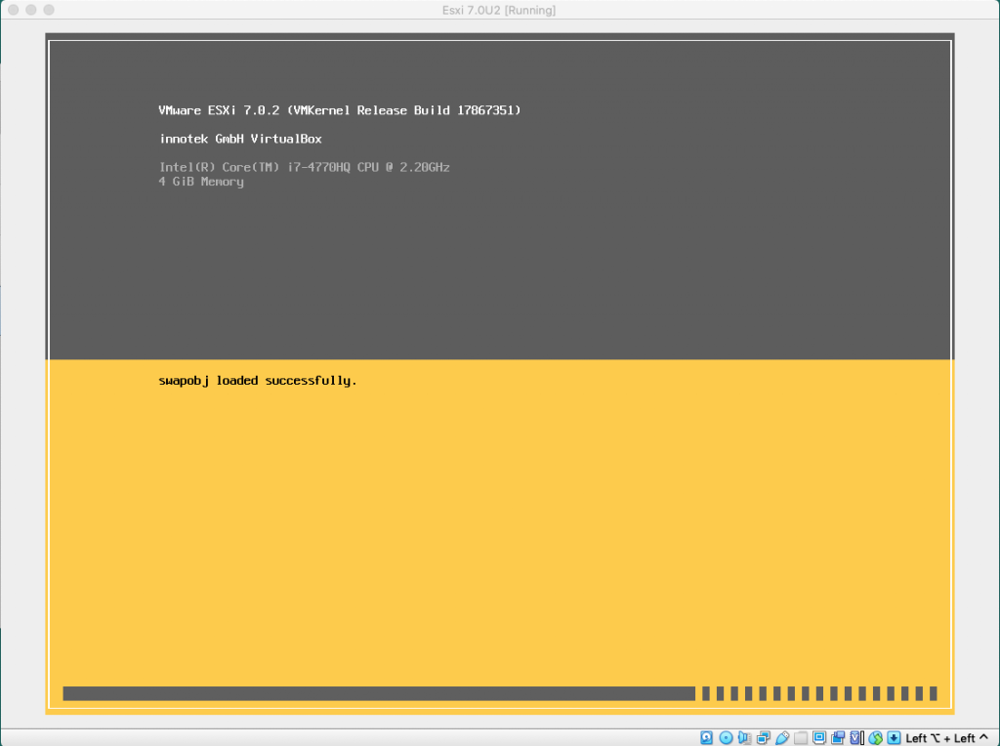
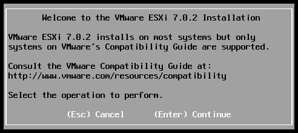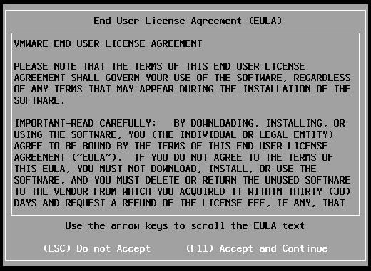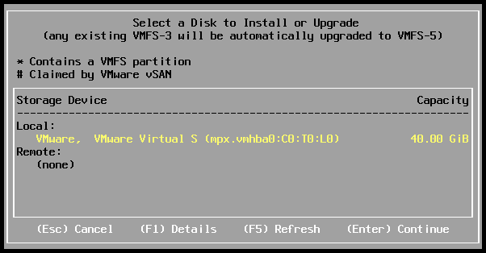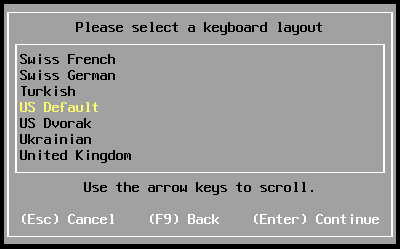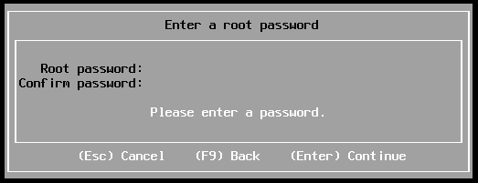

Note: Utiliser 420-1c3 comme mot de passe.

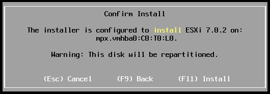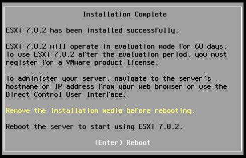

Redémarrer la VM

---

## Activer la console de commandes (Shell)

Appuyer sur Atl+F1 pour afficher la console de commandes:

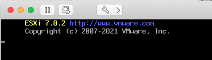

Appuyer sur Alt+F2 pour retourner à l’écran d’accueil

Appuyer sur la touche F2 pour effectuer la configuration du serveur

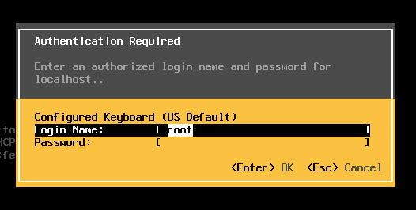

Activer la console et l’accès SSH:

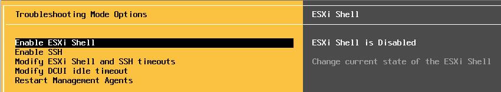

Appuyer sur <retour> pour modifier la valeur de la sélection courante:

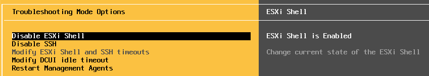

Tester l’accès à la console:

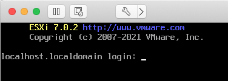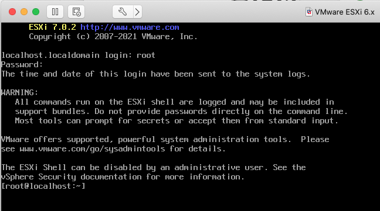

---

## 4 – Gestion d’un serveur ESXi

4.1 – Obtenir l’adresse IP du serveur

4.2 – Inscrire l’adresse dans un fureteur:

Note: L’application de gestion du serveur ESXi est de type Web.

Accepter la connexion non privée:

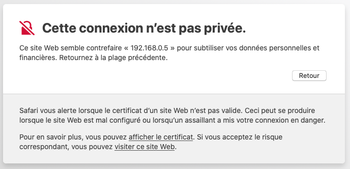

Se connecter à l’application de gestion ESXi en utilisant le mot de passe renseigné lors de l’installation

root : 420-1c3

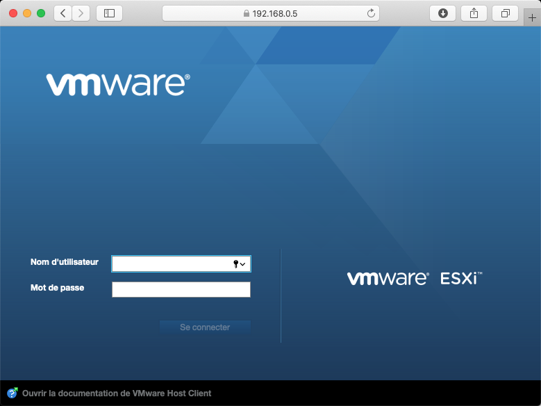
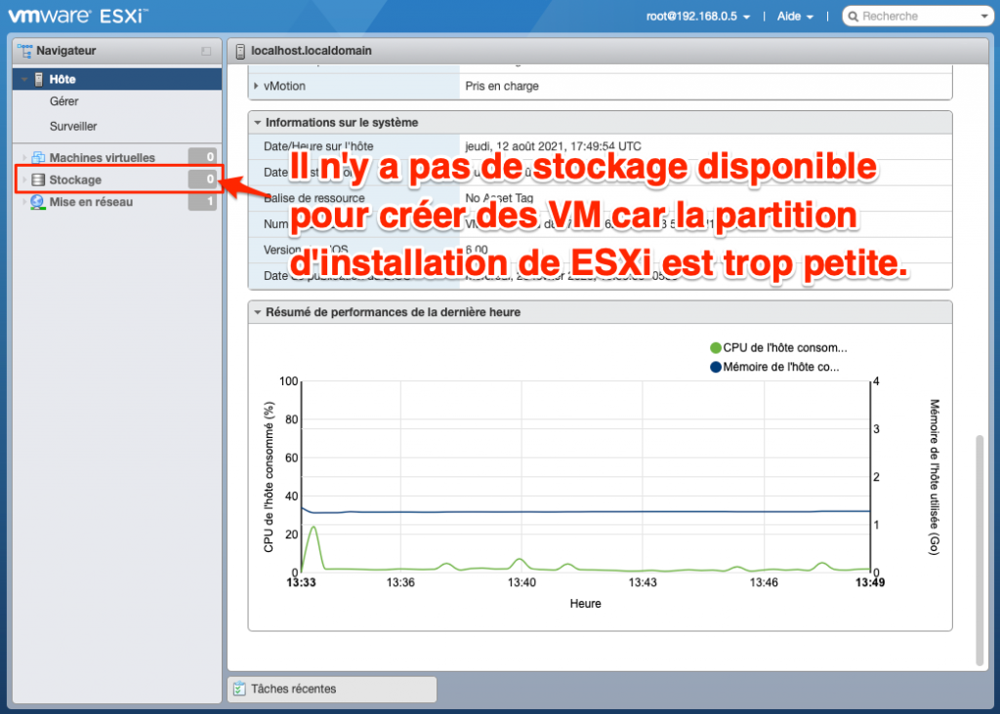

Solutions:

1 – Ajouter un autre disque dans la configuration de la VM.

2 – Restreindre la taille de la partition système de ESXi pour libérer de l’espace sur un petit disque. Par défaut, cette partition occupe 138Go. Lors de l’installation, il est possible de limite cette taille avec une option d’installation:

Au démarrage du programme d’installation de ESXi, appuyer sur SHIFT+O et ajouter une des options suivantes:

**systemMediaSize**=

- min = 25GB
- small = 55GB
- default = 138GB (valeur par défaut)
- max = Utilise toute l’espace disponible

---

## 5 – Installation sur des serveurs non supportés (CPU trop anciens)

Depuis la version 7.x de ESXi, le noyau utilise des instructions CPU de virtualisation qui ne sont pas disponibles sur des CPU plus ancien.

Il est par contre possible d’installer ESXi en mode de compatibilité avec ces CPU.

Au démarrage du programme d’installation de ESXi, il faut utiliser l’option suivante (SHITF+O):

> **allowLegacyCPU**=true

Pour **ESXi V8**, il sera peut-être nescéssaire d’ajouter le paramètre suivant lors du démarrage: **cpuUniformityHardCheckPanic=FALSE** ([ref](https://williamlam.com/2022/09/homelab-considerations-for-vsphere-8.html))

**NOTE**: Cette option devra être ajoutée à chaque redémarrage du serveur ESXi. Il est possible de rendre l’option permanente en l’ajoutant dans les fichiers suivants:

> /bootbank/boot.cfg
>
> /altbootbank/boot.cfg
>
> À la fin de la ligne: kernelopt=…

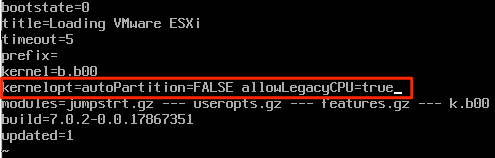

Il faudra aussi ajouter le paramètre suivant dans la configuration des machines virtuelles qui seront créées sur le serveur ESXi:

> **Ajouter dans les paramètres avancés de la VM**
>
> **monitor.allowLegacyCPU=true**

---

## 6 – Ajouter un disque supplémentaire sur le serveur ESXi

Notre installation ESXi a été réalisée sur un disque inférieure à 120Go, ce qui n’a pas laissé d’espace pour la création de VM sur le serveur.

Pour remédier à cette situation, nous allons ajouter un disque supplémentaire à la VM de ESXi.

6.1 – Éteindre le serveur ESXi

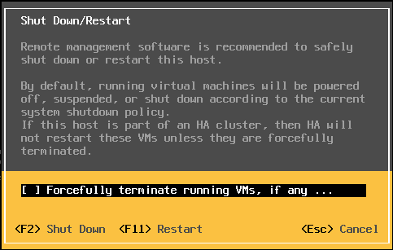

6.2 – Afficher la configuration de la VM ESXi:

Ajouter un nouveau disque de 40GO

6.3 – Redémarrer la VM

6.4 – Accéder à l’application Web de gestion du serveur ESXi

6.5 – Sélectionner l’option

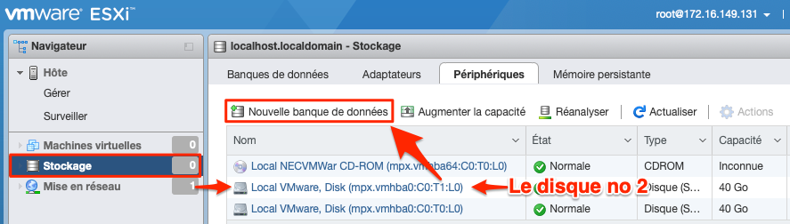
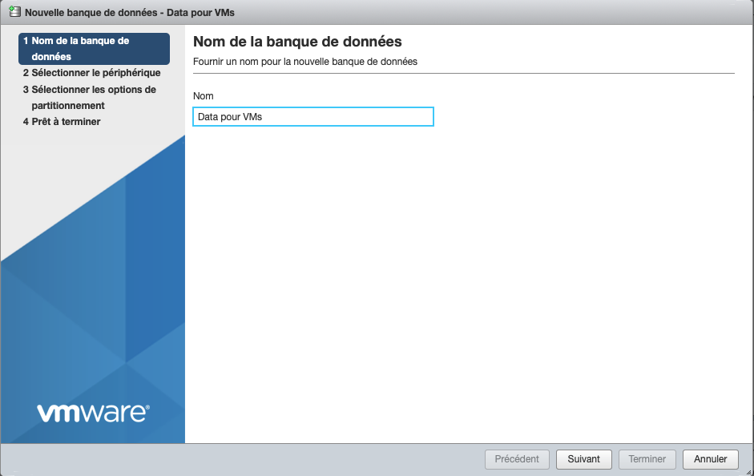
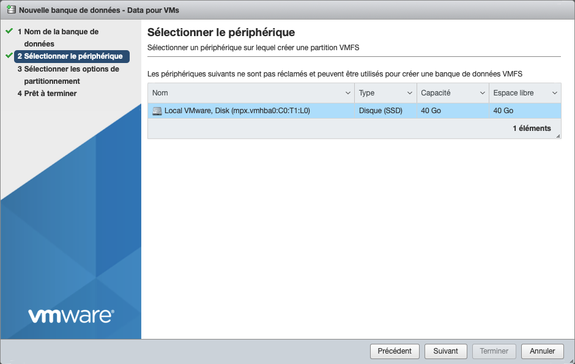
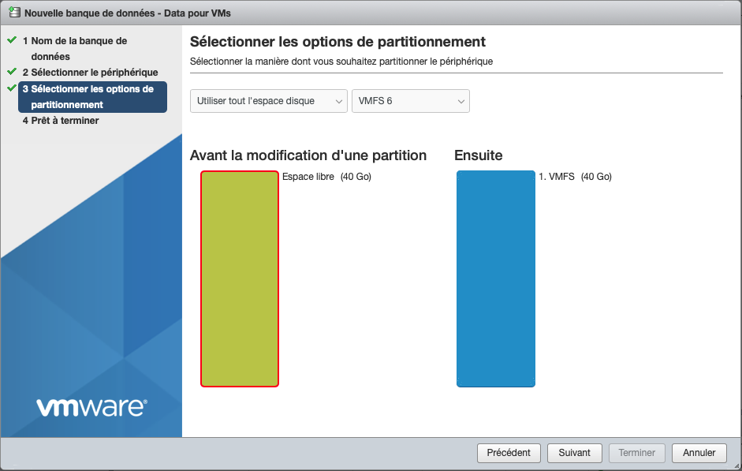
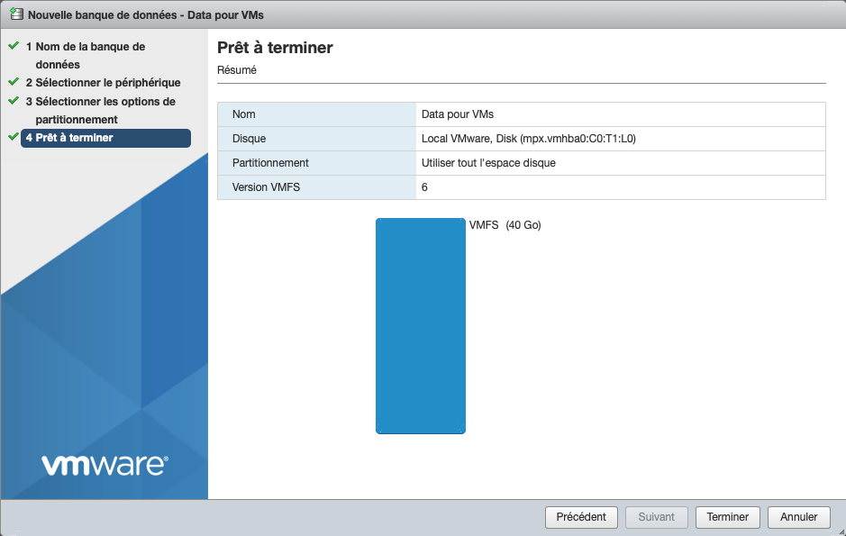
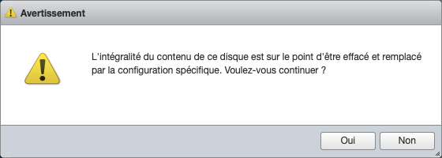
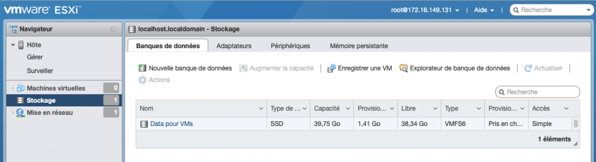

Voilà, nous avons maintenant une banque de données, ce qui permettra la création d’une VM.

---

## 7 – Création de notre première VM sous ESXi

Nous sommes maintenant prêt à créer notre première VM et à y installer un système d’exploitation.

Pour ce faire, il faut posséder l’image d’installation d’un OS sous la forme d’un fichier ISO.

7.1 – Télécharger le version 10 de Debian

[Lien de téléchargement](https://cdimage.debian.org/debian-cd/current/amd64/iso-cd/debian-10.10.0-amd64-netinst.iso)

[Lien alternatif](https://aboudrea.techinfo-cstj.ca/ressources/debian-10.10.0-amd64-netinst.iso)

7.2 – Créer la VM

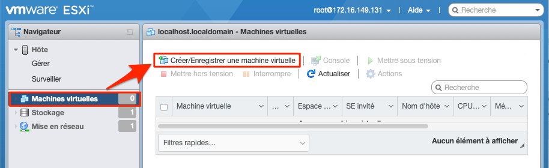
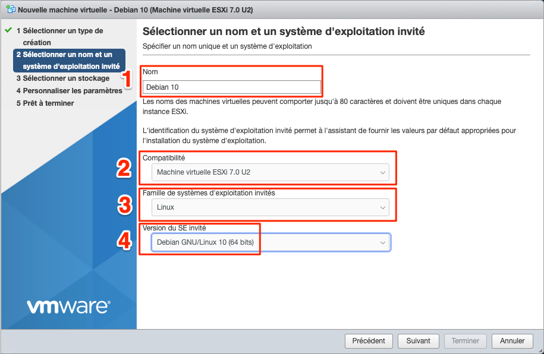
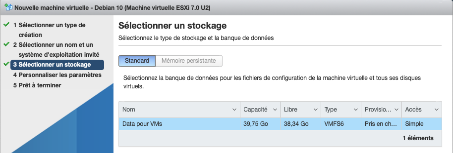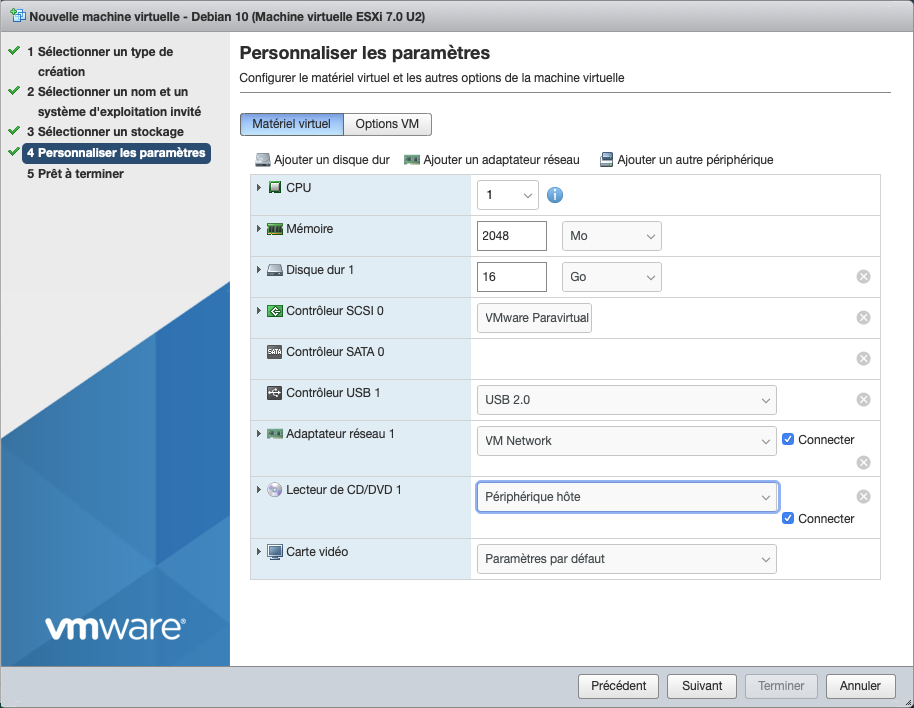
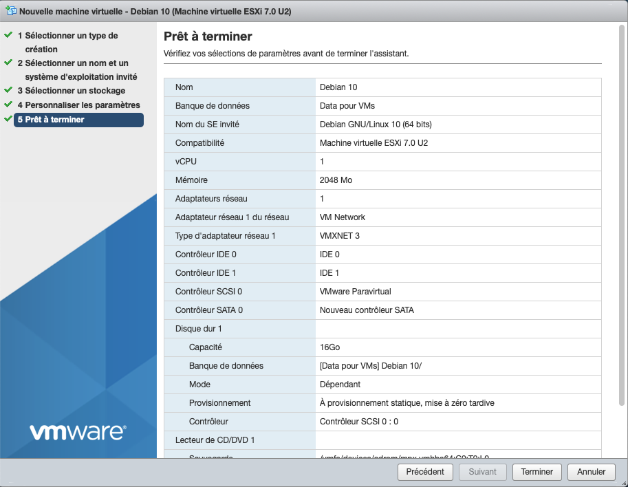
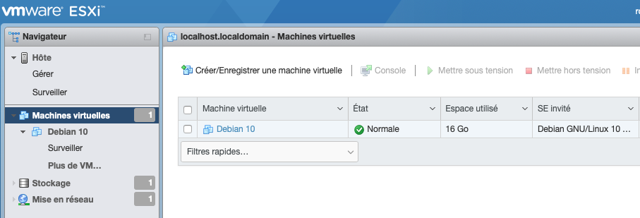
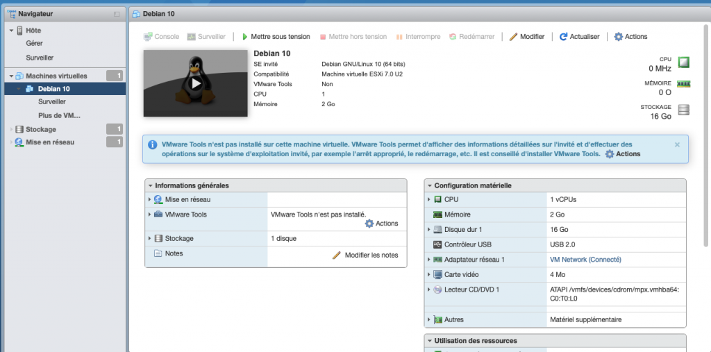

## 8 – Téléverser les fichiers ISO sur le serveur ESXi

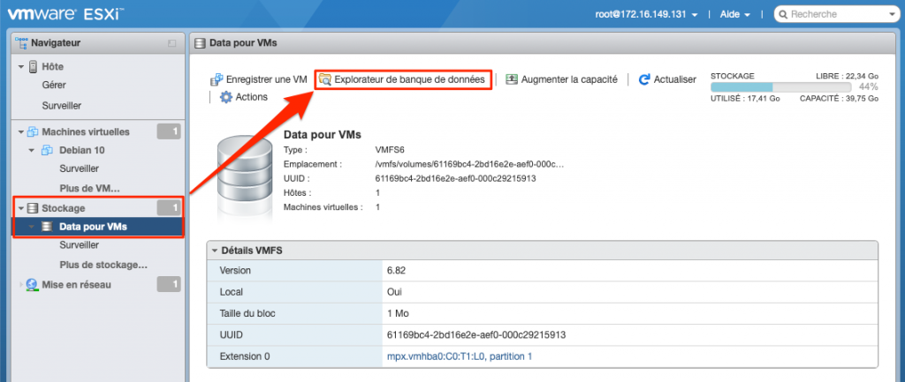
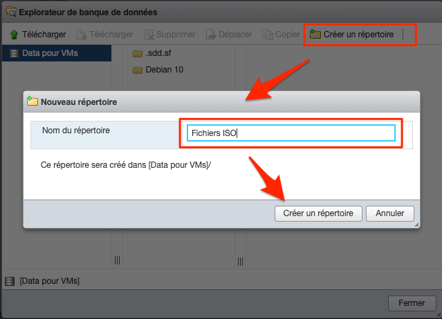
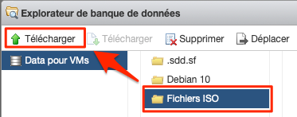
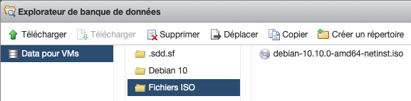

---

## 9 – Renseigner la source d’installation d’une VM

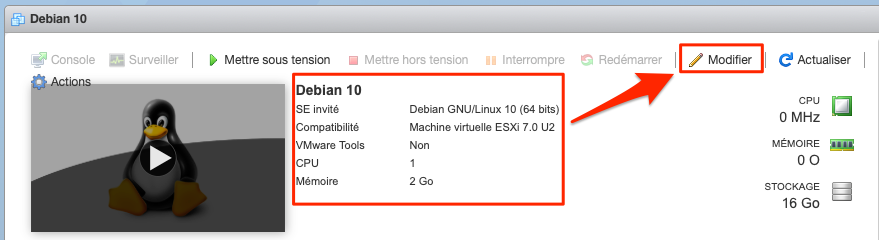
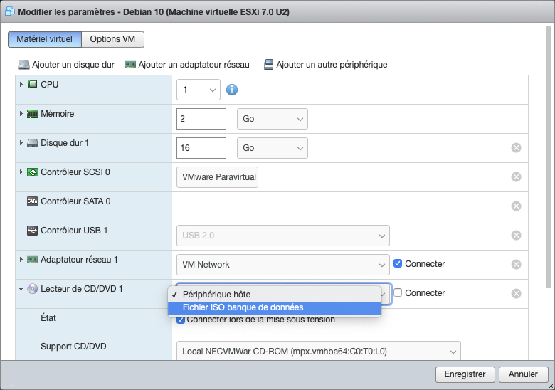
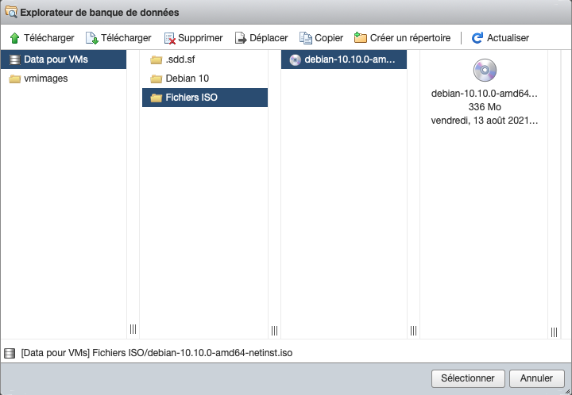

Voilà, il ne reste plus qu’à démarrer la VM Debian 10.

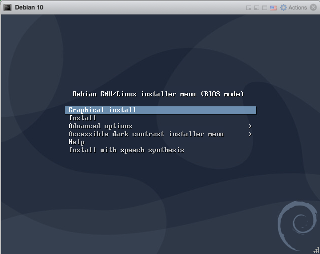

---

###### Document rédigé par Alain Boudreault aka ve2cuy – version 2021.08.13.01

---

[⬅️ Retour à la liste des documents](../README.md)
