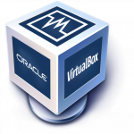
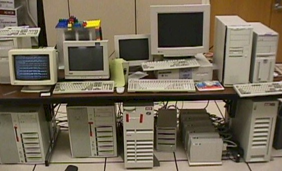
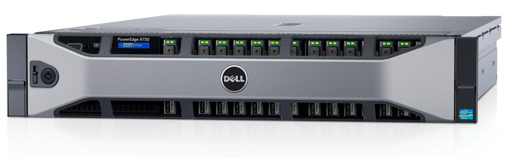
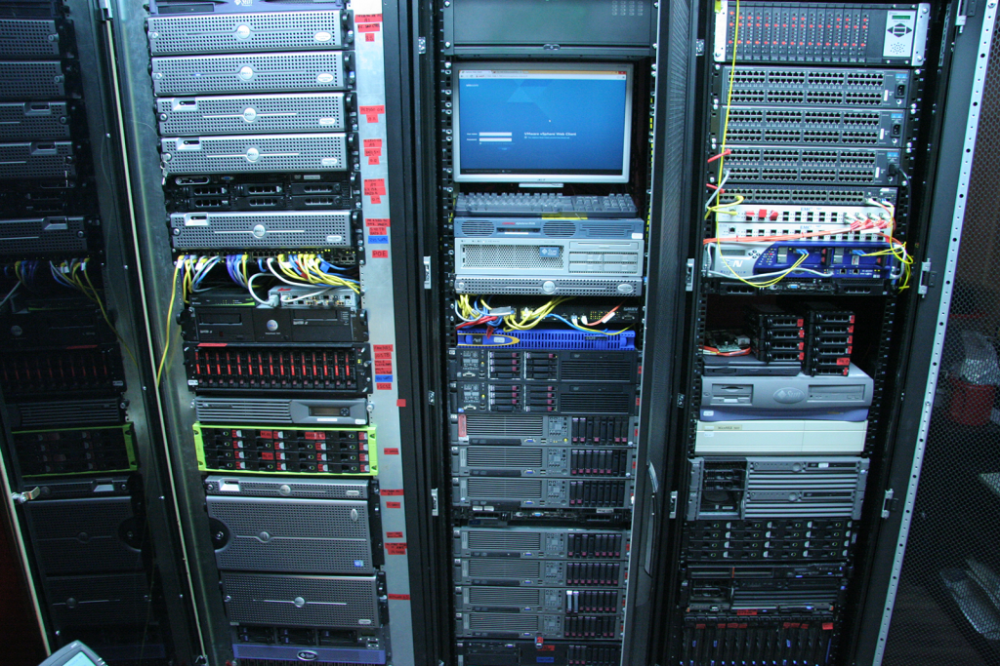
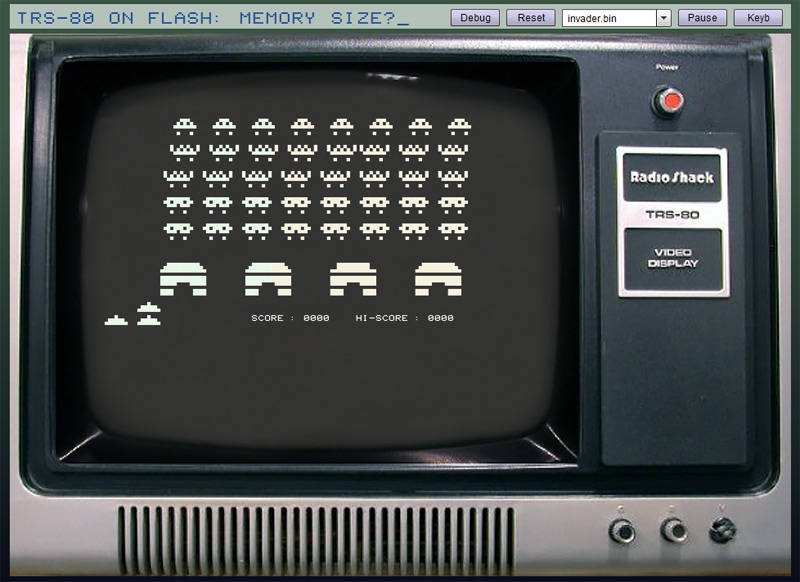

# Virtualisation des technologies WEB

*Document converti depuis [ve2cuy.com/420-3c3](https://ve2cuy.com/420-3c3/?page_id=259) — dernière modification : 2024-08-20*

---

# Objectif principal

Amener le participant à comprendre la notion de virtualisation et à utiliser un outil de création d’une machine virtuelle.

---

# Contenu

- **Définition du concept de virtualisation**
- **Outils de virtualisation disponibles**
- **Installation de VirtualBox**
- **Création d’une carte de réseau privé**
- **Création d’une machine virtuelle**

---

# 1 – Virtualisation – Définition

De façon simple, la virtualisation est une technique qui permet de simuler plusieurs ordinateurs complets; CPU, mémoire, carte réseau, unités de stockage, …. sur un ordinateur physique (metal).

L’avantage de cette approche est l’économie d’argent et d’espace.

Prenons l’exemple suivant,

‘La cie WEB ABC’, 200 employés, héberge les ressources informatiques suivantes:

- Partage 10 imprimantes via un serveur d’impression Ubuntu
- Partage des fichiers via 5 serveurs (3 serveurs Windows server, 2 serveur Netware).
- Héberge les courriels ‘entreprise’ des employés sur 1 serveur de courriers Solaris
- Héberge le site web de l’entreprise sur un serveur Linux Debian.

Au total, l’entreprise possède 7 ordinateurs pour répondre à ses besoins.

Il faut savoir qu’un ordinateur fonctionne rarement à 100% de sa capacité.

Dans le cas qui nous occupe;

- Le serveur d’impression travaille **15%** du temps et consomme **.3** kilowatt heure
- Les serveurs de fichiers  travaille **33%** du temps et consomme **2.5** kilowatts heure
- Le serveur de courrier travaille **10%** du temps et consomme **0,5** kilowatt heure
- Le serveur Web travaille **5%** du temp et consomme **0,4** kilowatt heure

De plus, il faut suffisamment d’espace pour loger 6 ordinateurs physiques.

google.stanford.edu circa 1997

Avec la virtualisation il est possible d’installer tous les services informatiques de l’entreprise, même si ces derniers roulent sur des systèmes d’exploitation différents, sur une seule machine physique.

Voici un exemple d’ordinateur couramment utilisé pour ce type de fonction:

Ces ordinateurs permettent l’installation de plusieurs processeurs (CPU) et une grande quantité de mémoire vive (RAM).

Donc, une seule de ces machines serait en mesure de rouler tous les services de ‘La cie WEB ABC’.

Pour une entreprise ou une organisation de grande envergure, il est possible d’installer ce type d’ordinateur dans un support à serveurs (server rack)

**Note**: On appelle ce type d’ordinateur ‘headless computer’ car suite à l’installation initiale, ils vont fonctionner sans clavier ni écran.

---

# 2 – Virtualisation versus Émulation

## 2.1 -Émulation

Dans la cas de l’émulation, tout est simulé, le processeur, la mémoire et les périphériques.

Cette technique est utilisé lorsqu’un programme a été conçu pour un appareil totalement différent de l’ordinateur sur lequel on désire l’exécuter.

Par exemple, si nous voulions rouler le jeu ‘**Space invader**‘ conçu pour le **TRS-80** (un des premiers ordinateurs personnelles de l’histoire moderne), il faudrait présenter, à l’application du jeu, un faux TRS-80 en tous points identique, au niveau fonctionnel, à l’original:  le processeur (un Z80 – avec toutes ses instructions), la carte vidéo, le clavier, la mémoire, …

C’est une approche qui n’est réaliste que si la machine que nous voulons émuler est bien moins performante que l’ordinateur servant à exécuter l’émulateur.

Simuler un processeur différent que celui que l’on retrouve sur l’ordinateur hôte requière énormément de traitement.  Idem pour la simulation d’une carte vidéo.

L’émulation d’une machine performante, comme par exemple, la dernière console de jeu à la mode, est impraticable, même sur un PC haut de gamme.

---

## 2.2 – Virtualisation

Termes:

- **VM** – machine virtuelle  (virtual machine).
- **host** (hôte) – Le système de virtualisation – celui qui permet de créér des VM.
- **guest** (invité) – un system d’exploitation qui roule dans une VM.

Il existe plusieurs technologies de virtualisation.

Celle qui est couverte par ce cours est nommée ‘**virtualisation complète**‘.

La virtualisation complète permet de créer des machines virtuelles de même type que l’ordinateur sur lequel roule l’application de virtualisation.

Il sera donc possible de créer une VM qui permet l’installation du même type de systèmes d’exploitation qui pourrait être installer sur l’ordinateur hôte.

Avec ce type de virtualisation et n’est pas possible faire rouler le ‘space invader’ du TRS-80.

**Cette limitation est l’avantage de la virtualisation complète.**

Au lieu de créer de fausses pièces d’ordinateur (CPU, mémoire, …), la virtualisation complète va plutôt ‘partager’ les ressources physiques de l’ordinateur entre plusieurs instances d’une système d’exploitation invité, ou entre des instances des systèmes d’exploitation différents.

Cette approche permet d’obtenir des machines virtuelles presque qu’aussi performante qu’une machine physique.

C’est la solution parfaite pour ‘La cie WEB ABC’.

---

# 3 – Virtualisation – Outils disponibles

Il y a deux approches disponibles pour la mise en place d’un système de virtualisation complète:

1. Sur un ordinateur exécutant un système d’exploitation typique comme, Windows, MacOS ou Linux.
2. Sur un ordinateur sans système d’exploitation typique – sur métal.

## 

## 3.1 – Virtualisation dans un système d’exploitation typique

C’est l’approche utilisée lorsque les besoins de virtualisation sont limités.

Par exemple, le propriétaire d’un ordinateur iMac roulant MacOS aimerait exécuter une application disponible que sur Windows.

Il pourra alors installer, sur son MAC, une application de virtualisation, de créer une VM et d’y installer Windows.

Au démarrage de la VM, l’instance de Windows va s’exécuter dans une fenêtre application sur le bureau du MAC.

L’utilisateur pourra passer de sa fenêtre Windows à ses applications MAC sans avoir à redémarrer l’ordinateur.

Voici une liste d’applications de virtualisation de ce type:

- [VirtualBox](https://doc.ubuntu-fr.org/virtualbox "virtualbox") (gratuit)
- [GNOME Machines](https://doc.ubuntu-fr.org/gnome-boxes "gnome-boxes") (gratuit)
- [Logiciels de virtualisation de VMWare](https://doc.ubuntu-fr.org/vmware "vmware") : [VMWare Player](https://doc.ubuntu-fr.org/vmware_player "vmware_player"), [VMWare Workstation](https://doc.ubuntu-fr.org/vmware_workstation "vmware_workstation"), [Fusion](https://www.vmware.com/fr/products/fusion.html)
- [Parallels Desktop for Windows & Linux](https://doc.ubuntu-fr.org/parallels_desktop "parallels_desktop")
- [KVM](https://doc.ubuntu-fr.org/kvm "kvm") (gratuit)

Ce type de virtualisation est aussi appelé ‘**Virtualisation de niveau 2**‘

## 3.2 – Virtualisation sur  métal (bare metal)

C’est l’approche utilisée pour les serveurs d’entreprises et les grands parcs informatique.

Il est rare qu’un utilisateur travaille directement sur un serveur d’entreprise.  Il devient alors inutile de consommer des ressources de l’ordinateur pour une interface graphique, une souris, des accès réseaux, une gestion des fichiers, à l’impression, …

Il est possible d’installer des logiciels de virtualisation qui sont autonomes et qui n’ont pas besoin d’être installés dans un système d’exploitation classique comme Windows ou Linux.

On les installe directement sur le matériel de l’ordinateur d’où leur nom de ‘bare metal’.

Voici une liste d’applications de virtualisation de ce type:

- [KVM](https://doc.ubuntu-fr.org/kvm "kvm") (gratuit)
- [Red Hat Enterprise Virtualization (RHEV)](https://www.redhat.com/fr/technologies/virtualization)
- [Xen / Citrix XenServer](https://www.citrix.fr/products/xenserver/)
- [Microsoft Windows Server Hyper-V](https://fr.wikipedia.org/wiki/Hyper-V)
- VMware vSphere / [ESXi](https://www.vmware.com/fr/products/esxi-and-esx.html) (gratuit)

Ce type de virtualisation est aussi appelé ‘**Virtualisation de niveau 1**‘

---

# 4 – Installation de virtualBox

VirtualBox est un choix intéressant de virtualisation car il est gratuit et disponible en version Windows, Linux, Solaris et MacOS.

Les programmes d’installation sont disponibles [ici](https://www.virtualbox.org/wiki/Downloads).

Il suffit de télécharger la version compatible avec la machine hôte et de l’installer comme n’importe quel autre programme.

**Note**: VirtualBox pourrait déjà être installé sur les poste de travail du local.

La suite de ce document se trouve [ici](Virtualisation-d-Ubuntu.md) : Installation d’Ubuntu serveur

---

##### Document rédigé par Alain Boudreault – version 2024.08.19

---

[⬅️ Retour à la liste des documents](../README.md)
